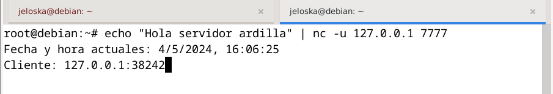

# Examen práctico
#### Jeloska Isabel Chavez Paredez

## Ejercicio 1 (ex-1)
### Ejecución del servidor

### Conexión al servidor con netcad

### Mensaje del servidor al recibir la conexión

## Ejercicio 2 (ex-2)

### Archivos del servidor

### Ejecución del servidor 

### Pruebas del cliente
- Descarga `.txt`

- Descarga `.py`

- Descarga `.html`

- Descarga `.pdf`

- Descarga `.mp4`

#### Mensajes del servidor 

## Ejercicio 3 (ex-3)

### Ejerccuión del servidor .py

### Ejecución del cliente .java
