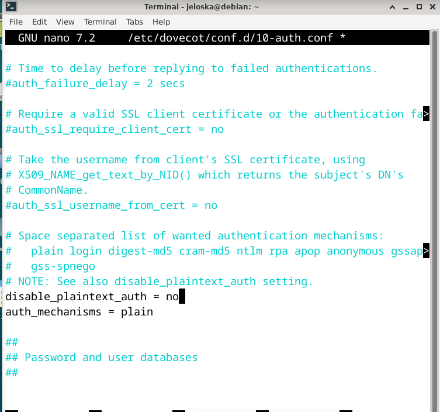

## Instalacion
``` bash
apt install dovecot-imapd dovecot-pop3d
```


## Protocolos
```
!include_try /usr/share/dovecot/protocols.d/*.protocol

```


## Configurando las recepciones

```
listen = 192.168.188.40, ::
```


## Configurando la autenticacion
```
disable_plaintext_auth = no
auth_mechanisms = plain

```



## Setup Mailbox Directory


## Setting up the 10-master.conf file with the ports
(without ssl)
 - Imap
 
 - POP3
 

 - Before it was setting: 
 
 
## Setting up 10-ssl.conf file 
we set ssl fiel with 'no'


## Step 3 - Manage Dovecot Service
- Enable dovecot service
```
sudo systemctl enable dovecot.service
```

- Starting service


## Testing connections to IMAP and POP3 and loggin
- IMAP
```
telnet 192.168.0.12 143

. login jeloska ***

```

- POP3

```
telnet 192.168.0.12 110

user jeloska
pass ***

```

# Dominio
sudo nano /etc/hosts
añadimos el dominio para su resolucion

## Postfix
sudo apt update
sudo apt install postfix

seleccionamos Internet Site


## Configuracion predetermindad de postfix

```
/etc/postfix/main.cf
# See /usr/share/postfix/main.cf.dist for a commented, more complete version


# Debian specific:  Specifying a file name will cause the first
# line of that file to be used as the name.  The Debian default
# is /etc/mailname.
#myorigin = /etc/mailname

smtpd_banner = $myhostname ESMTP $mail_name (Debian/GNU)
biff = no

# appending .domain is the MUA's job.
append_dot_mydomain = no

# Uncomment the next line to generate "delayed mail" warnings
#delay_warning_time = 4h

readme_directory = no

# See http://www.postfix.org/COMPATIBILITY_README.html -- default to 3.6 on
# fresh installs.
compatibility_level = 3.6


# TLS parameters
smtpd_tls_cert_file=/etc/ssl/certs/ssl-cert-snakeoil.pem
smtpd_tls_key_file=/etc/ssl/private/ssl-cert-snakeoil.key
smtpd_tls_security_level=may

smtp_tls_CApath=/etc/ssl/certs
smtp_tls_security_level=may
smtp_tls_session_cache_database = btree:${data_directory}/smtp_scache


smtpd_relay_restrictions = permit_mynetworks permit_sasl_authenticated defer_unauth_destination
myhostname = debian

alias_maps = hash:/etc/aliases
alias_database = hash:/etc/aliases
myorigin = /etc/mailname

mydestination = $myhostname, midominio.test, debian, localhost.localdomain, localhost
relayhost = 
mynetworks = 127.0.0.0/8 [::ffff:127.0.0.0]/104 [::1]/128
mailbox_size_limit = 0
recipient_delimiter = +
inet_interfaces = all
inet_protocols = all

```
## Estableciendo configracionde postfix
```
sudo nano /etc/postfix/main.cf

```

``` conf
myhostname = mail.midominio.test
mydomain = midominio.test
myorigin = $mydomain
mydestination = $myhostname, localhost.$mydomain, $mydomain, localhost
inet_interfaces = all
inet_protocols = all
home_mailbox = Maildir/
```

Surtimos los cambios con
```bash
systemctl restart postfix
```

## Dovecot: Configuración de Dovecot para Integrarse con Postfix
```
antes
# Postfix smtp-auth
  unix_listener /var/spool/postfix/private/auth {
    #mode = 0666
  }

service lmtp {
  unix_listener lmtp {
    #mode = 0666
  }

  # Create inet listener only if you can't use the above UNIX socket
  #inet_listener lmtp {
    # Avoid making LMTP visible for the entire internet
    #address =
    #port = 
  #}
}
  

```
```
service auth {
  ...
  unix_listener /var/spool/postfix/private/auth {
    mode = 0660
    user = postfix
    group = postfix
  }
  ...
}

service lmtp {
  ...
  unix_listener /var/spool/postfix/private/dovecot-lmtp {
    mode = 0600
    user = postfix
    group = postfix
  }
  ...
}
```

## Pruebas post & dovecot
instalé 
sudo apt install mailutils
echo "Este es el cuerpo del correo." | mail -s "Prueba de correo" jeloska@midominio.test


## Instrucciones para verificacion
Verificar la Recepción del Correo
Para verificar si el correo ha sido recibido, puedes:

Verificar el buzón del usuario local: Si jeloska es un usuario del sistema en el servidor de correo y utilizas Dovecot con configuración de Maildir, revisa el directorio /home/jeloska/Maildir. Deberías ver el correo en la carpeta new dentro de ese directorio si todo está configurado correctamente.
Acceder al correo mediante un cliente de correo: Configura un cliente de correo electrónico, como Evolution, para acceder a la cuenta jeloska@midominio.test usando IMAP o POP3 (según tu configuración de Dovecot) y verifica si el correo está presente.

## Pendiente [presenté error mutt -f imaps://jeloska@midominio.test
Could not connect to midominio.test (Connection refused).
]
sudo apt install mutt
ejecuté `mutt -f imaps://jeloska@midominio.test`

# Evolution
## Installing evolution


## Iniciando evolution


## Conf correo entrante


## Inbox : aqui el mail de prueba que envie :-)

## Notes
- dont forget to change ip on conf nano /etc/dovecot/dovecot.conf 

