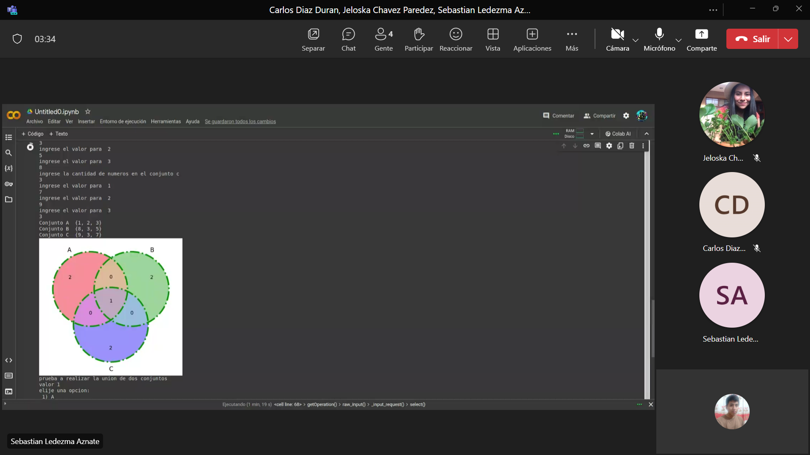
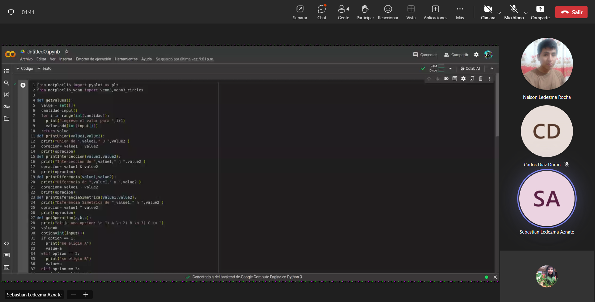

# Proyecto de Operaciones con Conjuntos y Visualización con Diagramas de Venn

## Descripción General

Este proyecto facilita la realización de operaciones básicas con conjuntos, tales como la unión, intersección, diferencia, y diferencia simétrica. A través de una interfaz de consola interactiva, los usuarios pueden ingresar conjuntos de números enteros y seleccionar operaciones para visualizar los resultados. Además, el proyecto utiliza visualizaciones gráficas, específicamente diagramas de Venn, para representar las relaciones entre hasta tres conjuntos distintos.

## Dependencias 

### Matplotlib

- **Descripción**: Matplotlib es una biblioteca de gráficos en Python que ofrece una amplia gama de figuras, gráficos y visualizaciones. Es ampliamente utilizada para la creación de gráficos estáticos, animados e interactivos en Python.
- **Uso en el Proyecto**: Utilizamos Matplotlib para generar los diagramas de Venn que visualizan las relaciones entre los conjuntos. Esta biblioteca facilita la presentación gráfica de las operaciones de conjuntos de manera intuitiva y comprensible.

### Matplotlib-venn

- **Descripción**: Matplotlib-venn es un complemento de Matplotlib diseñado específicamente para crear diagramas de Venn. Ofrece funciones que simplifican la generación de estos diagramas para dos o tres conjuntos.
- **Uso en el Proyecto**: Con matplotlib-venn, generamos diagramas de Venn de tres conjuntos para visualizar sus intersecciones, uniones y diferencias simétricas, facilitando una comprensión visual de estas operaciones.

## Instalación de Dependencias

Para instalar las dependencias necesarias, se debe ejecutar el siguiente comando en la terminal:

```bash
pip install matplotlib matplotlib-venn
```

Este comando instala tanto Matplotlib como Matplotlib-venn, preparando el entorno para la ejecución del proyecto.

## Funciones Principales

### `getValues()`

- **Propósito**: Solicita al usuario ingresar números para formar un conjunto.
- **Entradas**: Ninguna (entrada de usuario en tiempo de ejecución).
- **Salida**: Un conjunto (`set`) de enteros.
- **Cómo funciona**: Pide al usuario el número de elementos que desea agregar al conjunto y luego recoge esos elementos uno por uno, asegurando su unicidad al utilizar la estructura de datos `set` de Python.
- **Uso**: Utilizada al comienzo para definir los conjuntos A, B, y C con los que el usuario trabajará.

### `printUnion(value1, value2)`

- **Propósito**: Calcula e imprime la unión de dos conjuntos.
- **Entradas**: Dos conjuntos de números (`value1`, `value2`).
- **Salida**: Impresión de la unión de los conjuntos.
- **Cómo funciona**: Utiliza el operador `|` para calcular la unión de `value1` y `value2`, mostrando el resultado.
- **Uso**: Proporciona una forma sencilla de visualizar la unión de dos conjuntos seleccionados por el usuario.

### `printInterceccion(value1, value2)`

- **Propósito**: Calcula y muestra la intersección de dos conjuntos.
- **Comportamiento**: Emplea el operador `&` para determinar los elementos comunes y los imprime.
- **Entradas**: Dos conjuntos (`value1`, `value2`).
- **Cómo funciona**: Emplea el operador `&` para encontrar elementos comunes entre `value1` y `value2`.
- **Uso**: Ayuda a entender qué elementos comparten dos conjuntos.

### `printDiferencia(value1, value2)`

- **Propósito**:  Calcula y muestra la diferencia de dos conjuntos.
- **Comportamiento**: Aplica el operador `-` para encontrar los elementos de `value1` que no están en `value2` y los imprime.
- **Entradas**: Dos conjuntos (`value1`, `value2`).
- **Uso**: Ilustra los elementos únicos de un conjunto en relación con otro.

### `printDiferenciaSimetrica(value1, value2)`

- **Propósito**: Calcula y muestra la diferencia simétrica entre dos conjuntos.
- **Comportamiento**: Usa el operador `^` para obtener elementos únicos en ambos conjuntos y los imprime.
- **Entradas**: Dos conjuntos (`value1`, `value2`).
- **Uso**: Destaca los elementos exclusivos cuando se comparan dos conjuntos, omitiendo cualquier intersección.

### `getOperation(a, b, c)`

- **Propósito**: Permite al usuario seleccionar uno de los tres conjuntos disponibles.
- **Comportamiento**: Presenta un menú de opciones al usuario, captura la elección y devuelve el conjunto correspondiente. Si la selección es inválida, se elige el conjunto `a` por defecto.
- **Entradas**: Tres conjuntos (`a`, `b`, `c`).
- **Retorno**: El conjunto elegido.

### Visualización con Diagramas de Venn (`venn3` y `venn3_circles`)

Estas funciones de `matplotlib_venn` generan y muestran un diagrama de Venn, respectivamente, ilustrando visualmente las relaciones entre tres conjuntos.

- **Cómo funciona**: `venn3

` crea el diagrama de Venn basado en los tamaños de intersecciones de los conjuntos. `venn3_circles` agrega círculos al diagrama para mejorar la visualización.
- **Uso**: Fundamental para visualizar cómo los conjuntos A, B, y C se relacionan entre sí a través de sus uniones, intersecciones, y diferencias.

### Flujo de Ejecución

1. **Inicio**: Solicita al usuario ingresar elementos para los conjuntos A, B, y C.
2. **Visualización**: Muestra los conjuntos A, B, y C y sus relaciones a través de un diagrama de Venn.
3. **Operaciones con Conjuntos**: Permite al usuario realizar y visualizar operaciones entre los conjuntos seleccionados.

### Visualización de Diagramas de Venn

Utiliza `venn3` para mostrar un diagrama de Venn de tres conjuntos y `venn3_circles` para personalizar los círculos que representan cada conjunto. Los conjuntos se visualizan después de ser definidos por el usuario, proporcionando una representación gráfica inmediata de sus relaciones.


### Ejecución de Operaciones

El script invita al usuario a realizar operaciones específicas entre los conjuntos. Para cada operación, el usuario debe seleccionar dos conjuntos sobre los cuales operar. Las operaciones disponibles son unión, intersección, diferencia, y diferencia simétrica.

## Ejecución



### Bibliografia:
- [Conjuntos en Python: El tipo set y operaciones más comunes](
http://elclubdelautodidacta.es/wp/2012/07/python-union-interseccion-y-diferencia-de-conjuntos/)

- [Diagramas de Venn con matplotlib](
https://recursospython.com/guias-y-manuales/diagramas-de-venn-con-matplotlib/)

- [Matplotlib: Visualization with Python](
https://matplotlib.org/stable/tutorials/pyplot.html)

- [Teoria de Conjuntos características y elementos](
https://www.lifeder.com/teoria-de-conjuntos/)


