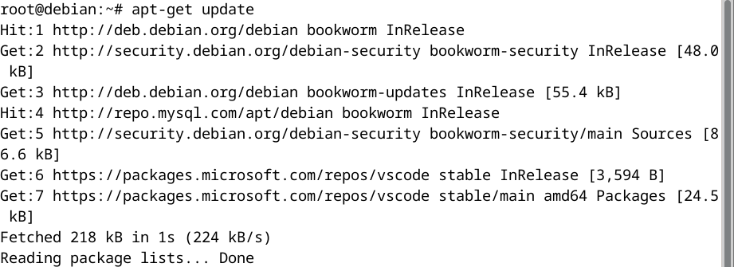
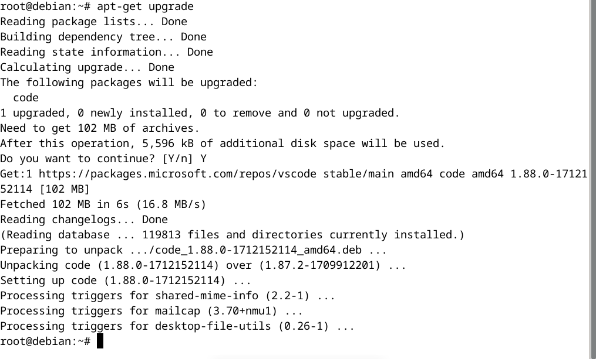

## 1. Instalación y configuración - Dovecot

### 1.1 Actualización del Sistema
Inicialmente, debemos asegurarnos que el sistema operativo esté completamente actualizado para evitar incompatibilidades o vulnerabilidades de seguridad. Para tal efecto ejecutamos los siguientes comandos en la terminal:

```bash
sudo apt-get update
sudo apt-get upgrade
```



### 1.2. Instalación de Dovecot
Posteriormente, se procedeció a la instalación del software Dovecot, el cual es esencial para la habilitación de los servicios de correo electrónico mediante los protocolos POP3 e IMAP4. Utilizamos el gestor de paquetes `apt-get` para instalar los componentes necesarios con el siguiente comando:

```bash
sudo apt-get install dovecot-core dovecot-imapd dovecot-pop3d
```


### 1.3. Configuración de Dovecot en Debian y habilitar los servicios IMAP4 y POP3

Para configurar Dovecot permitiendo el uso de los protocolos IMAP4 y POP3 sin cifrado TLS/SSL, es necesario realizar ajustes específicos en la configuración del servidor. Este proceso implica modificar archivos de configuración para deshabilitar el cifrado y asegurar que Dovecot escuche en los puertos estándar para IMAP y POP3. 

#### Paso 1: Edición de la Configuración del Servicio

Abrimos el archivo de configuración `/etc/dovecot/conf.d/10-master.conf`, el cual define y ajusta las propiedades de los servicios ofrecidos por Dovecot, incluyendo los mecanismos de autenticación y conexión para IMAP y POP3:


Dentro del archivo `10-master.conf`, buscamos las secciones denominadas `service imap-login` y `service pop3-login`. Estas secciones definen como Dovecot maneja las conexiones entrantes para los protocolos IMAP y POP3, respectivamente.

- **Configuración de `inet_listener` para IMAP y POP3:**

En cada sección de servicio (`service imap-login` y `service pop3-login`), identificamos las subsecciones `inet_listener imap` y `inet_listener pop3`. Estas subsecciones especifican los detalles de la red, incluidos los puertos en los cuales Dovecot escuchará las solicitudes de conexión para cada protocolo

Establecimos el valor de `port` en `143` para IMAP y `110` para POP3, como se muestra a continuación:

   ```ini
   service imap-login {
     inet_listener imap {
       port = 143
     }
   }

   service pop3-login {
     inet_listener pop3 {
       port = 110
     }
   }
   ```

- **Puerto 143** es el puerto estándar para conexiones IMAP sin cifrar. Este protocolo permite la gestión de correos electrónicos directamente en el servidor, facilitando el acceso desde múltiples dispositivos.
- **Puerto 110** es el puerto estándar para conexiones POP3 sin cifrar. Este protocolo está diseñado para la descarga de correos desde el servidor al cliente de correo electrónico, permitiendo la lectura de estos sin necesidad de una conexión a internet.

Tras realizar las modificaciones mencionadas, guardamos los cambios.

### Paso 2: Desactivación de SSL/TLS

Procedimos a editar el archivo ` /etc/dovecot/conf.d/10-ssl.conf` para desactivar el cifrado SSL/TLS globalmente. Este archivo es responsable de definir la política de Dovecot respecto al manejo de conexiones seguras SSL/TLS. Contiene parámetros que habilitan o deshabilitan el cifrado, especifican la ubicación de los certificados y las claves, y definen la suite de cifrado a utilizar, entre otros ajustes relacionados con la seguridad.


Modificamos la directiva correspondiente a la configuración `SSL` para establecerla en `no`, indicando así a Dovecot que no utilice cifrado SSL/TLS para las conexiones. Esto implica que todas las comunicaciones entre los clientes de correo y el servidor Dovecot se realizarán en texto plano, sin ninguna forma de cifrado. Guardamos y cerramos el archivo tras aplicar el cambio.

### Paso 3: Reinicio de Dovecot

Para aplicar los cambios realizados en la configuración, es necesario reiniciar el servicio Dovecot:

```bash
sudo systemctl restart dovecot
```

### 1.4. Configuración de la Interfaz de Escucha

Dovecot está configurado por defecto para escuchar en todas las interfaces disponibles, incluidas IPv4 e IPv6. Para restringir Dovecot a una interfaz específica, realizamos los siguientes ajustes en el archivo principal de configuración `/etc/dovecot/dovecot.conf`.

**Especificar la Interfaz de Escucha:**
En el archivo `dovecot.conf`, modificamos la directiva `listen`. Por defecto, esta opción estaba configurada para escuchar en todas las interfaces `(listen = *, ::)`. Para limitar la escucha a una interfaz específica, reemplazamos `*` con la dirección IP de la interfaz de red. 

``` bash
listen = 192.168.0.12, ::
```
Indicamos que el servicio debe estar disponible tanto para conexiones IPv4 específicas en 192.168.0.12 (La IP de red asignada al hsot) como para cualquier conexión IPv6.


### 1.5. Configuración de Autenticación
Configurar correctamente el archivo `10-auth.conf` permite definir la forma en la que Dovecot manejará las solicitudes de autenticación de los usuarios.

   ```bash
   sudo nano /etc/dovecot/conf.d/10-auth.conf
   ```
En este archivo, ajustamos las directivas de autenticación:
- `disable_plaintext_auth = no`: Esta directiva configura Dovecot para permitir la autenticación de usuarios mediante credenciales enviadas en texto plano sobre la red. Establecer este valor en "no" significa que Dovecot aceptará contraseñas sin cifrar durante el proceso de autenticación.
- `auth_mechanisms = plain login`:  Esta configuración especifica los mecanismos de autenticación que Dovecot soportará para la verificación de las credenciales de los usuarios. Los valores "plain" y "login" se refieren a dos métodos básicos de autenticación:

    - `Plain`: Este mecanismo permite que las credenciales se transmitan al servidor de manera sencilla (sin cifrado por parte del mecanismo de autenticación, aunque pueden estar protegidas por una capa de seguridad como SSL/TLS).
    - `Login`: Similar al mecanismo "plain", pero tradicionalmente utilizado por clientes que requieren una secuencia de comandos de autenticación ligeramente diferente.


### 1.6. Configuración del Directorio del Buzón

Dovecot utiliza el archivo `/etc/dovecot/conf.d/10-mail.conf` para configurar el directorio de almacenamiento de los buzones de correo.Establecimos la siguiente configuración: 

``` bash
mail_location = maildir:~/Maildir 
```
La configuración `mail_location = maildir:~/Maildir` en Dovecot especifica el formato y la ubicación del almacenamiento de los correos electrónicos de los usuarios en el servidor.

- **Formato `Maildir`**: Este valor indica que Dovecot utilizará el formato `Maildir` para almacenar los correos electrónicos. `Maildir` es un formato de almacenamiento de correo electrónico que mantiene cada mensaje en un archivo único dentro de una estructura de directorios específica. 

- **Ubicación `~/Maildir`**: La ruta `~/Maildir` especifica que cada usuario tendrá su directorio `Maildir` dentro de su directorio home (`~`).


# 2. Establecer un Nombre de Dominio Local
Para configurar un entorno de prueba con el servidor de correo, asignamos un nombre de dominio local a la dirección IP del servidor. Procedimos a mapear un nombre de dominio a nuestra dirección IP en el archivo `/etc/hosts` del servidor.

```
192.168.0.12       midominio.test
```

Este paso garantiza que `midominio.test` se resuelva a la dirección IP correcta en la red local, lo que permite la comunicación entre los clientes de correo y el servidor de correo utilizando este dominio.


# 3. Postfix: Instalación y configuración
Postfix es un agente de transferencia de correo (MTA) que maneja el envío y la recepción de correos electrónicos en tu servidor. Funciona en conjunto con Dovecot, un servidor IMAP/POP3 que permite a los usuarios acceder a sus correos. Mientras Postfix se encarga de la comunicación con otros servidores de correo en Internet, Dovecot proporciona el acceso a los mensajes almacenados a los clientes de correo como Evolution. Esta combinación permite implementar un servidor de correo electrónico completo, capaz de enviar, recibir y almacenar correos, así como de ofrecer acceso seguro a los usuarios finales a través de protocolos estándares.
### 3.1. Instalación

Ejecutamos el siguiente comando para la instalación de postfix
``` bash
sudo apt install postfix
```


La ventana presentada es un diálogo de configuración de Postfix que nos permitirá especificar el tipo de operación para el servicio de correo electrónico que se está configurando. Las opciones disponibles son:

- **No configuration**: Esta opción mantiene la configuración actual sin cambios. Seleccionar esto no alterará ningún archivo de configuración existente.
  
- **Internet site**: Esta opción configura Postfix como un servidor de correo independiente que envía y recibe correos directamente utilizando el protocolo SMTP. Es adecuada para la mayoría de los escenarios donde el servidor tiene una dirección IP pública y está diseñado para manejar el correo electrónico de dominios específicos alojados en el servidor.

- **Internet with smarthost**: Establece que Postfix enviará todo el correo saliente a través de otro servidor de correo, conocido como 'smarthost', mientras que aún puede recibir correos directamente. Esto es útil en entornos donde el correo saliente debe pasar por un procesamiento o control centralizado.

- **Satellite system**: Similar a la configuración anterior, pero en este caso, incluso el correo entrante es manejado por el smarthost, haciendo que el servidor actual actúe como un relé.

- **Local only**: Restringe la entrega de correo únicamente a los usuarios dentro del mismo sistema. No se intercambian correos con la red externa, lo que lo hace útil para pruebas o para sistemas aislados de correo.


Elegimos "Internet site" para configurar Postfix porque necesitamos un servidor de correo que pueda manejar de manera autónoma tanto el envío como la recepción de correos para un dominio específico. 


Durante la configuración de Postfix, definimos el nombre de dominio del sistema que Postfix utilizará para calificar todas las direcciones de correo electrónico que no tienen un dominio especificado. En el campo "System mail name" de la interfaz de configuración de Postfix, introdujimos `midominio.test` como el dominio de correo electrónico completamente calificado (FQDN) para el servidor. Así, si un usuario del sistema envía un correo sin especificar un dominio, Postfix automáticamente añadirá `@midominio.test` a la dirección de correo electrónico. 


### 3.2. Configuración de Postfix

En el proceso de configuración se efectuaron los siguientes ajustes detallados en el archivo de configuración `/etc/postfix/main.cf`:

1. Configuración de Identidad del Servidor:
   - `myhostname = mail.midominio.test`: Se definió el nombre de host completo (FQDN) para el servidor de correo electrónico.
   - `mydomain = midominio.test`: Se estableció el dominio principal del servidor, que se utiliza para formar direcciones de correo electrónico completas para cuentas locales.
   - `myorigin = $mydomain`: Postfix usa para construir la dirección de correo electrónico en los encabezados de los correos enviados.
   - `mydestination = $myhostname, localhost.$mydomain, $mydomain, localhost`: Se han definido los destinos para los que Postfix aceptará y procesará el correo de manera local.

2. Configuración de Red:
   - `inet_interfaces = all`: Postfix ha sido configurado para escuchar en todas las interfaces de red para recibir correos electrónicos de cualquier dirección.
   - `inet_protocols = all`: Se ha habilitado el uso de ambos protocolos de internet, IPv4 e IPv6, para la operación de red de Postfix.

3. Configuración de Almacenamiento de Correo:
   - `home_mailbox = Maildir/`: Se ha especificado el formato y la ubicación del almacenamiento del correo electrónico en formato 'Maildir', que separa cada correo en un archivo único dentro de un directorio específico para cada usuario.

## 3.3. Configuración de Dovecot para Integrarse con Postfix
 
  

Se llevaron a cabo configuraciones específicas en el archivo `/etc/dovecot/conf.d/10-master.conf`. Estas configuraciones establecen la interacción y el correcto funcionamiento entre los servicios de autenticación de Dovecot y la entrega de correo de Postfix.

1. **Configuración de la Autenticación**:
   - En la sección `service auth` del archivo de configuración, se configuró un `unix_listener` para que Postfix pueda comunicarse con Dovecot para autenticar a los usuarios. Los detalles técnicos son los siguientes:
     - `mode = 0660`: Establece los permisos del socket para que tanto el usuario como el grupo tengan permiso de leer y escribir, pero no el resto de los usuarios del sistema.
     - `user = postfix`: Especifica que el servicio de autenticación de Dovecot corre como el usuario `postfix`.
     - `group = postfix`: Determina que el grupo `postfix` es propietario del socket, permitiendo a Postfix realizar operaciones de lectura/escritura en él.

   Esta configuración permite que Postfix utilice el servicio de autenticación de Dovecot para verificar las credenciales de los usuarios cuando reciben o envían correos electrónicos.

2. **Configuración del Servicio de Entrega de Mensajes (LMTP)**:
Se realizó una configuración similar en la sección `service lmtp`, que es responsable de la entrega de correo a través del protocolo LMTP (Local Mail Transfer Protocol):
     - `unix_listener /var/spool/postfix/private/dovecot-lmtp`: Crea un socket de comunicación para que Postfix entregue los mensajes a Dovecot utilizando LMTP.
     - `mode = 0600`: Establece que solo el usuario `postfix` (y ninguna otra cuenta de usuario o grupo) tiene permisos para acceder a este socket.
     - `user = postfix` y `group = postfix`: Asegura que el servicio LMTP de Dovecot se ejecute con las credenciales necesarias para interactuar con Postfix.

# 4. Evolution: Instalación y COnfiguración
### 4.1. Instalación del Cliente de Correo Evolution:
Evolution es un cliente de correo integral que proporciona funcionalidades de correo electrónico, calendario y gestión de contactos. Para instalar Evolution en un sistema operativo basado en Debian/Ubuntu, se utilizó el siguiente comando:

```bash
sudo apt-get install evolution
```


### 4.2. Configuración de Cuentas de Correo en Evolution:**

Tras la instalación, se procedió a configurar las cuentas de correo electrónico utilizando los protocolos IMAP y POP3 proporcionados por el servidor de correo Dovecot.

### 4.2.1. Configuración de identidad del usuario


Se introdujeron el nombre completo y la dirección de correo electrónico asociada con la cuenta del usuario en el servidor de correo configurado. Específicamente:

- **Nombre Completo**: Se ingresó `jeloska`, que es el nombre que los destinatarios verán cuando reciban correos de esta cuenta.
- **Dirección de Correo Electrónico**: Se especificó `jeloska@midominio.test`, que es la dirección de correo electrónico completa que utilizará el usuario, coincidiendo con el dominio configurado en el servidor Postfix y Dovecot.

La opción “Look up mail server details based on the entered e-mail address” se activó, lo cual indica que Evolution intentará buscar automáticamente los detalles del servidor de correo basados en la dirección de correo proporcionada, simplificando el proceso de configuración posterior de los servidores entrante y saliente.

### 4.2.2. Configuración del servidor para recibir correos electrónicos


Configuramos el servidor para recibir correos electrónicos utilizando el protocolo IMAP. Se estableció la dirección del servidor de correo electrónico Dovecot y las credenciales del usuario para el acceso IMAP, así como los parámetros de seguridad correspondientes:

- **Server (Servidor)**: Se introdujo `midominio.test` como el nombre de dominio del servidor de correo, que es el FQDN configurado en Dovecot y Postfix.
- **Username (Nombre de usuario)**: Se ingresó `jeloska` como el nombre de usuario de la cuenta de correo en Dovecot.
- **Port (Puerto)**: Se mantuvo el puerto `143`, que es el estándar para conexiones IMAP sin cifrado.
- **Encryption method (Método de encriptación)**: Se seleccionó "No encryption" debido a que se está configurando para un entorno de pruebas y desarrollo, sin la utilización de cifrado TLS/SSL.
- **Authentication (Autenticación)**: Se eligió "Password" como método de autenticación, lo cual permitirá que Evolution se autentique con el servidor utilizando una contraseña en texto plano.

Además de la configuración IMAP, Evolution también puede ser configurado para utilizar POP3. En caso de querer usar POP3, los pasos son similares, pero se debería:

- **Server Type (Tipo de servidor)**: Cambiar de IMAP a POP.
- **Port (Puerto)**: Cambiar a `110`, que es el puerto estándar para conexiones POP3 sin cifrado.

La configuración actual permite a Evolution comunicarse con el servidor de correo Dovecot para recibir correos. Para un entorno de producción.

### 4.2.3. Recepción de correo en Evolution 


La configuración de recepción de correo en Evolution se dejó con los valores predeterminados, donde verifica automáticamente los nuevos mensajes cada 60 minutos y aplica filtros a los mensajes que llegan a la bandeja de entrada. Esta configuración es adecuada para un uso estándar, manteniendo un equilibrio entre la actualización frecuente y la eficiencia del servidor. Las notificaciones de cambio del servidor están activadas, permitiendo actualizaciones en tiempo real si el servidor las soporta. Las opciones de filtrado y sincronización avanzadas se pueden personalizar según las necesidades específicas del usuario.

### 4.2.4. Envío de correo


En la configuración de envío de correo de Evolution, hemos establecido `midominio.test` como el servidor SMTP y configurado el puerto `25`, que es estándar para conexiones SMTP no seguras. Hemos marcado la opción que indica que el servidor requiere autenticación y seleccionado "No encryption" para el método de seguridad, lo cual concuerda con el entorno de prueba sin conexiones cifradas. Se ha mantenido "PLAIN" como tipo de autenticación y confirmado el nombre de usuario `jeloska`. 

## Summary


- **Nombre de la Cuenta**: Se ha establecido `jeloska@midominio.test` como el identificador de la cuenta. Este nombre ayudará a diferenciar esta cuenta de otras que puedan estar configuradas en Evolution.

- **Detalles Personales**: 
  - **Nombre Completo**: Se ha introducido `jeloska`.
  - **Dirección de Correo Electrónico**: Se confirmó como `jeloska@midominio.test`.

- **Configuración de Recepción de Correo**:
  - **Tipo de Servidor**: IMAP (imapx).
  - **Servidor**: `midominio.test`, que corresponde al servidor de correo Dovecot.
  - **Nombre de Usuario**: `jeloska`.
  - **Seguridad**: Ninguna, lo cual indica que las conexiones IMAP no están cifradas.

- **Configuración de Envío de Correo**:
  - **Tipo de Servidor**: SMTP.
  - **Servidor**: `midominio.test`, que se refiere al servidor Postfix.
  - **Nombre de Usuario**: `jeloska`.
  - **Seguridad**: Ninguna, acorde con la configuración de Postfix para aceptar conexiones sin cifrado.

---

# PRUEBAS
## Pruebas de Funcionamiento de Servidores SMTP y POP3


**Conexión y Pruebas con el Servidor SMTP**

Se inició una sesión Telnet al servidor SMTP en `midominio.test` en el puerto `25`. Tras la conexión, el servidor respondió con el mensaje "220 mail.midominio.test ESMTP Postfix (Debian/GNU)", indicando que está listo para la comunicación.

El comando `EHLO` se utilizó para identificar el dominio del cliente al servidor, el cual respondió con una serie de líneas, cada una empezando con "250-", seguido de diferentes capacidades del servidor:

- **250-PIPELINING**: Indica que el cliente puede enviar un conjunto de comandos de forma continua sin esperar una respuesta individual.

- **250-SIZE 10240000**: Informa al cliente que el servidor puede aceptar mensajes de correo electrónico de hasta 10 MB de tamaño.

- **250-VRFY**: Significa que el servidor admite la verificación de existencia de direcciones de correo electrónico individuales.

- **250-ETRN**: Indica la disponibilidad del comando ETRN, que permite la solicitud de entrega de correo en espera para un dominio específico.

- **250-STARTTLS**: Muestra que el servidor soporta la encriptación TLS y está preparado para negociar una conexión segura si el cliente lo solicita.

- **250-ENHANCEDSTATUSCODES**: El servidor enviará códigos de estado extendidos, proporcionando descripciones más detalladas de las respuestas del servidor.

- **250-8BITMIME**: El servidor soporta mensajes MIME que no son solo de texto ASCII de 7 bits, permitiendo así contenido de mensaje más rico.

- **250-DSN**: El servidor puede enviar notificaciones de estado de entrega, indicando si un mensaje ha sido entregado, retrasado o fallido.

- **250-SMTPUTF8**: Esta extensión permite el uso de caracteres UTF-8 en los parámetros del correo electrónico, como las direcciones de correo.

- **250 CHUNKING**: El servidor soporta la división de mensajes grandes en pedazos o fragmentos para su envío, mejorando así la eficiencia en el manejo de grandes volúmenes de datos.

Con las capacidades SMTP verificadas, se procedió a realizar un test de envío:

- **MAIL FROM**: Se definió el remitente del mensaje de prueba como `jeloska@midominio.test`, y el servidor respondió con "250 2.1.0 Ok", indicando que la dirección del remitente es aceptable.

- **RCPT TO**: Se definió el destinatario del correo electrónico de prueba, que es la misma dirección del remitente para propósitos de prueba, y el servidor aceptó con "250 2.1.5 Ok".

- **DATA**: Se inició la entrada del cuerpo del mensaje con el comando `DATA`, y tras escribir el contenido del mensaje y terminarlo con un punto en una línea sola, el servidor respondió con "250 2.0.0 Ok: queued as 6702DA15F7", lo que significa que el mensaje ha sido aceptado para su entrega y ha sido puesto en cola con el identificador dado.

- **QUIT**: Se envió el comando `QUIT` para finalizar la sesión, y el servidor confirmó el cierre de la conexión con "221 2.0.0 Bye".

**Conexión y Pruebas con el Servidor POP3**

Se inició una sesión Telnet al servidor POP3 en `midominio.test` en el puerto `110`. Al conectar, el servidor Dovecot respondió con "+OK Dovecot (Debian) ready.", lo que indica que está listo para la comunicación POP3.

Se procedió con las siguientes pruebas de funcionalidad:

- **USER y PASS**: Se introdujeron comandos de autenticación con el nombre de usuario y la contraseña del usuario `jeloska`. El servidor respondió con "+OK" a ambos, confirmando una autenticación exitosa.

- **LIST**: Para listar los mensajes en el buzón, se envió el comando `LIST`, recibiendo una respuesta "+OK 1 messages:", indicando que hay un mensaje disponible.

- **RETR**: Se recuperó el mensaje usando el comando `RETR 1`. El servidor respondió con el contenido del mensaje, que incluye las cabeceras y el cuerpo del correo, confirmando que es el mismo mensaje enviado previamente.

- **QUIT**: Se finalizó la sesión con el comando `QUIT`, y el servidor cerró la sesión con "+OK Logging out.", confirmando una desconexión exitosa.

El mensaje recuperado mostró la ruta completa que siguió a través del sistema de correo electrónico, verificando que fue procesado por Postfix y entregado a la bandeja de entrada de Dovecot como se esperaba. Las cabeceras detalladas proporcionaron un seguimiento completo desde el punto de envío hasta la recepción, incluyendo las marcas de tiempo y el identificador único del mensaje, lo que es crucial para el diagnóstico en profundidad y la auditoría del sistema de correo.

**Conclusión de la Prueba:**

Las pruebas de envío y recepción con los servidores SMTP y POP3 se llevaron a cabo con éxito, confirmado por los códigos de estado positivos y la capacidad de recuperar el mensaje enviado desde el buzón del usuario. Esto valida la configuración y el funcionamiento correcto de los servicios de correo electrónico SMTP y POP3 en el dominio `midominio.test`. 

Las pruebas proporcionaron una visión clara de las capacidades SMTP soportadas por el servidor, así como una verificación efectiva de la capacidad de Dovecot para recibir y almacenar mensajes de correo electrónico. Sin embargo, se reitera que para un entorno de producción, se deben implementar y verificar conexiones cifradas (usando, por ejemplo, STARTTLS en lugar de conexiones sin cifrar), y se debe utilizar autenticación segura para proteger las credenciales y la información de los usuarios.


Se realizó una prueba de recepción de correo electrónico a través de una conexión POP3 utilizando Telnet. Aquí está el detalle técnico de la sesión:

1. **Conexión al Servidor POP3**: 
   Se estableció una conexión con el servidor `midominio.test` en el puerto 110, que es el puerto estándar para POP3. El servidor Dovecot respondió con un mensaje de bienvenida, confirmando que está listo para la interacción.

2. **Inicio de Sesión**: 
   La autenticación se realizó con éxito utilizando el comando `USER` seguido por el nombre de usuario `jeloska`, y el comando `PASS` seguido de la contraseña. Dovecot confirmó el inicio de sesión con el mensaje "+OK Logged in."

3. **Listado de Mensajes**: 
   El comando `LIST` fue utilizado para solicitar la lista de mensajes disponibles en el buzón, a lo cual el servidor respondió con "+OK 1 messages:", indicando la existencia de un único mensaje en el buzón, con un tamaño de 500 octetos.

4. **Recuperación de un Mensaje**: 
   Se solicitó el contenido del primer mensaje con el comando `RETR 1`. Dovecot proporcionó una respuesta positiva y mostró los encabezados del correo electrónico, seguidos por el cuerpo del mensaje. Los encabezados incluyen información importante como:
   
   - `Return-Path`: La dirección de retorno para respuestas al mensaje, `jeloska@midominio.test`.
   - `X-Original-To`: La dirección original a la cual fue enviado el mensaje.
   - `Delivered-To`: La confirmación de que el mensaje fue entregado al buzón correcto.
   - `Received`: Información detallada sobre la ruta que tomó el mensaje, incluyendo el servidor de origen (Postfix en este caso) y la confirmación de que fue enviado a través de ESMTP con el identificador de mensaje `6702DA15F7`.
   - `Subject`: El asunto del correo, "Prueba de Envio", confirmando que el contenido del mensaje corresponde con el enviado en la prueba SMTP.
   - `Message-Id`: Un identificador único generado por Postfix para el mensaje.
   - `Date`: La fecha y hora en que el mensaje fue recibido por el servidor de correo.
   - `From`: El remitente del mensaje.

5. **Cierre de Sesión**: 
   Finalmente, la sesión se cerró con el comando `QUIT`, y Dovecot confirmó el cierre de sesión con "+OK Logging out." y se cerró la conexión.

Esta prueba de Telnet al servidor POP3 confirmó la correcta recepción de mensajes en el servidor de correo configurado y la capacidad de recuperar y leer mensajes desde la línea de comandos, lo que es fundamental para la verificación del sistema de correo electrónico en un entorno de pruebas o desarrollo.

## Activación de firewalls


En el sistema Debian, se utilizaron comandos para configurar el firewall con UFW (Uncomplicated Firewall) para permitir el tráfico en los puertos utilizados por los servicios de correo electrónico. Los comandos ejecutados y las acciones realizadas fueron:

1. `sudo ufw allow smtp`: Este comando configuró UFW para permitir el tráfico en el puerto 25, utilizado por el protocolo SMTP. UFW agregó reglas para IPv4 e IPv6.

2. `sudo ufw allow imap`: Se permitió el tráfico en el puerto 143, estándar para conexiones IMAP sin cifrado. Nuevamente, UFW añadió reglas para IPv4 e IPv6.

3. `sudo ufw allow pop3`: Se habilitó el puerto 110, usado por el protocolo POP3 sin cifrado, con reglas para ambas versiones de IP.

Al intentar nuevamente permitir el tráfico en el puerto SMTP con `ufw allow smtp`, el sistema respondió que la regla ya existía, por lo que no se hicieron cambios adicionales.

Finalmente, se reiniciaron los servicios de correo electrónico para asegurarse de que las nuevas reglas de firewall surtieran efecto:

- `systemctl restart postfix`: Se reinició el servicio Postfix para aplicar cualquier cambio en la configuración o en el entorno de red.

- `systemctl restart dovecot`: Se reinició Dovecot por las mismas razones.

Estas acciones aseguraron que los servicios de correo electrónico puedan comunicarse a través del firewall y que estén funcionando con la configuración actualizada del sistema.


----
### Pruebas PASOS PARA NOSOTRAS

### **Pruebas de Recepción de Correo (POP3)**:

**Usar Telnet para Conectar al Servidor POP3:**

1. **Abrir una conexión Telnet al servidor POP3**:
   ```bash
   telnet midominio.test 110
   ```

2. **Iniciar sesión con tu usuario**:
   - Enviar usuario:
     ```bash
     USER tu_usuario
     ```
   - Enviar contraseña:
     ```bash
     PASS tu_contraseña
     ```

3. **Listar los mensajes disponibles**:
   - Para obtener un listado de los correos:
     ```bash
     LIST
     ```

4. **Leer un mensaje específico**:
   - Para leer el mensaje número 1 (cambia `1` por el número de mensaje que quieras leer):
     ```bash
     RETR 1
     ```

5. **Salir de la sesión POP3**:
   - Para cerrar la sesión:
     ```bash
     QUIT
     ```

### **Pruebas de Envío de Correo (SMTP)**:

**Usar Telnet para Conectar al Servidor SMTP:**

1. **Abrir una conexión Telnet al servidor SMTP**:
   ```bash
   telnet midominio.test 25
   ```

2. **Saludar al servidor con HELO o EHLO**:
   - Enviar saludo inicial:
     ```bash
     EHLO midominio.test
     ```

3. **Definir el remitente del correo**:
   - Comando para definir el remitente:
     ```bash
     MAIL FROM: tu_email@midominio.test
     ```

4. **Definir el destinatario del correo**:
   - Comando para definir el destinatario:
     ```bash
     RCPT TO: email_destinatario@example.com
     ```

5. **Escribir y enviar el mensaje**:
   - Iniciar la redacción del mensaje:
     ```bash
     DATA
     ```
   - Escribir el contenido del mensaje seguido por un punto en una línea sola para terminar el mensaje:
     ```bash
     Subject: Prueba de Envío
     Hola, esto es una prueba.
     .
     ```

6. **Cerrar la sesión SMTP**:
   - Para finalizar la sesión de envío:
     ```bash
     QUIT
     ```


Para probar la recepción y envío de correos utilizando el protocolo IMAP4 sin un cliente de correo gráfico como Evolution, puedes usar la herramienta de línea de comandos `telnet` o `openssl` si prefieres una conexión cifrada, aunque en este caso, estamos trabajando sin cifrado. A continuación, te proporciono una guía detallada:

### Pruebas de Recepción de Correo (IMAP4):

**Conexión con Telnet:**

1. **Conectar al Servidor IMAP4**:
   ```bash
   telnet midominio.test 143
   ```

2. **Iniciar Sesión**:
   Después de la conexión, inicia sesión con tus credenciales.
   ```bash
   a LOGIN tu_usuario tu_contraseña
   ```
   Sustituye `tu_usuario` y `tu_contraseña` con tu nombre de usuario y contraseña reales.

3. **Verificar Carpetas y Mensajes**:
   Puedes listar todas las carpetas con el comando:
   ```bash
   a LIST "" "*"
   ```
   Y seleccionar la bandeja de entrada para trabajar con ella:
   ```bash
   a SELECT INBOX
   ```

4. **Leer un Correo Electrónico**:
   Para leer el primer correo electrónico de la bandeja de entrada:
   ```bash
   a FETCH 1 BODY[]
   ```
   Cambia el `1` por el número del mensaje que desees leer.

5. **Cerrar la Sesión**:
   Cuando hayas terminado, cierra la sesión con:
   ```bash
   a LOGOUT
   ```

### Pruebas de Envío de Correo (SMTP):

**Uso de Telnet o OpenSSL para Conexión SMTP**:

1. **Conectar al Servidor SMTP**:
   ```bash
   telnet midominio.test 25
   ```

2. **Saludar al Servidor con HELO**:
   Envía un saludo al servidor para iniciar la comunicación.
   ```bash
   HELO midominio.test
   ```

3. **Autenticación**:
   Si el servidor requiere autenticación, tienes que enviar tu nombre de usuario y contraseña codificados en base64 después del comando AUTH LOGIN. Omitiremos este paso porque asumimos que la autenticación no es necesaria para la conexión de prueba.

4. **Definir Remitente y Destinatario**:
   Especifica el remitente y el destinatario de tu mensaje de prueba.
   ```bash
   MAIL FROM:<tu_email@midominio.test>
   RCPT TO:<destinatario@example.com>
   ```

5. **Escribir el Mensaje**:
   Inicia la composición del mensaje y después escribe el cuerpo del mensaje, terminando con un punto en una línea nueva.
   ```bash
   DATA
   Subject: Test Email
   This is a test message sent from Telnet.
   .
   ```

6. **Cerrar la Sesión SMTP**:
   Para finalizar, cierra la conexión SMTP.
   ```bash
   QUIT
   ```

Recuerda que estas pruebas son para un entorno de desarrollo o pruebas. En un entorno de producción, deberías usar un método más seguro para enviar credenciales, como SSL/TLS, junto con herramientas adecuadas que soporten estas funciones de seguridad.

---