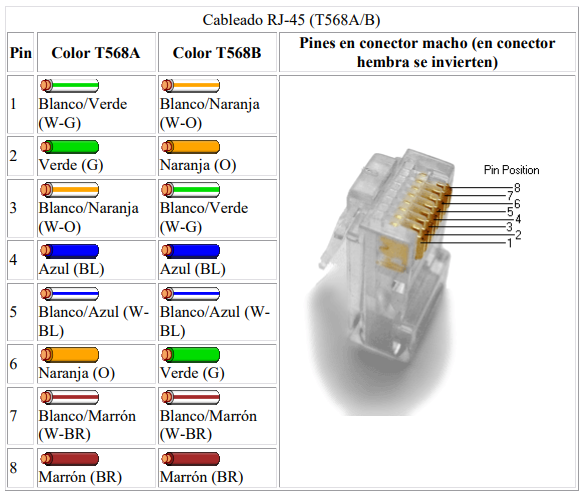
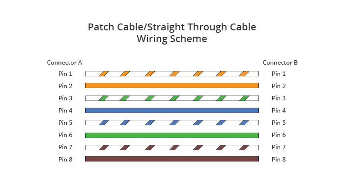
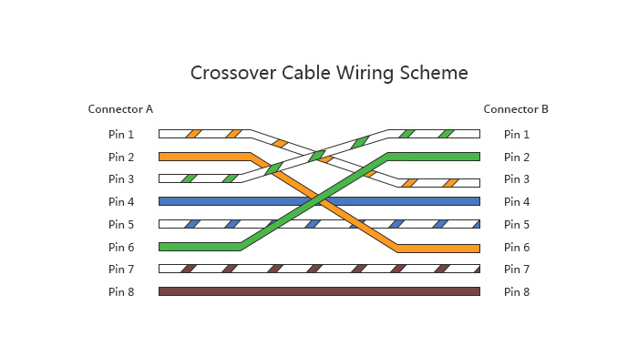
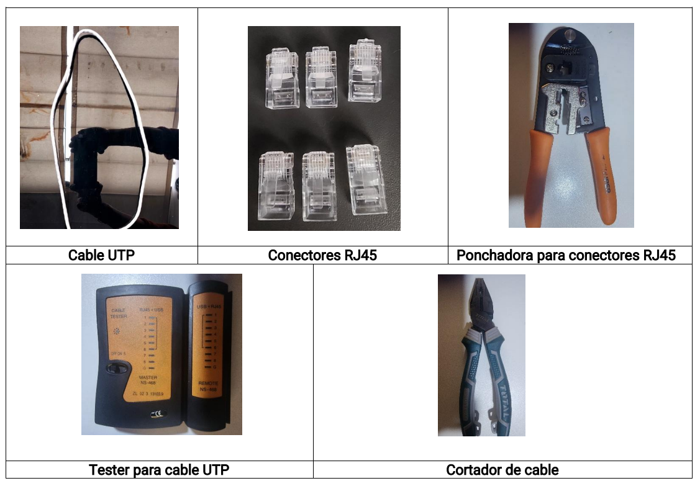
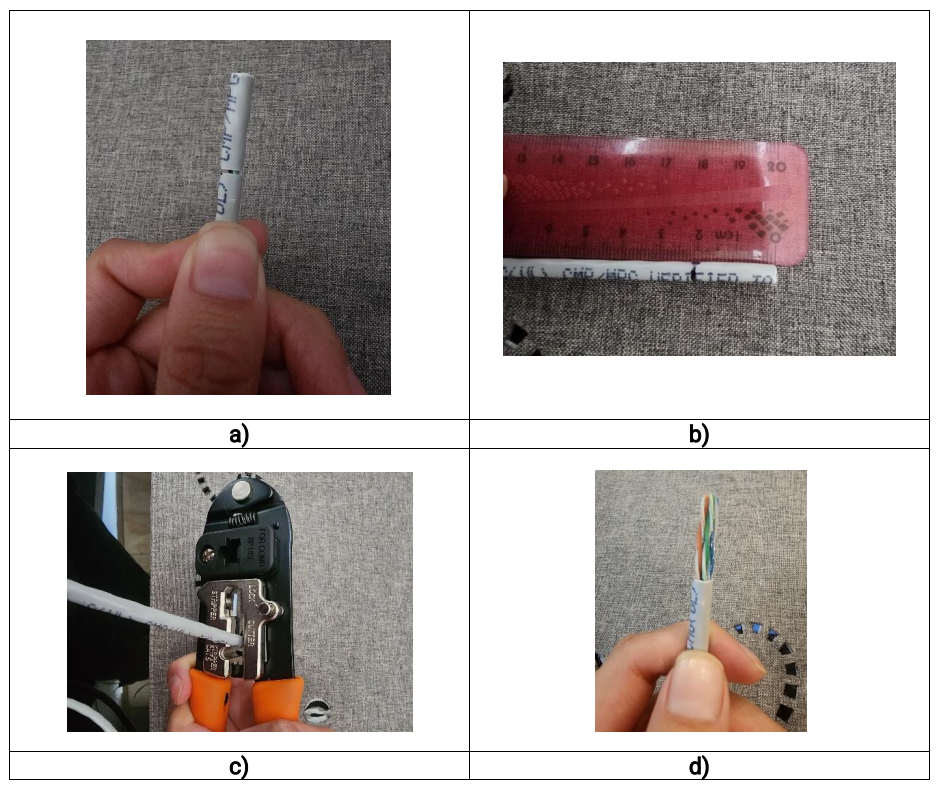
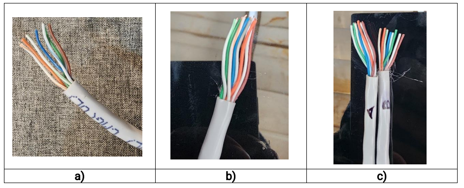
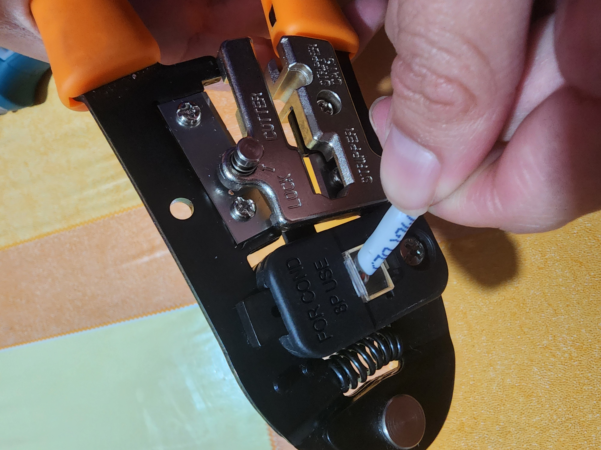
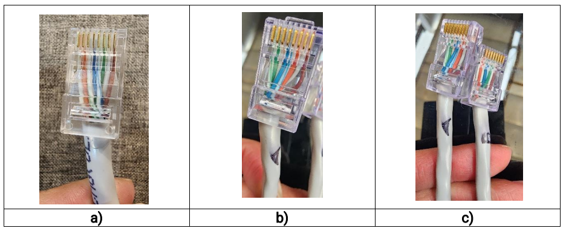
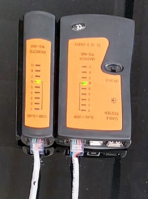

# Laboratorio 1

## 1. Introducción
El cableado estructurado es esencial para redes eficientes al proveer la infraestructura física para la transmisión de datos, voz y video. En este informe, exploramos sus fundamentos, centrándonos en sus componentes clave y la norma TIA/EIA-568B. También analizamos los tipos de cables, especialmente el par trenzado sin apantallar (UTP), con sus características y categorías. A través de procedimientos experimentales, demostramos la preparación y conexión de cables UTP según las normas T568A y T568B, así como la diferencia entre cableado directo y cruzado, resaltando su importancia en diversas configuraciones de red.
## 2. Fundamentos teóricos
### 2.1. Fundamentos del cableado estructurado
El cableado estructurado es un método estándar para construir redes, que implica la instalación de cables, conectores y hardware para facilitar la transmisión de datos, voz y video. Se caracteriza por su enfoque organizado y escalable, con subsistemas como el cableado horizontal, troncal, salas de telecomunicaciones y componentes del área de trabajo. Este sistema se adapta a diversas tecnologías de red, como Ethernet, fibra óptica y redes inalámbricas.

#### 2.1.2. Componentes del Cableado Estructurado
Los sistemas de cableado estructurado comprenden varios elementos clave que colaboran para establecer una infraestructura de red integrada:

**a) Cables:** Transmiten datos en sistemas de cableado estructurado, como cables de cobre (par trenzado), fibra óptica y coaxiales, según las necesidades específicas. Ejemplos incluyen el uso de par trenzado para Ethernet y fibra óptica para transmisiones rápidas y de larga distancia.

**b) Conectores:** Esenciales para interconectar cables o conectarlos a dispositivos de red. Ejemplos incluyen RJ-45 para Ethernet y SC para fibra óptica.

**c) Paneles de Parcheo:** Actúan como centros de consolidación para cables, permitiendo una gestión organizada y modificaciones rápidas sin interrupciones en la red.

**d) Racks y Gabinetes:** Albergan y protegen equipos de red, asegurando un entorno ordenado y seguro con acceso conveniente para mantenimiento.

**e) Cables de Parcheo:** Cables cortos con conectores en ambos extremos para conexiones rápidas entre dispositivos y el sistema de cableado estructurado.

**f) Gestión de Cables:** Implica el uso de herramientas como bridas y etiquetas para organizar, proteger e identificar cables, facilitando actividades de mantenimiento.

#### 2.1.3. Norma TIA/EIA-568B
La norma TIA/EIA-568B es una serie de estándares que definen el cableado comercial para productos y servicios de telecomunicaciones. Uno de los aspectos más destacados de esta norma es la asignación de pares/pines en cables de par trenzado de 8 hilos y 100 ohmios, también conocida como T568A y T568B.

##### 2.1.3.1. Arquitectura y Topología del Cableado Estructurado

La norma TIA/EIA-568B establece una arquitectura jerárquica para los sistemas de cableado estructurado, que incluye conectores cruzados principales y horizontales, así como puntos de consolidación opcionales. Esta arquitectura permite una distribución eficiente de la conectividad a través de una topología en estrella, que garantiza la accesibilidad a zonas de trabajo individuales como oficinas y cubículos. Además, la norma define las características y requisitos específicos del cableado para cada componente del sistema, desde las instalaciones de entrada hasta las salas de telecomunicaciones.

##### 2.1.3.2. Terminaciones T568A y T568B

Las terminaciones T568A y T568B son especificaciones cruciales dentro del estándar TIA/EIA-568-B.1-2001, que regula el diseño y la implementación de infraestructuras de cableado estructurado para redes de datos. Estas terminaciones definen la disposición de los cables en los conectores RJ45 de ocho pines modulares y jacks utilizados comúnmente en entornos de red.

El estándar TIA/EIA-568-B.1-2001 establece que los cables deben terminarse preferiblemente utilizando las asignaciones pin/par del T568A. Sin embargo, también se permite el uso del estándar T568B en ciertos sistemas de cableado de 8 pines. Es importante destacar que aunque T568B es equivalente al estándar AT&T 258A, no es oficialmente reconocido por las Telecomunicaciones Federales de los Sistemas de Comunicación Nacional de Estados Unidos.

Ambos estándares, T568A y T568B, tienen la misma función básica: establecer una conexión eléctrica precisa entre dispositivos de red. La diferencia principal entre ellos radica en la disposición de los pares naranja y verde. Mientras que T568A asigna el color naranja al segundo par de cables (par 2) y el color verde al tercer par de cables (par 3), T568B hace lo contrario: asigna el color naranja al tercer par de cables y el color verde al segundo par de cables.

Para comprender mejor esta diferencia, se proporciona la siguiente tabla que muestra la asignación de colores para ambos estándares:

<figure>
  
  <figcaption align="center">Figura 1: Guía de colores para el cableado RJ-45 según los estándares T568A y T568B. </figcaption>
</figure>

Estos estándares no solo consideran la conexión eléctrica, sino también la minimización de la interferencia electromagnética (EMI) entre los cables. Al asignar colores específicos a los pares de cables y mantener una disposición coherente, se reduce la probabilidad de interferencia entre las señales eléctricas transportadas por los cables, lo que garantiza un rendimiento óptimo y confiable del sistema de cableado.

### 2.2. Cableado de Red: Tipos y Características

El cableado de red es el sistema físico de cables y dispositivos que permite la conexión y comunicación entre diferentes equipos informáticos en una red, como computadoras, servidores y dispositivos de red. Es fundamental para transmitir datos, voz y video en redes locales (LAN) o extendidas (WAN).

#### 2.2.1. Tipos de Cables Utilizados en Redes
El cableado de red comprende diversos tipos de cables, cada uno con sus propias características y aplicaciones específicas:

El cableado de red incluye diversos tipos de cables con diferentes características y usos:

- **Cable de par trenzado sin apantallar (UTP)**: Ampliamente utilizado en redes, su calidad varía según la categoría del cable, que determina la capacidad de transmisión de datos. Las diferentes categorías ofrecen distintas capacidades de transmisión.

- **Cable de par trenzado apantallado (FTP)**: Similar al UTP pero con un apantallamiento que protege globalmente los 4 pares de cables. Su calidad se encuentra entre el UTP y el STP.

- **Cable de par trenzado apantallado (STP)**: Protege cada par de cables individualmente contra interferencias eléctricas mediante un apantallamiento.

- **Cable coaxial**: Conductor de cobre rodeado por una capa aislante y una rejilla metálica para resistir interferencias. Con dos clases: coaxial fino y grueso.

- **Cable de fibra óptica**: Transmite señales mediante luz, ofreciendo alta capacidad de transmisión y resistencia a interferencias eléctricas. Ideal para ambientes con interferencias y largas distancias.

#### 2.2.2. Cable UTP: Características y Categorías
Se compone de pares de cables trenzados, donde cada par está formado por dos hilos de cobre aislados que se enrollan entre sí en una disposición helicoidal. Este diseño ayuda a reducir las interferencias electromagnéticas (EMI) al mitigar los efectos de la diafonía, que es la interferencia entre los cables adyacentes. La reducción de la diafonía es crucial para mantener una transmisión de datos confiable y de alta calidad.

Los cables UTP se clasifican en diferentes categorías según sus capacidades de transmisión de datos. Las categorías más comunes se presentan en la Tabla 1.

**Tabla 1: Características y frecuencias de las categorías del cable UTP**

| Categoría | Frecuencia Máxima (MHz) | Velocidad de Transmisión Máxima | Características |
|-----------|-------------------------|--------------------------------|-----------------|
| Cat 1     | No definida             | No definida                    | Usado para telefonía analógica. |
| Cat 2     | 1 MHz                   | 4 Mbps                         | Obsoleto, utilizado para sistemas telefónicos básicos. |
| Cat 3     | 16 MHz                  | 10 Mbps                        | Adecuado para Ethernet de 10 Mbps. |
| Cat 4     | 20 MHz                  | 16 Mbps                        | Utilizado para redes Token Ring. |
| Cat 5     | 100 MHz                 | 100 Mbps                       | Ampliamente utilizado para Ethernet de 100 Mbps. |
| Cat 5e    | 100 MHz                 | 1 Gbps                         | Mejora de Cat 5 para soportar Gigabit Ethernet. |
| Cat 6     | 250 MHz                 | 1 Gbps                         | Ofrece mejor rendimiento para Gigabit Ethernet. |
| Cat 6a    | 500 MHz                 | 10 Gbps                        | Diseñado para redes 10 Gigabit Ethernet. |
| Cat 7     | 600 MHz                 | 10 Gbps                        | Proporciona mejor rendimiento en redes de alta velocidad. |
| Cat 7a    | 1000 MHz                | 10 Gbps                        | Mejora de Cat 7 con mayor ancho de banda. |

La elección de la categoría del cable UTP depende de los requisitos de velocidad y rendimiento de la red. El cable de Categoría 5 es uno de los cables más utilizados en redes de área local (LAN). 

#### 2.2.3. Transmisión de Señales en Cable UTP
La funcionalidad de un cable UTP se basa en la distribución específica de sus cables individuales para la transmisión de datos y la integridad de la red. Estos cables se organizan en cuatro pares distintos, cada uno con un propósito definido:

- **Par 1 (blanco-azul y azul)**: Utilizado para transmitir datos en una dirección específica. El cable blanco-azul envía datos desde la fuente hacia el dispositivo de destino, mientras que el azul se encarga de recibir datos en la transmisión. Ambos cables forman un par equilibrado para reducir la interferencia electromagnética.

- **Par 2 (blanco-naranja y naranja)**: Similar al par 1, se emplea para la transmisión de datos. El cable blanco-naranja transmite datos desde la fuente hacia el dispositivo de destino, mientras que el naranja recibe datos en la transmisión, también trenzados para minimizar interferencias.

- **Par 3 (blanco-verde y verde)**: Otro par utilizado para la transmisión de datos en una dirección específica. El cable blanco-verde envía datos desde la fuente hacia el dispositivo de destino, mientras que el verde se emplea para recibir datos en la transmisión. Al igual que los pares anteriores, están trenzados para reducir la interferencia y mejorar el rendimiento.

- **Par 4 (blanco-marrón y marrón)**: Este par tiene usos diversos según la configuración de la red. Generalmente, se reserva para funciones como Power over Ethernet (PoE), suministrando energía a dispositivos de red. No obstante, en algunas configuraciones, también puede usarse para transmisión de datos adicionales o señalización.

La Tabla 2 proporciona un resumen de las funciones de cada par de cables en un UTP.

**Tabla 2: Funciones de los cables en un cable UTP**

| Par  | Cable            | Función en la transmisión de datos            |
|------|------------------|------------------------------------------------|
| 1    | Blanco-Azul      | Envío de datos desde la fuente hacia el destino |
|      | Azul             | Recepción de datos en la transmisión          |
| 2    | Blanco-Naranja   | Envío de datos desde la fuente hacia el destino |
|      | Naranja          | Recepción de datos en la transmisión          |
| 3    | Blanco-Verde     | Envío de datos desde la fuente hacia el destino |
|      | Verde            | Recepción de datos en la transmisión          |
| 4    | Blanco-Marrón    | Usos variados, incluyendo alimentación eléctrica (por ejemplo, PoE) |
|      | Marrón           | Usos variados, incluyendo alimentación eléctrica (por ejemplo, PoE) |

### 2.3. Tipos de Cableado en Sistemas de Cableado Estructurado
#### 2.3.1. Cableado Directo

Un cable de conexión directa, también conocido como cable recto, es un tipo de cable de par trenzado utilizado en redes Ethernet. En un cable de conexión directa Ethernet, los pines cableados en ambos extremos coinciden. Los cables de conexión directa siguen un estándar de cableado único: ambos extremos utilizan el estándar de cableado T-568A o ambos utilizan el estándar de cableado T-568B.
<figure>
  
  <figcaption align="center">Figura 2: Esquema de cableado para un cable directo o patch cable, mostrando la conexión pin a pin.
 </figcaption>
</figure>

#### Usos
- Conectar un enrutador a un concentrador.
- Conectar una computadora a un switch.
- Conectar un puerto de red local (LAN) a un switch o computadora.

#### 2.3.2. Cableado Cruzado

Un cable cruzado Ethernet es un tipo de cable utilizado para conectar dispositivos informáticos directamente entre sí. A diferencia del cable de conexión directa, el cable cruzado utiliza dos estándares de cableado diferentes en ambos extremos: un extremo utiliza el estándar de cableado T568A, y el otro extremo utiliza el estándar de cableado T568B. La disposición interna de los cables cruzados Ethernet invierte las señales de transmisión y recepción.

Los cables de conexión directa tienen el mismo arreglo de cables en ambos extremos, mientras que los cables cruzados tienen cables diferentes en cada extremo. Por lo tanto, tienen aplicaciones diferentes en redes Ethernet. Los cables de conexión directa se utilizan para conectar dispositivos a una red, mientras que los cables cruzados se utilizan para conectar dos dispositivos directamente.
<figure>
  
  <figcaption align="center">Figura 3: Esquema de cableado para un cable cruzado, mostrando la conexión pin a pin. </figcaption>
</figure>

#### Usos:
- Conectar una computadora a otra computadora.
- Conectar un switch a otro switch.
- Conectar un enrutador a otro enrutador.
- Conectar un concentrador a otro concentrador.

**Escenarios de Uso:**

1. **Conexión de PC a PC:**
   Cuando se conectan dos computadoras directamente entre sí, los cables de conexión directa no son suficientes. En este caso, se requiere un cable cruzado para conectar las dos PC. Esto se debe a que las señales enviadas desde la PC 1 en el cable TX se reciben en el extremo opuesto de la PC 2 en el cable RX, permitiendo la comunicación directa entre dispositivos idénticos.
   <figure >
  
  <figcaption align="center">Figura 4: Conexión de PC a PC.</figcaption>
</figure>

2. **Conexión de PC a Switch a PC:**
   Si se introduce un switch entre dos computadoras, ya no se necesita un cable cruzado. Los switches están diseñados para facilitar la comunicación entre dispositivos y automáticamente gestionan el cruce de señales. En este escenario, se puede utilizar un cable de conexión directa para conectar la PC al switch, permitiendo una comunicación eficiente.
   <figure>
  
  <figcaption align="center">Figura 5: Conexión de PC a Switch a PC</figcaption>
</figure>

3. **Conexión de PC a Switch a Switch a PC:**
   Cuando intervienen dos switches en la conexión, se necesita una combinación de cables de conexión directa y cruzados. Por ejemplo, al conectar la PC 1 al Switch 1, se utiliza un cable de conexión directa. Cuando el Switch 1 se conecta al Switch 2, se requiere un cable cruzado debido a la naturaleza de la comunicación entre switches. Finalmente, para conectar el Switch 2 a la PC 2, se vuelve a utilizar un cable de conexión directa.
   <figure>
  
  <figcaption align="center">Figura 6: Conexión de PC a Switch a Switch a PC</figcaption>
</figure>

### 3. Desarrollo Experimental

#### 3.1. Materiales y Herramientas

- 3 metros de cable UTP categoría 5
- 6 conectores RJ45
- Herramienta ponchadora para conectores RJ45
- Pelacables
- Tester para cable UTP

<figure>
  
  <figcaption align="center">Figura 7: Materiales para el cableado de red</figcaption>
</figure>

#### 3.2. Procedimiento
#### Paso 1: Preparación del Cable
   - Cortamos el extremo del cable para asegurarnos de que esté recto y sin daños (ver figura 8a).
   - Medimos aproximadamente 1.5-2cm de la cubierta exterior (ver figura 8b).Utilizamos la herramienta de pelado para retirar la cubierta exterior del cable medida (ver figura 8c), exponiendo los hilos de cobre en su interior (ver figura 8d).

<figure>
  
  <figcaption align="center">Figura 8: (a) Proceso de corte del cable. (b) Medición de 2 cm desde el extremo del cable para retirar la cubierta. (c) Extracción de la cubierta exterior utilizando un pelacables.(d) Cable expuesto después de retirar la cubierta.
</figcaption>
</figure>

#### Paso 2: Disposición de los Hilos
1. **Cableado directo: Norma T568B:**
   Para ambos extremos del cable, organizamos los colores siguiendo el estándar T568B (consultar Tabla 1) (ver figura 9a).
2. **Cableado directo: Norma T568A:**
   En ambos extremos del cable, seguimos el orden de los cables de acuerdo con la norma T568A (consultar Tabla 1) (ver figura 9b).

3. **Cable Cruzado (Cross-Over):**
   El cable cruzado requiere una disposición diferente de los hilos en cada extremo para posibilitar la conexión directa entre dos dispositivos del mismo tipo. En este caso, seguimos el esquema de cableado cruzado especificado por el estándar T568A en un extremo y el estándar T568B en el otro extremo (ver figura 9c).

<figure>
  
  <figcaption align="center">
Figura 9: Representación de la disposición de cables para: (a) cableado directo según la norma T568B, (b) cableado directo conforme a la norma T568A, y (c) Cableado cruzado.
</figcaption>
</figure>

#### Paso 3: Ponchado de los Conectores RJ45
<figure>
  
  <figcaption align="center">
Figura 10: Crimpado del cable con el ponchador de cable.
</figcaption>
</figure>

Para cada cable, seguimos los siguientes pasos:
   - Alineamos los hilos en el conector RJ45 de acuerdo con el orden especificado para la norma respectiva.
   - Utilizamos las ponchadora de cable para insertar y sujetar los cables, asegurándonos de una conexión firme (ver figura 11).

<figure>
  
  <figcaption align="center">
Figura 11: Cables UTP con conectores RJ45 según las normas (a) T568B, (b) T568A y (c) T568B y T568A para un cable de red cruzado.
</figcaption>
</figure>

   

#### Paso 4: Verificación del Cable mediante Prueba de Continuidad
La prueba de continuidad es un paso crucial en el proceso de instalación de cables de red, ya que garantiza que no haya interrupciones en la conexión eléctrica a lo largo del cable. Se realiza para asegurar que cada conductor dentro del cable está correctamente conectado en ambos extremos y que no hay cortocircuitos entre ellos.

1. **Utilización del Probador de Cables de Red:**
   - Conectamos ambos extremos del cable al probador de cables de red. Este dispositivo suele tener dos unidades: un transmisor y un receptor (Ver figura 12).
   - El transmisor envía una señal eléctrica a través de uno de los extremos del cable.
   - El receptor, conectado al otro extremo, detecta la señal y muestra los resultados.
  
  <figure>
  
  <figcaption align="center">
Figura 12: Conexión al tester para cable UTP.
</figcaption>
</figure>

2. **Interpretación de los Resultados:**

   - **Continuidad de los Conductores:**
     - Si todos los conductores están correctamente conectados, el probador mostrará una indicación de continuidad para cada par de cables.
     - Si falta alguna conexión o hay un corte en algún conductor, el probador mostrará una interrupción o falta de continuidad en el par correspondiente.

   - **Cortocircuitos:**
     - Si dos conductores están en contacto directo entre sí (cortocircuito), el probador mostrará una indicación de cortocircuito.
     - Esto puede ser indicativo de una conexión defectuosa que podría causar problemas de funcionamiento en la red.

#### Interpretación de los Resultados para los Tres Tipos de Cables de Red:

1. **Prueba de Continuidad para Norma 568A y 568B:**
En ambos casos, se confirmó que el probador mostrara continuidad en cada uno de los pares de cables, lo que indica una correcta conexión según las normativas establecidas.
Este resultado garantiza que el cableado directo cumple con los estándares de calidad y funcionalidad requeridos para su uso en redes de comunicación.
   

2. **Prueba de Continuidad para Cable Cruzado (Cross-Over):**
  Dado que el cable cruzado sigue un esquema de cableado diferente en cada extremo, el probador mostró continuidad en todos los pares de cables, pero con un patrón de colores alternado entre los estándares T568A y T568B. Se obervó presencia de continuidad y la ausencia de cortocircuitos indicando así que el cable cruzado está correctamente cableado para permitir la conexión directa entre dos dispositivos del mismo tipo.

  <figure>
  
  <figcaption align="center">
Figura 13: Pruebas de Continuidad (a) Cableado Directo según Norma T568B (b) Cableado Directo según Norma T568A (c) Cableado Cruzado.
</figcaption>
</figure>

### 4.Conclusiones
El cableado estructurado es vital para redes confiables y eficientes. Entender sus componentes, normas y tipos de cables es clave para sistemas de red efectivos. Los ejercicios ayudaron a comprender la preparación y conexión de cables UTP, resaltando la importancia de seguir estándares para un rendimiento óptimo. Distinguir entre cableado directo y cruzado y su aplicación en diferentes escenarios.

### 5. Referencias
