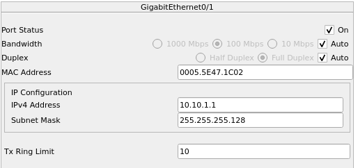

# Laboratorio 10

#### Jeloska Isabel Chavez Paredez
## Item 1
### Análisis de la IP de la red

- **Dirección de Red:** 72.25.76.0/23
- **Máscara de Subred:** 255.255.254.0
- **Rango de IP:** 72.25.76.0 - 72.25.77.255
- **Hosts Utilizables:** 72.25.76.1 - 72.25.77.254

#### Paso 1: Construcción de la arquitectura de red

#### Construcción de la Arquitectura de Red

Inicialmente, configuramos dos servidores: uno que funcionará como servidor DNS y DHCP, y otro que servirá como servidor web. Estos servidores están conectados a Switch1 mediante cables de cobre estándar, que proporcionan una conexión estable y fiable.

A continuación, añadimos tres PCs a la red. PC1 y PC2 se conectaron a Switch0 usando cables de cobre. Por otro lado, PC3 se conectó a Switch1, también utilizando un cable de cobre. Adicionalmente, incluimos una tableta que se conectará de forma inalámbrica a la red mediante un punto de acceso. Este punto de acceso se conectó a Switch0 con un cable de cobre, proporcionando conectividad inalámbrica para dispositivos móviles.

Para asegurar que todos los dispositivos en la red puedan comunicarse entre sí, conectamos los dos switches utilizando un enlace troncal (trunk link) configurado en el puerto Fa0/1 de ambos switches. Este enlace troncal es crucial para la cohesión de la red, permitiendo que los datos fluyan sin interrupciones entre los diferentes segmentos de la red y facilitando el manejo de múltiples VLANs si fuera necesario.

En la captura de pantalla, se puede observar la disposición de los dispositivos y sus conexiones. Cada dispositivo está conectado correctamente a su respectivo switch mediante los tipos de enlaces adecuados, formando una red organizada y funcional. Esta configuración inicial establece una base sólida para las etapas posteriores de configuración.

#### a) Asignación de Direcciones IP Estáticas

Procedemos a asignar direcciones IP estáticas a los servidores y a PC3, utilizando las primeras direcciones disponibles en la red 72.25.76.0/23. 

1. **Servidor DNS - DHCP:**
   

   - **Dirección IP:** 72.25.76.1
   - **Máscara de subred:** 255.255.254.0
   - **Puerta de enlace por defecto (Gateway):** No especificado (0.0.0.0)
   - **Servidor DNS:** 72.25.76.1 (autorreferenciado)

   La dirección IP 72.25.76.1 se asignó al servidor DNS - DHCP, siendo la primera dirección disponible en la red. Esta dirección permite que el servidor actúe como la principal fuente de servicios de DNS y DHCP para todos los dispositivos en la red. 

   No se especificó un gateway por defecto porque este servidor no necesita comunicarse fuera de su propia red. Al ser tanto el servidor DHCP como el servidor DNS, la configuración del servidor DNS se autoreferencia, permitiendo que los dispositivos de la red utilicen este servidor para resolver nombres de dominio.

1. **Servidor Web:**
   

   - **Dirección IP:** 72.25.76.2
   - **Máscara de subred:** 255.255.254.0
   - **Puerta de enlace por defecto:** No especificado (0.0.0.0)
   - **Servidor DNS:** 72.25.76.1

   El servidor web recibió la dirección IP 72.25.76.2, la segunda dirección en el rango. Esta configuración asegura que todos los dispositivos en la red puedan acceder al servidor web utilizando esta dirección específica. Al igual que el servidor DNS - DHCP, utiliza la misma máscara de subred para mantenerse dentro del mismo segmento de red. 

   Tampoco se especificó una puerta de enlace por defecto para el servidor web, ya que su función principal es servir contenido dentro de la misma red local. La configuración del servidor DNS apunta a 72.25.76.1, que es el servidor DNS - DHCP configurado anteriormente.

2. **PC3:**

   - **Dirección IP:** 72.25.76.3
   - **Máscara de subred:** 255.255.254.0
   - **Puerta de enlace por defecto:** No especificado (0.0.0.0)
   - **Servidor DNS:** 72.25.76.1

   La PC3 fue configurada con la dirección IP estática 72.25.76.3, la tercera dirección disponible. Esta configuración proporciona una dirección IP fija y conocida para PC3, permitiendo una fácil gestión y acceso a los recursos de la red. La máscara de subred 255.255.254.0 asegura que PC3 está en el mismo segmento de red que los otros dispositivos.

   Al igual que los servidores, PC3 no tiene especificada una puerta de enlace por defecto, ya que su comunicación se limita a la red local en este escenario. La configuración del servidor DNS también se establece en 72.25.76.1, permitiendo que PC3 utilice el servidor DNS - DHCP para la resolución de nombres.

### Configuración de los servidores 
#### Servidor DNS - DHCP

**Configuración DNS:**

El servidor DNS se configura para resolver nombres de dominio dentro de la red local. En este caso, configuramos el servidor DNS con la dirección IP 72.25.76.1 y establecimos el dominio "labtelematica.edu". Esta configuración permite que todos los dispositivos en la red puedan utilizar este servidor DNS para resolver nombres de dominio.

**Configuración DHCP:**

Configuramos el servidor DHCP para asignar direcciones IP automáticamente a los dispositivos de la red. El pool de direcciones DHCP comienza en 72.25.76.234 y proporciona hasta 20 direcciones IP. 

- **Nombre del pool:** serverPool
- **Dirección del servidor DNS:** 72.25.76.1
- **Dirección inicial del pool:** 72.25.76.234
- **Máscara de subred:** 255.255.254.0
- **Número máximo de usuarios:** 20

#### Servidor Web

**Configuración del Servicio HTTP y HTTPS:**

En el servidor web, habilitamos los servicios HTTP y HTTPS para permitir el acceso seguro y no seguro al contenido web. Esto se hace activando ambas opciones en la configuración del servidor. Además, editamos el archivo `index.html`.

### Configuracion IP Dinámica PC1, PC2 y Tablet

Cada dispositivo configurado para DHCP envía una solicitud al servidor DHCP al conectarse a la red. Las direcciones IP asignadas a cada dispositivo son únicas y se encuentran dentro del rango especificado en el servidor DHCP (72.25.76.234 - 72.25.76.253), evitando conflictos de direcciones.

**PC1:**

- **Modo de Configuración:** DHCP
- **Dirección IP Asignada:** 72.25.76.234
- **Máscara de Subred:** 255.255.254.0
- **Puerta de Enlace por Defecto:** 0.0.0.0 (no se utiliza gateway en este escenario)
- **Servidor DNS:** 72.25.76.1

En la captura de pantalla, se muestra que PC1 ha obtenido su configuración IP automáticamente del servidor DHCP. La dirección IP asignada es 72.25.76.234, la primera del rango DHCP configurado.

**PC2:**

- **Modo de Configuración:** DHCP
- **Dirección IP Asignada:** 72.25.76.235
- **Máscara de Subred:** 255.255.254.0
- **Puerta de Enlace por Defecto:** 0.0.0.0
- **Servidor DNS:** 72.25.76.1

La captura de pantalla muestra que PC2 también ha obtenido su configuración IP automáticamente. La dirección IP asignada es 72.25.76.235, la segunda del rango DHCP.

**Tableta:**

- **Modo de Configuración:** DHCP
- **Dirección IP Asignada:** 72.25.76.236
- **Máscara de Subred:** 255.255.254.0
- **Puerta de Enlace por Defecto:** 0.0.0.0
- **Servidor DNS:** 72.25.76.1

### Pruebas de conectividad

- **PC1 - Server DNS-DHCP (72.25.76.1) & Sever Web (72.25.76.2)**
  

- **PC2 - Server DNS-DHCP (72.25.76.1) & Sever Web (72.25.76.2)**

- **Tablet - Server DNS-DHCP (72.25.76.1) & Sever Web (72.25.76.2)**

- **Server DNS-DHCP - PC1 PC2 Tablet**

- **Server DNS-DHCP - PC1 PC2 Tablet**
  

### Pruebas de acceso a `http:// labtelematica.edu`

## Item 2

10.10.0.0/20
IP de red: 10.10.0.0

### Identificación de los requisitos de hosts por subred

1. **Subred A**: 200 hosts
2. **Subred B**: 100 hosts
3. **Subred C**: 50 hosts
4. **Subred D**: 2 hosts
5. **Subred E**: 2 hosts 

### Cálculo de las máscaras de subred

Para cada subred, calculamos la máscara de subred que puede soportar el número requerido de hosts más el direccionamiento de red y broadcast. Esto es $2^{n} - 2 \geq \text{Número de Hosts}$, donde $n$  es el número de bits en la parte host de la dirección IP.

- **Subred A** (200 hosts): Se necesitan al menos $\log_2(200 + 2) \approx 8$ bits, por lo tanto, la máscara de subred será /24 (256 direcciones, 254 hosts útiles).
- **Subred B** (100 hosts): Se necesitan al menos $\log_2(100 + 2) \approx 7$ bits, por lo tanto, la máscara de subred será /25 (128 direcciones, 126 hosts útiles).
- **Subred C** (50 hosts): Se necesitan al menos $\log_2(50 + 2) \approx 6$ bits, por lo tanto, la máscara de subred será /26 (64 direcciones, 62 hosts útiles).
- **Subred D** (2 hosts): Se necesitan al menos $\log_2(4 + 2) \approx 3$ bits, por lo tanto, la máscara de subred será /29 (8 direcciones, 6 hosts útiles).
- **Subred E** (2 hosts): Se necesitan al menos $\log_2(2 + 2) \approx 2$ bits, por lo tanto, la máscara de subred será /30 (4 direcciones, 2 hosts útiles).

### Asignación de direcciones IP

Usando el espacio de dirección $10.10.0.0/20$ y comenzando con la subred más grande:

1. **Subred A**: $10.10.0.0/24$
2. **Subred B**: $10.10.1.0/25$
3. **Subred C**: $10.10.1.128/26$
4. **Subred D**: $10.10.1.192/29$
5. **Subred E**: $10.10.1.200/30$

### Detalles para cada subred:

#### 1. Subred A - 200 Hosts
- **Dirección de red**: 10.10.0.0
- **Máscara de subred**: /24 (255.255.255.0)
- **Rango de direcciones utilizables**: 10.10.0.1 - 10.10.0.254
- **Dirección de broadcast**: 10.10.0.255

#### 2. Subred B - 100 Hosts
- **Dirección de red**: 10.10.1.0
- **Máscara de subred**: /25 (255.255.255.128)
- **Rango de direcciones utilizables**: 10.10.1.1 - 10.10.1.126
- **Dirección de broadcast**: 10.10.1.127

#### 3. Subred C - 50 Hosts
- **Dirección de red**: 10.10.1.128
- **Máscara de subred**: /26 (255.255.255.192)
- **Rango de direcciones utilizables**: 10.10.1.129 - 10.10.1.190
- **Dirección de broadcast**: 10.10.1.191

#### 4. Subred D - 2 Hosts
- **Dirección de red**: 10.10.1.192
- **Máscara de subred**: /30 (255.255.255.252)
- **Rango de direcciones utilizables**: 10.10.1.193 - 10.10.1.194
- **Dirección de broadcast**: 10.10.1.195

#### 5. Subred E - 2 Hosts 
- **Dirección de red**: 10.10.1.196
- **Máscara de subred**: /30 (255.255.255.252)
- **Rango de direcciones utilizables**: 10.10.1.197 - 10.10.1.198
- **Dirección de broadcast**: 10.10.1.199

### Configuración de la topología de red
#### Adición de módulos seriales

Para establecer conexiones seriales entre el router HQ y los routers B1 y B2, primero agregamos módulos seriales HWIC-2T a cada uno de estos routers. 

#### Cableado de la Red

Luego, procedimos a cablear la red, estableciendo enlaces seriales y Ethernet entre los dispositivos.

1. **Subred A (200 Hosts):** Esta subred está diseñada para soportar hasta 200 hosts.
   - **Dispositivos Incluidos:** Router B1, Switch0, y PC1.
   - **Conexiones:**
     - **Router B1 a Switch0:** Utilizando un cable GigaEthernet.
     - **Switch0 a PC1:** Conectado también mediante GigaEthernet.

2. **Subred B (100 Hosts):** Esta subred puede manejar hasta 100 hosts.
   - **Dispositivos Incluidos:** Router B2, Switch1, y PC3.
   - **Conexiones:**
     - **Router B2 a Switch1:** Conectado con un cable GigaEthernet.
     - **Switch1 a PC3:** Conexión mediante GigaEthernet.

3. **Subred C (50 Hosts):** Soporta hasta 50 hosts.
   - **Dispositivos Incluidos:** Switch2 y PC2.
   - **Conexiones:**
     - **Router HQ a Switch2:** Enlace mediante GigaEthernet.
     - **Switch2 a PC2:** Conectado con un cable GigaEthernet.

4. **Subred D (2 Hosts - Enlace WAN):** Enlace serial que conecta HQ con B1.
   - **Dispositivos Incluidos:** Router HQ y Router B1.
   - **Conexiones:**
     - **Router HQ a Router B1:** Utilizando un cable serial.

5. **Subred E (2 Hosts - Enlace WAN):** Enlace serial entre HQ y B2.
   - **Dispositivos Incluidos:** Router HQ y Router B2.
   - **Conexiones:**
     - **Router HQ a Router B2:** Conexión a través de un cable serial.

### Configuración de Interfaces
#### Router HQ

Primero, configuramos el router HQ. Para la interfaz Se0/0/0, que forma parte de la subred D, asignamos la dirección IP 10.10.1.193 con una máscara de subred 255.255.255.252. Esto permite que HQ tenga la primera dirección IP en esta subred para la conexión WAN con el router B1.

Para la interfaz Se0/0/1, también parte de una subred WAN, configuramos la dirección IP 10.10.1.197 con la misma máscara de subred. Esto asegura que HQ pueda comunicarse con el router B2 usando la primera dirección IP de la subred E.

La interfaz Gi0/1 de HQ, que se conecta a la LAN de la subred C, recibió la dirección IP 10.10.1.129 con una máscara de subred 255.255.255.192. Esto garantiza que HQ gestione la comunicación dentro de esta subred de manera eficiente.

#### Router B1

El siguiente en la lista fue el router B1. Para la interfaz Se0/0/0, asignamos la dirección IP 10.10.1.194 con una máscara de subred 255.255.255.252. Esta configuración permite que B1 use la última dirección IP de la subred D para la conexión con HQ.

La interfaz Gi0/1 de B1, que conecta a la subred A, recibió la dirección IP 10.10.0.1 con una máscara de subred 255.255.255.0, asignándole así la primera dirección IP de esta subred para gestionar la LAN.

#### Router B2

Para el router B2, configuramos la interfaz Se0/0/1 con la dirección IP 10.10.1.198 y una máscara de subred 255.255.255.252. Al igual que B1, B2 usa la última dirección IP de la subred E para su conexión WAN con HQ.

La interfaz Gi0/1 de B2, que se conecta a la subred B, fue configurada con la dirección IP 10.10.1.1 y una máscara de subred 255.255.255.128, asignándole la primera dirección IP de esta subred para gestionar la LAN.

#### PCs

Finalmente, configuramos las PCs. PC1, que se encuentra en la subred A, recibió la dirección IP 10.10.0.254 con una máscara de subred 255.255.255.0. Esto asigna la última dirección IP de la subred A, asegurando que las direcciones estén bien distribuidas.

PC2, ubicada en la subred C, recibió la dirección IP 10.10.1.190 con una máscara de subred 255.255.255.192. Esta configuración utiliza eficientemente la última dirección IP de la subred C.

PC3, en la subred B, fue configurada con la dirección IP 10.10.1.126 y una máscara de subred 255.255.255.128. Esta configuración asigna la última dirección IP de la subred B para maximizar el uso de direcciones disponibles.

### Esquema de direccionamiento

| Dispositivo | Interfaz | Dirección IP  | Máscara de subred   |
|-------------|----------|---------------|---------------------|
| HQ          | 1        | 10.10.1.193   | 255.255.255.252     |
| HQ          | 2        | 10.10.1.197   | 255.255.255.252     |
| HQ          | 3        | 10.10.1.129   | 255.255.255.192     |
| B1          | 1        | 10.10.1.194   | 255.255.255.252     |
| B1          | 2        | 10.10.0.1     | 255.255.255.0       |
| B2          | 1        | 10.10.1.198   | 255.255.255.252     |
| B2          | 2        | 10.10.1.1     | 255.255.255.128     |
| PC1         | 1        | 10.10.0.254   | 255.255.255.0       |
| PC2         | 1        | 10.10.1.190   | 255.255.255.192     |
| PC3         | 1        | 10.10.1.126   | 255.255.255.128     |

