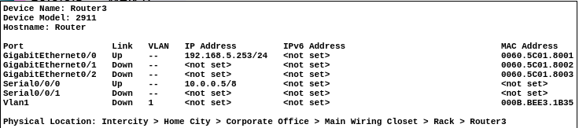

# Laboratorio 11
#### Jeloska Isabel Chavez Paredez

## Item 1

### Construcción de la topología de red

Agregamos tres routers modelo Cisco 2911 al escenario de Packet Tracer. Estos routers serán los nodos centrales que manejarán el enrutamiento de nuestra red. Luego, colocamos tres switches Cisco PT, que servirán de intermediarios entre los routers y los dispositivos finales (PCs).

#### Configuración de los módulos seriales

Dado que necesitamos conexiones WAN entre los routers, cada router fue equipado con un módulo HWIC-2T, que proporciona dos puertos seriales de alta velocidad. Para añadir este módulo, seleccionamos cada router en el escenario, accedimos a la configuración física, y agregamos el módulo HWIC-2T.


#### Conexiones físicas

Una vez configurados los routers con los módulos necesarios, procedimos a realizar las conexiones físicas entre los dispositivos:

- **Conexión de PCs a Switches**: 
  - PC1 se conectó a Switch1 usando un cable Ethernet.
  - PC2 se conectó a Switch2 utilizando un cable Ethernet.
  - PC3 se conectó a Switch3, también con un cable Ethernet.

Estas conexiones establecieron la comunicación básica de los PCs con sus respectivos switches, permitiendo así la creación de la subred para cada PC.

- **Conexión de switches a routers**:
  - Switch1 se conectó al puerto GigabitEthernet0/0 de Router1.
  - Switch2 se conectó al puerto GigabitEthernet0/0 de Router2.
  - Switch3 se conectó al puerto GigabitEthernet0/0 de Router3.

Estas conexiones establecen que cada PC estuviera conectado a su router correspondiente a través de un switch, formando la base de nuestra topología LAN.

- **Conexiones WAN entre routers**:
  - Para conectar Router1 a Router2, utilizamos un cable serial, conectando el puerto Serial0/0/0 de Router1 al puerto Serial0/0/0 de Router2.
  - Para conectar Router2 a Router3, usamos otro cable serial, conectando el puerto Serial0/0/1 de Router2 al puerto Serial0/0/0 de Router3.

Estas conexiones seriales entre los routers permiten la creación de las redes WAN.


### Configuración de IPs

#### Subred LAN A
- **IP Subred**: 192.168.3.0/24
- **IP red**: 192.168.3.0
- **Broadcast**: 192.168.3.255
- **Rango**: 192.168.3.1 - 192.168.3.254
- **IP PC1**: 192.168.3.1
- **IP Router1 (LAN)**: 192.168.3.254

#### Subred LAN B
- **IP Subred**: 192.168.5.0/24
- **IP red**: 192.168.5.0
- **Broadcast**: 192.168.5.255
- **Rango**: 192.168.5.1 - 192.168.5.254
- **IP PC2**: 192.168.5.1
- **IP Router2 (LAN)**: 192.168.5.254
- **IP Router3 (LAN)**: 192.168.5.253

#### Subred LAN C
- **IP Subred**: 192.168.7.0/24
- **IP red**: 192.168.7.0
- **Broadcast**: 192.168.7.255
- **Rango**: 192.168.7.1 - 192.168.7.254
- **IP PC3**: 192.168.7.1
- **IP Router4 (LAN)**: 192.168.7.254

#### Subred WAN A (entre Router1 y Router2)
- **IP Subred**: 10.0.0.0/30
- **IP red**: 10.0.0.0
- **Broadcast**: 10.0.0.3
- **Rango**: 10.0.0.1 - 10.0.0.2
- **IP Router1 (WAN)**: 10.0.0.1
- **IP Router2 (WAN)**: 10.0.0.2

#### Subred WAN B (entre Router3 y Router4)
- **IP Subred**: 10.0.0.4/30
- **IP red**: 10.0.0.4
- **Broadcast**: 10.0.0.7
- **Rango**: 10.0.0.5 - 10.0.0.6
- **IP Router3 (WAN)**: 10.0.0.5
- **IP Router4 (WAN)**: 10.0.0.6

### Configuración de los dispositivos

#### PC1
En PC1, configuramos la dirección IP dentro de la subred LAN A. La dirección asignada fue 192.168.3.1, y la puerta de enlace predeterminada fue configurada como 192.168.3.254, que corresponde a la dirección IP de la interfaz LAN del Router1. Esta configuración permite a PC1 comunicarse con otros dispositivos en la subred 192.168.3.0/24 y enviar tráfico fuera de la subred a través de Router1.


#### PC2
Para PC2, la configuración de IP fue realizada dentro de la subred LAN B. Asignamos la dirección IP 192.168.5.1, con la puerta de enlace predeterminada 192.168.5.254, que es la dirección IP de la interfaz LAN del Router2. Esto permite a PC2 comunicarse con otros dispositivos en la subred 192.168.5.0/24 y acceder a redes externas a través de Router2.


#### PC3
PC3 fue configurado dentro de la subred LAN C. La dirección IP asignada fue 192.168.7.1, con la puerta de enlace predeterminada configurada en 192.168.7.254, que es la dirección IP de la interfaz LAN del Router4. Esta configuración permite a PC3 comunicarse con otros dispositivos en la subred 192.168.7.0/24 y enviar tráfico fuera de la subred a través de Router4.


#### Router1
Router1 fue configurado para manejar tanto la subred LAN A como la conexión WAN A. La interfaz LAN de Router1 fue configurada con la dirección IP 192.168.3.254, que actúa como la puerta de enlace para los dispositivos en la subred 192.168.3.0/24. La interfaz WAN fue configurada con la dirección IP 10.0.0.1, permitiendo la conexión a Router2 a través de la subred WAN A.


#### Router2
Router2 fue configurado para manejar la subred LAN B y la conexión WAN A. La interfaz LAN de Router2 tiene la dirección IP 192.168.5.254, que sirve como puerta de enlace para los dispositivos en la subred 192.168.5.0/24. La interfaz WAN tiene la dirección IP 10.0.0.2, permitiendo la conexión a Router1. Además, Router2 tiene otra interfaz LAN configurada en 192.168.5.253 para la comunicación con Router3 dentro de la misma subred.


#### Router3
Router3 fue configurado para manejar la subred LAN B y la conexión WAN B. La interfaz LAN de Router3 fue configurada con la dirección IP 192.168.5.253, que permite la comunicación con Router2. La interfaz WAN fue configurada con la dirección IP 10.0.0.5, permitiendo la conexión a Router4 a través de la subred WAN B.



#### Router4
Router4 fue configurado para manejar la subred LAN C y la conexión WAN B. La interfaz LAN de Router4 tiene la dirección IP 192.168.7.254, que actúa como la puerta de enlace para los dispositivos en la subred 192.168.7.0/24. La interfaz WAN fue configurada con la dirección IP 10.0.0.6, permitiendo la conexión a Router3 a través de la subred WAN B.


### Configuración de OSPF

Para facilitar el enrutamiento dinámico en la red, configuramos el protocolo OSPF en cada uno de los routers. A continuación, se detalla el proceso de configuración de manera descriptiva y clara.

#### Configuración de OSPF en Router1

En el Router1, comenzamos accediendo al modo de configuración y luego iniciamos el proceso OSPF con el identificador de proceso 1. Este identificador es único para este router y no necesita coincidir con los otros routers.

El primer paso fue asociar la red LAN 192.168.3.0/24 al proceso OSPF. Usamos el comando `network 192.168.3.0 0.0.0.255 area 0`, que indica a OSPF que incluya esta red en el área 0. El área 0 es el backbone de OSPF, una zona esencial para la comunicación entre diferentes áreas en una red OSPF.

Luego, configuramos la red WAN, que conecta Router1 con Router2. Para esto, utilizamos el comando `network 10.0.0.0 0.0.0.3 area 0`, que especifica la subred 10.0.0.0/30. La máscara 0.0.0.3 indica que solo los primeros dos bits de la dirección IP pueden variar, lo que se ajusta perfectamente a una subred /30. 

Después de introducir estos comandos, salimos del modo de configuración de OSPF para completar la configuración. Ahora, Router1 está listo para intercambiar rutas OSPF con los otros routers de la red.


#### Configuración de OSPF en Router2

En Router2, repetimos un proceso similar al de Router1. 

1. **Iniciar el proceso OSPF:**
   ```
   router ospf 1
   ```
   Este comando inicia el proceso OSPF con el identificador de proceso 1. Este identificador es único para este router y no necesita coincidir con los otros routers. Es simplemente un número de referencia para este proceso OSPF dentro del router.

2. **Asociar la red LAN al proceso OSPF:**
   ```
   network 192.168.5.0 0.0.0.255 area 0
   ```
   Este comando indica a OSPF que incluya la red 192.168.5.0/24 en el área 0. La máscara de wildcard 0.0.0.255 significa que los primeros tres octetos de la dirección IP deben coincidir exactamente y el último octeto puede variar, lo que es adecuado para una subred /24. 

3. **Asociar la Red WAN al Proceso OSPF:**
   ```
   network 10.0.0.0 0.0.0.3 area 0
   ```
   Este comando incluye la subred WAN 10.0.0.0/30 en el área 0 de OSPF. La máscara de wildcard 0.0.0.3 significa que los primeros 30 bits de la dirección IP deben coincidir, permitiendo que los últimos dos bits varíen, lo que es adecuado para una subred /30.

4. **Salir del Modo de Configuración OSPF:**
   ```
   exit
   ```
   Después de configurar las redes, salimos del modo de configuración de OSPF. Esto asegura que las configuraciones se apliquen y que el router empiece a participar en el enrutamiento OSPF con los otros routers.

Con estos comandos, Router2 está configurado para intercambiar rutas OSPF tanto para su red LAN como para su conexión WAN con Router1. 


#### Configuración de OSPF en Router3

En Router3, configuramos OSPF para gestionar tanto la subred compartida con Router2 como la conexión WAN a Router4. Nuevamente, comenzamos por acceder al modo de configuración y activamos OSPF.

Primero, incluimos la red LAN 192.168.5.0/24 en OSPF con el comando `network 192.168.5.0 0.0.0.255 area 0`. Esta red es compartida con Router2, por lo que es importante que ambos routers intercambien información de enrutamiento sobre esta subred.

Luego, configuramos la conexión WAN entre Router3 y Router4 con el comando `network 10.0.0.4 0.0.0.3 area 0`. Esto asegura que la subred WAN 10.0.0.4/30, que conecta estos dos routers, esté incluida en el proceso OSPF y que Router3 pueda comunicarse eficazmente con Router4.


#### Configuración de OSPF en Router4

Finalmente, en Router4, seguimos un procedimiento similar para configurar OSPF. Iniciamos el proceso OSPF con el mismo identificador de proceso 1 y comenzamos a asociar nuestras redes.

Para la red LAN, usamos `network 192.168.7.0 0.0.0.255 area 0`, indicando que todos los dispositivos en la subred 192.168.7.0/24 deben ser parte del área 0 de OSPF. Esta red permite la comunicación interna dentro de la subred y el acceso a otras subredes a través del enrutamiento OSPF.

Para la conexión WAN entre Router4 y Router3, usamos el comando `network 10.0.0.4 0.0.0.3 area 0`. Este comando asegura que la subred WAN 10.0.0.4/30 esté correctamente configurada para participar en el enrutamiento dinámico, permitiendo a Router4 intercambiar rutas con Router3.


### Comprobación de conexiones

Después de configurar OSPF en los routers y asignar las direcciones IP a cada dispositivo, procedimos a comprobar la conectividad entre las diferentes subredes de la red. Utilizamos el comando `ping` desde cada PC para verificar la conectividad con otros dispositivos en la red.

#### Verificación desde PC1

Desde PC1, realizamos pings a PC2 (192.168.5.1) y PC3 (192.168.7.1) para asegurar que todas las rutas estén correctamente configuradas y operativas. Los resultados mostraron que PC1 pudo comunicarse exitosamente con ambos dispositivos.


#### Verificación desde PC2

Desde PC2, realizamos pings a PC1 (192.168.3.1) y PC3 (192.168.7.1). Los resultados confirmaron que PC2 pudo comunicarse sin problemas con ambos dispositivos.


#### Verificación desde PC3

Desde PC3, realizamos pings a PC1 (192.168.3.1) y PC2 (192.168.5.1). Los resultados indicaron que PC3 pudo comunicarse exitosamente con ambos dispositivos.


### Tabla de enrutamiento en Router2

Para obtener la tabla de enrutamiento, el comando ejecutado fue:

```bash
show ip route
```

Este comando muestra todas las rutas conocidas por el router, incluyendo las rutas aprendidas a través de OSPF.


Las rutas marcadas con 'O' son rutas aprendidas a través de OSPF. 
1. **Ruta a la red 192.168.3.0/24:**
   ```plaintext
   O    192.168.3.0/24 [110/65] via 10.0.0.1, 02:09:50, Serial0/0/0
   ```
   - **O:** Indica que la ruta fue aprendida a través de OSPF.
   - **192.168.3.0/24:** La red de destino.
   - **[110/65]:** El primer número (110) es la distancia administrativa para OSPF. El segundo número (65) es el costo o métrica para alcanzar esta red.
   - **via 10.0.0.1:** La dirección del siguiente salto hacia la red 192.168.3.0/24.
   - **02:09:50:** El tiempo que la ruta ha estado en la tabla de enrutamiento.
   - **Serial0/0/0:** La interfaz de salida utilizada para alcanzar el siguiente salto.

2. **Ruta a la red 192.168.7.0/24:**
   ```plaintext
   O    192.168.7.0/24 [110/66] via 192.168.5.253, 02:09:50, GigabitEthernet0/0
   ```
   - **O:** Indica que la ruta fue aprendida a través de OSPF.
   - **192.168.7.0/24:** La red de destino.
   - **[110/66]:** El primer número (110) es la distancia administrativa para OSPF. El segundo número (66) es el costo o métrica para alcanzar esta red.
   - **via 192.168.5.253:** La dirección del siguiente salto hacia la red 192.168.7.0/24.
   - **02:09:50:** El tiempo que la ruta ha estado en la tabla de enrutamiento.
   - **GigabitEthernet0/0:** La interfaz de salida utilizada para alcanzar el siguiente salto.

Estas rutas muestran que Router 2 ha aprendido sobre las redes 192.168.3.0/24 y 192.168.7.0/24 a través de OSPF, y puede reenviar paquetes a estas redes utilizando las interfaces Serial0/0/0 y GigabitEthernet0/0 respectivamente. La métrica indica el costo para llegar a estas redes, lo cual OSPF utiliza para determinar la mejor ruta disponible.


## Item 2

### Topología y configuración de IPs


En esta red, diseñamos una topología donde tres routers están conectados en serie, formando dos enlaces seriales distintos. La configuración de direcciones IP se efectuó de la siguiente manera:

- **Router1 (R1)** se conecta a **Router2 (R2)** mediante la subred 172.16.0.0/19. La interfaz de R1 tiene la dirección IP 172.16.0.1, mientras que la interfaz correspondiente en R2 utiliza la dirección IP 172.16.0.2.

- **Router2 (R2)** se conecta a **Router3 (R3)** utilizando la subred 172.16.32.0/19. En este caso, la interfaz de R2 que conecta a R3 tiene la dirección IP 172.16.32.1, y la interfaz de R3 utiliza la dirección IP 172.16.32.2.


### Configuración de las interfaces 

**Router1**

Router1 tiene una interfaz serial configurada para la subred 172.16.0.0/19. La interfaz Serial0/0/0 de R1 se configura con la dirección IP 172.16.0.1 y se activa para la comunicación.


**Router2**

Router2 tiene dos interfaces seriales. La interfaz Serial0/0/0 se configura para la subred 172.16.0.0/19 con la dirección IP 172.16.0.2, mientras que la interfaz Serial0/0/1 se configura para la subred 172.16.32.0/19 con la dirección IP 172.16.32.1. Ambas interfaces se activaron para asegurar la conectividad.


**En Router3**

Router3 tiene una interfaz serial configurada para la subred 172.16.32.0/19. La interfaz Serial0/0/0 de R3 se configura con la dirección IP 172.16.32.2 y se activa para la comunicación.


## Configuración de enrutamiento estático


#### En Router1

Primero accedimos al modo de configuración global y configuramos una ruta estática para la red 172.16.32.0/19, que se encuentra en el extremo opuesto a través de Router2. La ruta estática se configura con el comando `ip route`, especificando la red de destino, la máscara de subred y la dirección IP del siguiente salto.


**Configuración de la ruta estática**:
   ```plaintext
   Router(config)# ip route 172.16.32.0 255.255.224.0 172.16.0.2
   ```
 Establecemos que cualquier paquete destinado a la red 172.16.32.0/19 debe ser enviado a la dirección IP 172.16.0.2, que es la interfaz de Router2. 


#### En Router2

Router2 actúa como intermediario entre R1 y R3. Por ello, configuramos dos rutas estáticas. La primera ruta permite que los paquetes destinados a la red 172.16.0.0/19 se envíen a través de 172.16.0.1 (Router1), y la segunda ruta asegura que los paquetes destinados a la red 172.16.32.0/19 se envíen a través de 172.16.32.2 (Router3).


**Configurar las rutas estáticas**:
   - Para la red 172.16.0.0/19 a través de Router1:
     ```plaintext
     Router(config)# ip route 172.16.0.0 255.255.224.0 172.16.0.1
     ```

     Este comando indica que cualquier paquete destinado a la red 172.16.0.0/19 debe ser enviado a la dirección IP 172.16.0.1, que es la interfaz de Router1.

   - Para la red 172.16.32.0/19 a través de Router3:
     ```plaintext
     Router(config)# ip route 172.16.32.0 255.255.224.0 172.16.32.2
     ```

Cualquier paquete destinado a la red 172.16.32.0/19 debe ser enviado a la dirección IP 172.16.32.2, que es la interfaz de Router3.


#### En Router3 (R3)

Finalmente, Router3 necesita saber cómo alcanzar la red 172.16.0.0/19 que se encuentra en el extremo opuesto a través de Router2. Configuramos una ruta estática en Router3 para que cualquier paquete destinado a la red 172.16.0.0/19 sea enviado a la dirección IP 172.16.32.1 (Router2).


**Configurar la ruta estática**:
   ```plaintext
   Router(config)# ip route 172.16.0.0 255.255.224.0 172.16.32.1
   ```

   Este comando indica que cualquier paquete destinado a la red 172.16.0.0/19 debe ser enviado a la dirección IP 172.16.32.1 que es la interfaz de Router2.


## Tablas de enrutamiento

#### Router1 (R1)


- **C 172.16.0.0/19**: Esta ruta indica que la subred 172.16.0.0/19 está directamente conectada a la interfaz Serial0/0/0 de R1. La "C" significa "Connected", lo que implica que esta red es directamente accesible desde R1.
  
- **L 172.16.0.1/32**: Esta entrada muestra que la dirección IP 172.16.0.1 está directamente conectada a la interfaz Serial0/0/0. La "L" significa "Local", indicando que esta es una IP asignada localmente al router.

- **S 172.16.32.0/19 [1/0] via 172.16.0.2**: Esta es una ruta estática ("S" significa "Static") que indica que para alcanzar la subred 172.16.32.0/19, los paquetes deben ser enviados a través de la dirección IP 172.16.0.2, que es la interfaz de Router2. El número [1/0] representa la métrica y el coste de la ruta.

#### Router2 


- **C 172.16.0.0/19**: Esta ruta indica que la subred 172.16.0.0/19 está directamente conectada a la interfaz Serial0/0/0 de R2. La "C" significa que es una red conectada directamente.

- **L 172.16.0.2/32**: Esta entrada muestra que la dirección IP 172.16.0.2 está directamente conectada a la interfaz Serial0/0/0. Esta es la IP asignada localmente a R2.

- **C 172.16.32.0/19**: Esta ruta indica que la subred 172.16.32.0/19 está directamente conectada a la interfaz Serial0/0/1 de R2. Al igual que la anterior, la "C" indica una conexión directa.

- **L 172.16.32.1/32**: Esta entrada muestra que la dirección IP 172.16.32.1 está directamente conectada a la interfaz Serial0/0/1.

#### Router3 (R3)


- **S 172.16.0.0/19 [1/0] via 172.16.32.1**: Esta es una ruta estática que indica que para alcanzar la subred 172.16.0.0/19, los paquetes deben ser enviados a través de la dirección IP 172.16.32.1, que es la interfaz de Router2. La "S" indica que es una ruta estática, y [1/0] representa la métrica de la ruta.

- **C 172.16.32.0/19**: Esta ruta indica que la subred 172.16.32.0/19 está directamente conectada a la interfaz Serial0/0/0 de R3. La "C" significa una conexión directa.

- **L 172.16.32.2/32**: Esta entrada muestra que la dirección IP 172.16.32.2 está directamente conectada a la interfaz Serial0/0/0. Esta es la IP asignada localmente a R3.

