# Laboratorio 12

#### Jeloska Isabel Chavez Paredez

## Item 1

### Construcción de la Topología
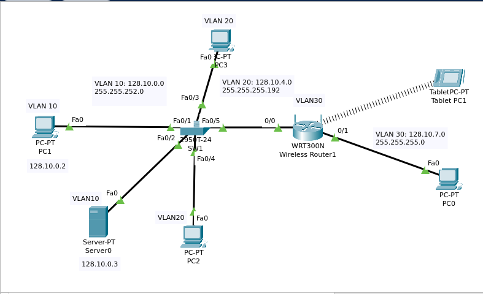

Se procedió a la configuración de la red utilizando VLANs para segmentar el tráfico. La topología consta de un switch (SW1) central al cual se conectaron varios dispositivos. En la VLAN 10, se conectaron PC1 y Server0 a los puertos Fa0/1 y Fa0/2, respectivamente. La VLAN 20 incluyó a PC2 y PC3 conectados a los puertos Fa0/3 y Fa0/5. Por último, se asignó la VLAN 30 al puerto Fa0/4, que conecta al router inalámbrico (Wireless Router1), el cual también proporciona conectividad a la Tablet PC0 mediante una conexión inalámbrica. Las subredes asignadas son 128.10.0.0/22 para VLAN 10, 128.10.4.0/26 para VLAN 20 y 128.10.7.0/24 para VLAN 30, asegurando así la correcta segmentación y comunicación entre los dispositivos de la red.

### Configuracion de IPs

### Configuración de las VLANs y Asignación de Direcciones IP

#### VLAN 10
**PC1:**
PC1 se configuró con una dirección IP de 128.10.0.2/22 y una puerta de enlace predeterminada de 128.10.0.1. Esta configuración asegura que PC1 esté correctamente segmentado en la subred asignada a la VLAN 10.

**Server0:**
Server0 se configuró con una dirección IP de 128.10.0.3/22 y la misma puerta de enlace predeterminada de 128.10.0.1. Esto permite a Server0 comunicarse dentro de la subred VLAN 10 y acceder a otros recursos de red asignados a la misma VLAN.

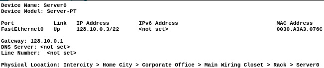

#### VLAN 20
**PC2:**
PC2 se configuró con una dirección IP de 128.10.4.3/26 y una puerta de enlace predeterminada de 128.10.4.1. Esta configuración le permite a PC2 operar dentro de la subred VLAN 20.

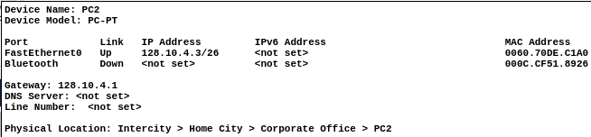

**PC3:**
PC3 se configuró con una dirección IP de 128.10.4.2/26 y la misma puerta de enlace predeterminada de 128.10.4.1, facilitando la comunicación dentro de la VLAN 20.

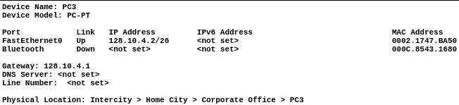

#### VLAN 30
**Wireless Router1:**
El Wireless Router1 se configuró con una dirección IP de 128.10.7.2/24 para la interfaz de Internet y una dirección IP de 10.0.0.1/27 para la LAN. La configuración incluye una conexión inalámbrica que permite a la Tablet PC0 conectarse a la VLAN 30. La puerta de enlace para esta VLAN es 128.10.7.1.

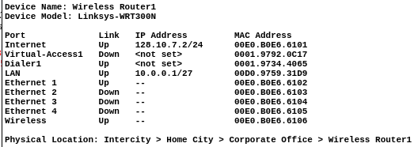

Estos ajustes aseguran que cada dispositivo esté correctamente configurado dentro de su respectiva VLAN, permitiendo una segmentación de red efectiva y una adecuada asignación de recursos y tráfico dentro de la red.

### Configuración del Servidor DHCP en el Router Inalámbrico
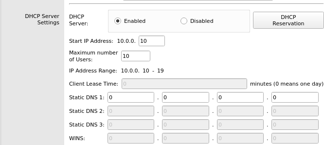
El servidor DHCP en el Wireless Router1 fue habilitado para asignar direcciones IP dinámicamente a los dispositivos conectados. La configuración se estableció con un rango de direcciones IP desde 10.0.0.10 hasta 10.0.0.19, permitiendo un máximo de 10 usuarios.

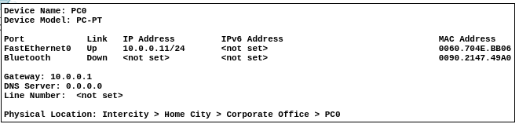
PC0 se configuró para obtener su dirección IP mediante DHCP. Al conectarse al Wireless Router1, PC0 recibió la dirección IP 10.0.0.11/24 con la puerta de enlace predeterminada 10.0.0.1. Esto asegura que PC0 pueda comunicarse dentro de la red inalámbrica asignada a la VLAN 30.

### Configuración de la Red Inalámbrica en el Router
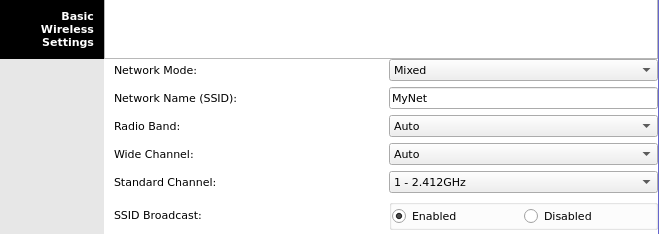
En el Wireless Router1, se configuró el modo de red en "Mixed", lo que permite la compatibilidad con diferentes estándares de Wi-Fi. El nombre de la red (SSID) se estableció como "MyNet". La banda de radio y el canal estándar se configuraron automáticamente, con el canal estándar establecido en 1 (2.412 GHz). La transmisión del SSID fue habilitada para que la red sea visible a los dispositivos inalámbricos.

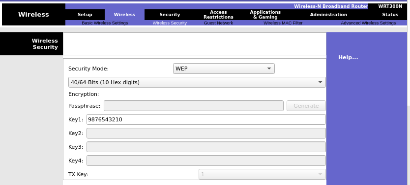
Para la seguridad de la red inalámbrica, se utilizó el modo WEP con una clave de 40/64 bits. La clave de seguridad configurada fue "9876543210". Esta clave fue introducida en el campo "Key1" para habilitar el cifrado de las comunicaciones inalámbricas.

### Conexión Inalámbrica de la Tablet PC1

**Configuración de la Tablet PC1:**
Para conectar la Tablet PC1 a la red inalámbrica configurada, se efectuaron los siguientes pasos:

1. **Configuración del SSID:**
   La Tablet PC1 se configuró para conectarse al SSID "MyNet".

2. **Autenticación y Seguridad:**
   La opción de autenticación WEP fue seleccionada, y se ingresó la clave de seguridad "9876543210" en el campo correspondiente.

3. **Configuración de IP:**
   La configuración IP se estableció en modo DHCP para que la Tablet PC1 obtuviera automáticamente una dirección IP del servidor DHCP configurado en el Wireless Router1.

4. **Configuración IPv6:**
   La configuración IPv6 se dejó en modo automático para asignar una dirección IPv6 de enlace local.

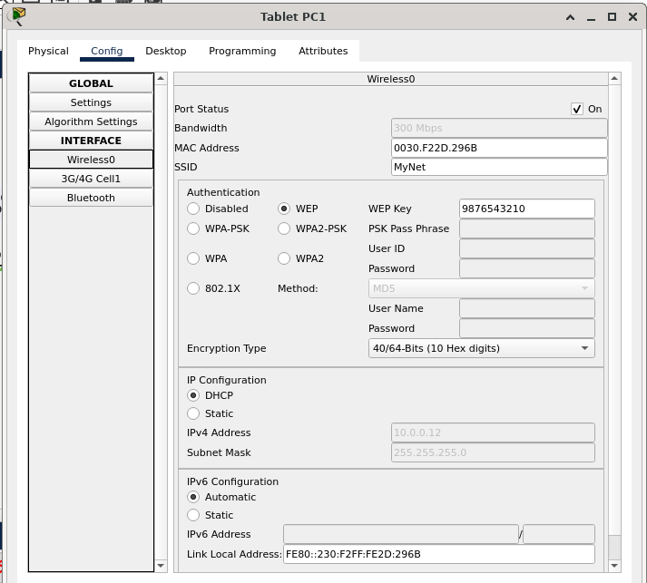

### Configuración del Switch y del Router para Comunicación entre VLANs

**Configuración del Trunk en el Switch (SW1):**
Para permitir la comunicación entre las VLANs, se configuró el puerto Fa0/6 del switch como un enlace troncal. Este enlace troncal permite el paso de tráfico de las VLANs 10, 20 y 30. 

Primero, se ingresó al modo de configuración global y luego al modo de configuración de la interfaz Fa0/6. Se configuró el modo del puerto como trunk y se especificaron las VLANs permitidas (10, 20 y 30). Después de aplicar estos comandos, se verificó la configuración del enlace troncal con el comando `show interface trunk`. Esto confirmó que el puerto Fa0/6 estaba operando en modo trunk, permitiendo el tráfico de las VLANs especificadas y utilizando la encapsulación 802.1q.

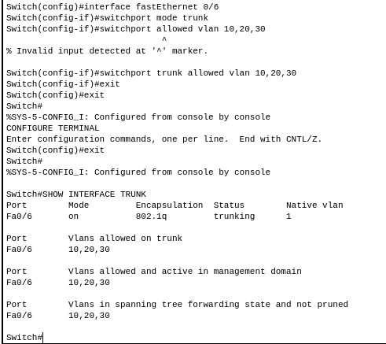

**Configuración del Router para Inter-VLAN Routing:**
El router se configuró para manejar el tráfico entre las VLANs mediante subinterfaces en el puerto GigabitEthernet 0/0. Cada subinterfaz se configuró con la encapsulación 802.1q correspondiente y una dirección IP para servir como puerta de enlace para cada VLAN.

Primero, se ingresó al modo de configuración global y luego al modo de configuración de la interfaz GigabitEthernet 0/0. Se crearon tres subinterfaces: `GigabitEthernet 0/0.10` para VLAN 10, `GigabitEthernet 0/0.20` para VLAN 20, y `GigabitEthernet 0/0.30` para VLAN 30. En cada subinterfaz, se especificó la encapsulación dot1q con el número de VLAN correspondiente y se asignó una dirección IP. Después de configurar cada subinterfaz, se verificó que las interfaces estaban en estado activo.

La subinterfaz `GigabitEthernet 0/0.10` se configuró con la encapsulación dot1q 10 y la dirección IP 128.10.0.1/22, actuando como la puerta de enlace para VLAN 10. La subinterfaz `GigabitEthernet 0/0.20` se configuró con la encapsulación dot1q 20 y la dirección IP 128.10.4.1/26 para VLAN 20. Finalmente, la subinterfaz `GigabitEthernet 0/0.30` se configuró con la encapsulación dot1q 30 y la dirección IP 128.10.7.1/24 para VLAN 30.
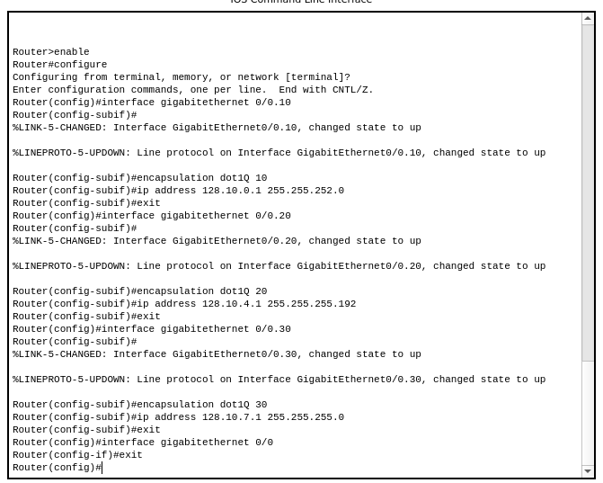

### Configuración del Servidor DNS y Verificación del Acceso Web
En el servidor Server0, se habilitó el servicio DNS y se agregó un registro A para el dominio "www.miweb.com" apuntando a la dirección IP 128.10.0.3. Esto permite que las solicitudes de resolución de nombres para "www.miweb.com" sean atendidas por Server0, resolviendo la dirección IP correspondiente.

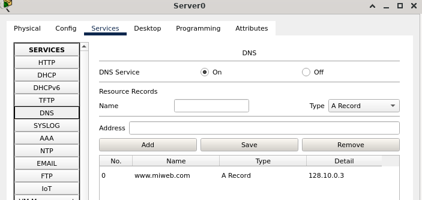
Se configuraron los hosts (PC1, PC2, PC3, PC0 y Tablet PC1) para utilizar el servidor DNS de Server0. Posteriormente, se verificó que todos los hosts pudieran acceder al sitio web "www.miweb.com" utilizando sus navegadores web. Las pruebas confirmaron que todos los dispositivos podían resolver el dominio y acceder a la página web correctamente.
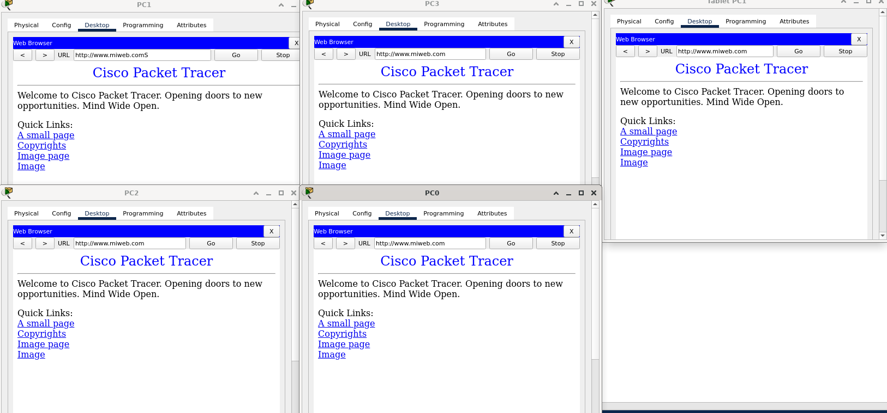

### Tabla de encrutamiento del Router

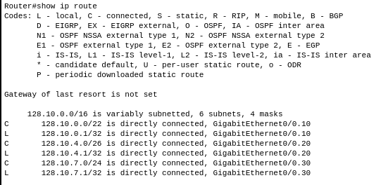

- **128.10.0.0/22**: Esta ruta indica que la red 128.10.0.0 con una máscara de subred /22 está directamente conectada a la subinterfaz `GigabitEthernet 0/0.10`. Esto se configura para la VLAN 10.
  
- **128.10.0.1/32**: Es una ruta local que indica que la dirección IP 128.10.0.1 está directamente conectada a la subinterfaz `GigabitEthernet 0/0.10`. Esta es la dirección IP asignada a la subinterfaz para la VLAN 10.

- **128.10.4.0/26**: Esta ruta indica que la red 128.10.4.0 con una máscara de subred /26 está directamente conectada a la subinterfaz `GigabitEthernet 0/0.20`. Esto se configura para la VLAN 20.

- **128.10.4.1/32**: Es una ruta local que indica que la dirección IP 128.10.4.1 está directamente conectada a la subinterfaz `GigabitEthernet 0/0.20`. Esta es la dirección IP asignada a la subinterfaz para la VLAN 20.

- **128.10.7.0/24**: Esta ruta indica que la red 128.10.7.0 con una máscara de subred /24 está directamente conectada a la subinterfaz `GigabitEthernet 0/0.30`. Esto se configura para la VLAN 30.

- **128.10.7.1/32**: Es una ruta local que indica que la dirección IP 128.10.7.1 está directamente conectada a la subinterfaz `GigabitEthernet 0/0.30`. Esta es la dirección IP asignada a la subinterfaz para la VLAN 30.

## Item 2

### Configuración de los Switches con VTP

**Configuración de SW0 como Servidor VTP:**
En el switch SW0, se estableció el dominio VTP con el nombre "lab273" y se configuró el switch como servidor VTP. Además, se configuró una contraseña VTP para asegurar las comunicaciones.

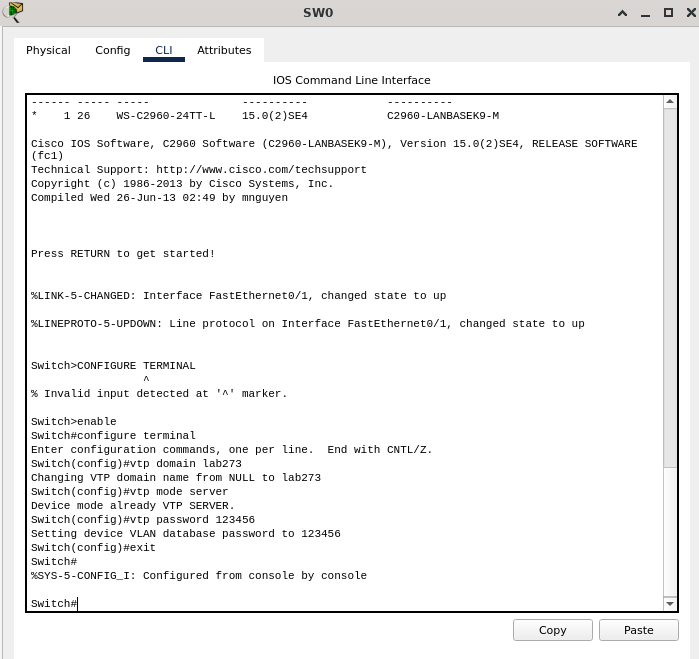
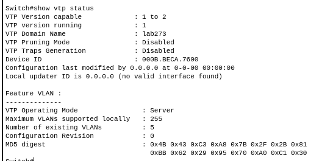

**Configuración de SW1 como Cliente VTP:**
En el switch SW1, se configuró el mismo dominio VTP "lab273" y se estableció el switch en modo cliente VTP. También se configuró la misma contraseña VTP.

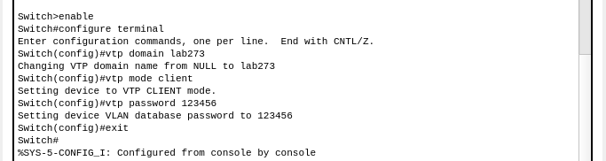

**Configuración de SW2 como Cliente VTP:**
En el switch SW2, se configuró el dominio VTP "lab273" y se estableció el switch en modo cliente VTP con la misma contraseña VTP.

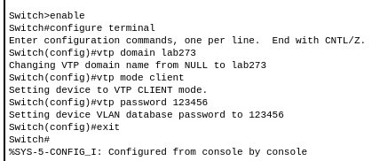
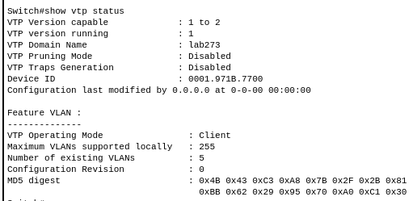

### Creación de VLANs en SW0 y Verificación en SW1 y SW2

Después de configurar SW0 como servidor VTP y SW1 y SW2 como clientes VTP, se procedió a crear cuatro VLANs en SW0. Se verificó que estas VLANs se distribuyeran automáticamente a los switches SW1 y SW2 mediante el protocolo VTP.

**Creación de VLANs en SW0:**
Se crearon las VLANs 10, 20, 30 y 40 en SW0 con los nombres correspondientes "Ventas", "Marketing", "Finanzas" e "IT".
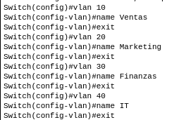

**Configuración de Enlaces Troncales:**
Se configuraron los puertos Fa0/1 y Fa0/2 de SW0 como enlaces troncales, permitiendo el tráfico de todas las VLANs. Esta configuración asegura que las VLANs creadas en SW0 se propagan a través de los enlaces troncales a SW1 y SW2.
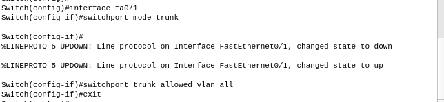

En SW2 también se configuró el puerto Fa0/1 como un enlace troncal para permitir el tráfico de todas las VLANs.
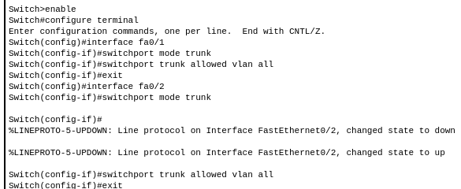

### Verificación de la Propagación de VLANs

Después de crear las VLANs en SW0 y configurar los enlaces troncales, se verificó que las VLANs se hayan distribuido correctamente en los switches SW1 y SW2 mediante los comandos `show vlan` y `show vtp status`.

**Verificación en SW1:**
Se utilizó el comando `show vlan` en SW1, que mostró que las VLANs 10, 20, 30 y 40 estaban presentes y activas en el switch. Además, el comando `show vtp status` confirmó que SW1 estaba operando en modo cliente y tenía la configuración de VLANs sincronizada con el servidor VTP.

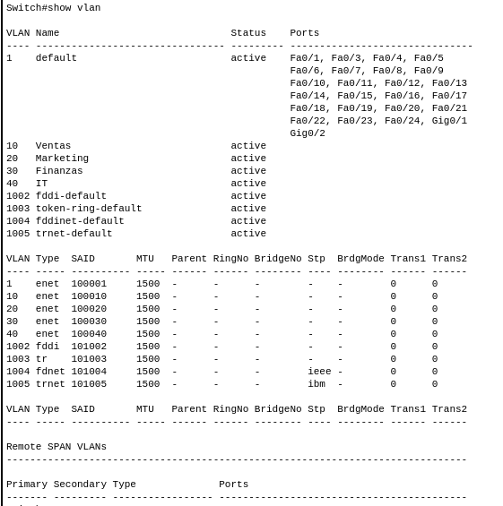
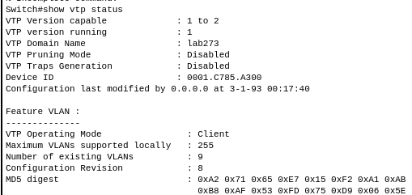

**Verificación en SW2:**
De manera similar, se utilizó el comando `show vlan` en SW2, y se observó que las VLANs 10, 20, 30 y 40 también estaban presentes y activas. El comando `show vtp status` en SW2 mostró que estaba en modo cliente, con la configuración de VLANs actualizada y sincronizada con el servidor VTP.

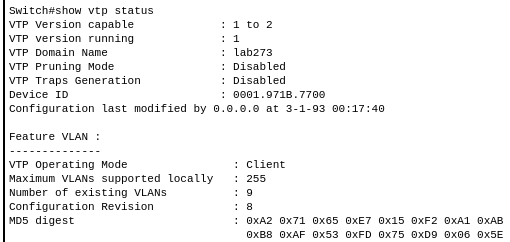
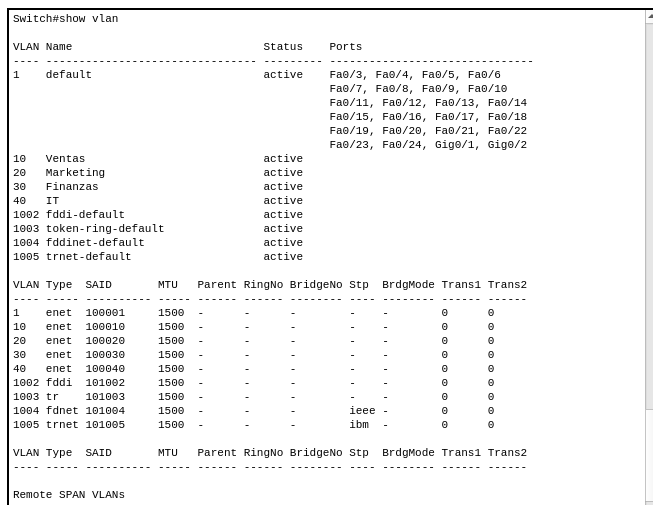

Estas verificaciones confirmaron que las VLANs creadas en SW0 se propagaron correctamente a los switches clientes SW1 y SW2 a través del protocolo VTP, asegurando una configuración consistente de VLANs en toda la red.

