# Laboratorio 2
##### Jeloska Isabel Chavez Paredez
## Item a: Configuración de IP estática en Ubuntu Linux

### Paso 1: Verificación de la configuración de red actual

Para iniciar el proceso de configuración de la red en Ubuntu Linux accedemos a la terminal con permisos de superusuario (sudo) con el comando `su -` para ejecutar comandos sensibles. Una vez autenticados como superusuario, utilizamos el comando `ifconfig` para inspeccionar la configuración actual de todas las interfaces de red del sistema.

Como podemos observar en la figura 1 la salida de `ifconfig` proporciona información detallada sobre cada interfaz de red. Aquí se presenta la salida completa para las interfaces `enp0s3` y `lo`.

<figure>
  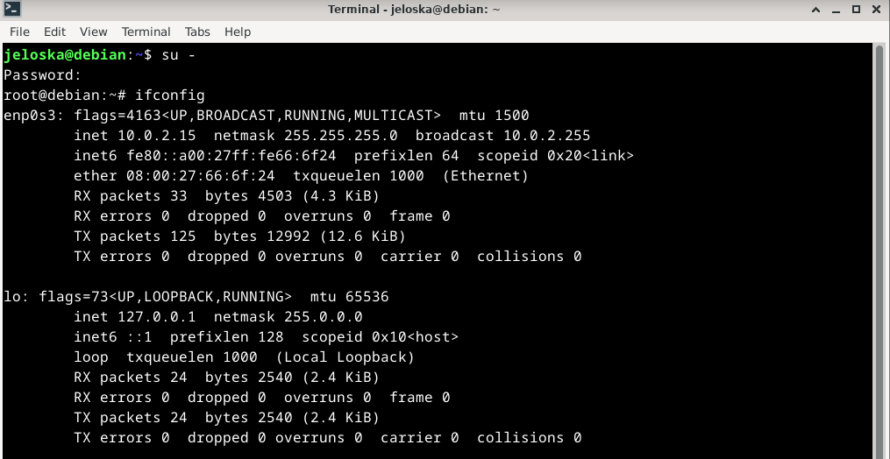
  <figcaption align="center">Figura 1: Cambio al usuario root y ejecución del comando <code>ifconfig</code> en consola.</figcaption>
</figure>


Para la interfaz `enp0s3`:

- **Estado**: Indica si la interfaz está activa para ser utilizada, permite la difusión de mensajes, está funcionando correctamente y puede manejar múltiples destinos.
- **MTU**: Especifica el tamaño máximo de datos que puede transmitir la interfaz.
- **Dirección IP**: Identifica única e individualmente la interfaz en la red (`10.0.2.15`), junto con la máscara de red (`255.255.255.0`) y la dirección de difusión (`10.0.2.255`).
- **Dirección MAC**: Es la identificación física única de la interfaz.
- **Paquetes recibidos y transmitidos**: Representan la cantidad de datos recibidos y enviados a través de la interfaz.
- **Errores de transmisión y recepción, paquetes descartados y colisiones**: Ofrecen información sobre problemas potenciales de comunicación, como errores en la transmisión o recepción de datos, paquetes descartados o colisiones entre paquetes.

Para la interfaz `lo`:

- **Estado**: Indica si la interfaz de bucle invertido está activa y funcionando correctamente, y si se trata de una interfaz de bucle invertido utilizada para comunicaciones internas del sistema.
- **MTU**: Especifica el tamaño máximo de datos que puede transmitir la interfaz.
- **Dirección IP**: Representa la dirección de bucle invertido (`127.0.0.1`) utilizada para referirse al propio dispositivo.
- **Dirección IPv6**: Muestra la dirección IPv6 asociada con la interfaz de bucle invertido.
- **Descripción**: Indica que esta interfaz se utiliza para las comunicaciones internas del sistema.

Además, exploramos las rutas establecidas en el sistema utilizando el comando `ip route`, que muestra la tabla de rutas utilizada por el kernel para determinar la ruta adecuada para enviar los paquetes de red.

<figure>
  
  <figcaption align="center">Figura 2: Verificacion de la puerta de enlace (getaway) mediante la ejecucion del comando <code>ip route</code></figcaption>
</figure>

La salida del comando `ip route` proporciona información sobre las rutas de red disponibles en el sistema:

- `default via 10.0.2.2 dev enp0s3 proto dhcp src 10.0.2.15 metric 100`: Esta línea indica la puerta de enlace predeterminada para alcanzar redes externas, utilizando DHCP para configurar la red.

- `10.0.2.0/24 dev enp0s3 proto kernel scope link src 10.0.2.15 metric 100`: Esta línea especifica la ruta para la red local a través de la interfaz `enp0s3`.

- `169.254.0.0/16 dev enp0s3 scope link metric 1000`: Esta línea representa la red de enlace local a través de la interfaz `enp0s3`, utilizada cuando no se puede obtener una dirección IP válida.

### Paso 2: Configuración de IP estática

Abrimos el archivo de configuración de interfaces de red en el editor de texto `nano`, ejecutando el comando `nano /etc/network/interfaces`

<figure>
  
  <figcaption align="center">Figura 3: Apertura del archivo  <code>interface</code> en el editor nano</figcaption>
</figure>

Agregamos las siguientes líneas al final del archivo para configurar la interfaz `enp0s3` con una dirección IP estática (ver figura 4):

```bash
auto enp0s3
iface enp0s3 inet static
  address 10.0.0.10
  netmask 255.0.0.0
  gateway 10.0.0.1
```
<figure>
  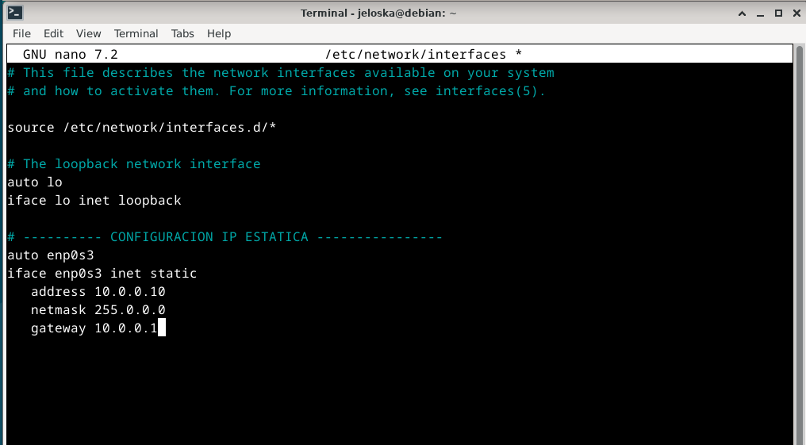
  <figcaption align="center">Figura 4: Configuración de IP estática de la interfaz enp0s3.
</figure>
A través de estas líneas, especificamos lo siguiente:

- `auto enp0s3`: Indica que la interfaz `enp0s3` se debe activar automáticamente al iniciar el sistema.
- `iface enp0s3 inet static`: Esto establece que la interfaz `enp0s3` utilizará una configuración de red estática en lugar de obtenerla dinámicamente (DHCP).
- `address 10.0.0.10`: Aquí especificamos la dirección IP estática que queremos asignar a la interfaz.
- `netmask 255.0.0.0`: Define la máscara de red que determina qué parte de la dirección IP pertenece a la red y qué parte identifica el dispositivo.
- `gateway 10.0.0.1`: Indicamos la dirección IP de la puerta de enlace predeterminada, que es el router a través del cual se enviarán los paquetes destinados a redes fuera del alcance local.

Posteriormente guardamos los cambios realizados en el archivo y cerramos el editor. Esto completa la configuración de la dirección IP estática en la interfaz `enp0s3`.

### Paso 3: Reinicio de servicios de red

Una vez realizada la configuración de la dirección IP estática, es necesario reiniciar los servicios de red para que los cambios surtan efecto. Este reinicio permite que el sistema reconozca y aplique la nueva configuración.

Para ello, ejecutamos el comando:

```bash
sudo /etc/init.d/networking restart
```

Este comando reinicia los servicios de red en el sistema, lo que aplicará la nueva configuración de IP estática. Sin embargo, al verificar con `ifconfig` (ver figura 5), observamos que los cambios aún no se han aplicado como esperábamos. Esto podría deberse a errores en la configuración, conflictos de configuración, problemas de permisos u otros factores.

<figure>
  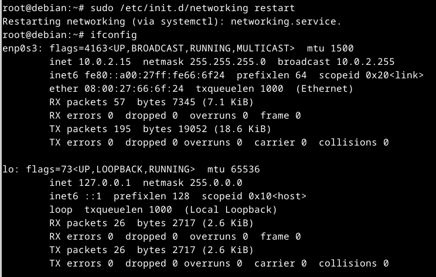
  <figcaption align="center">Figura 5: Reinicio de servicios de red y posterior verificación de modificación de la IP estática.</figcaption>
</figure>

### Paso 4: Solución de problemas y aplicación de cambios

Ante la falta de efectividad del reinicio de servicios mediante el método anterior, intentamos reiniciar los servicios de red utilizando systemd, una herramienta de administración de servicios en sistemas Linux modernos.

Ejecutamos el siguiente comando:

```bash
sudo systemctl restart networking
```

Este comando reinicia los servicios de red utilizando systemd. Nuevamente verificamos los cambios con `ifconfig` y notamos que los cambios aún no se han aplicado (ver figura 6).

<figure>
  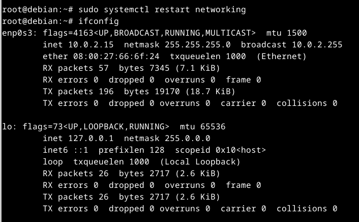
  <figcaption align="center">Figura 6: Reinicio de servicios de red ejecutando el comando <code>systemd</code> y posterior verificación de modificación de la IP estática.</figcaption>
</figure>

### Paso 5: Reinicio del sistema y Verificación final

Ante la persistencia del problema, optamos por reiniciar el sistema para asegurarnos de que todos los cambios se apliquen correctamente y se restablezcan los servicios de red.

Una vez reiniciado el sistema, verificamos nuevamente la configuración de red y la tabla de rutas para confirmar que los cambios se hayan aplicado correctamente. Ejecundo los comandos `ifconfig` y `ip route`:
 <figure>
  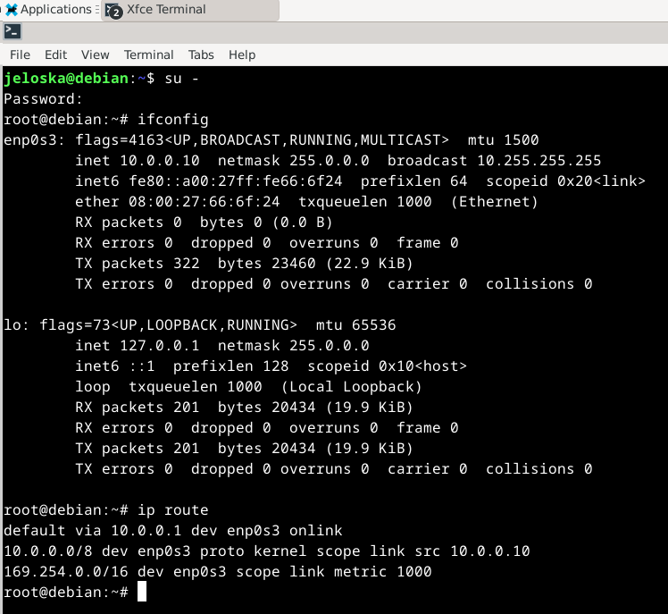
  <figcaption align="center">Figura 7: Verificación de la IP estática después de reiniciar la máquina</figcaption>
</figure>

Ahora observamos que la interfaz `enp0s3` tiene la dirección IP 10.0.0.10 con una máscara de red de 255.0.0.0 y la puerta de enlace predeterminada *getaway* es 10.0.0.1 (ver figura 7). Los cambios se han aplicado satisfactoriamente después del reinicio del sistema. Este enfoque garantiza que los servicios de red se reinicien correctamente y que los cambios de configuración se apliquen de manera efectiva.

## Item b: Restaurar la configuración del host

### Paso 1: Revertir la configuración de red

Para restablecer la configuración inicial del sistema, es necesario revertir los cambios realizados en el archivo de configuración de interfaces de red ubicado en `/etc/network/interfaces`. Al igual que en el anterior ejercicio utilizaremos el editor de texto como `nano` para abrir y modificar el archivo.
Dentro del archivo, encontraremos las líneas que agregamos anteriormente para configurar la dirección IP estática. Eliminamos o comentamos estas líneas (ver figura 8) y guardaremos los cambios realizados en el archivo.

<figure>
  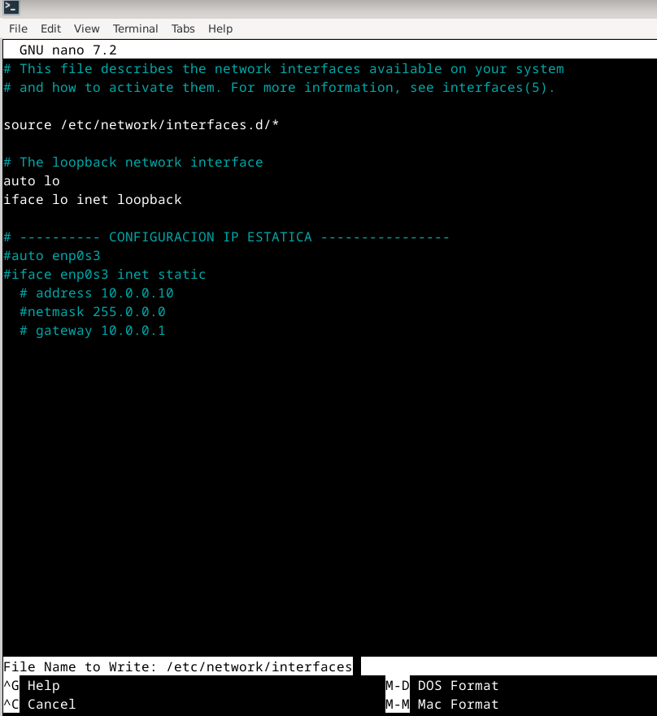
  <figcaption align="center">Figura 8: Restableciendo la configuración del archivo interfaces a su estado incial</figcaption>
</figure>


### Paso 2: Reinicio de los servicios de red

Una vez revertida la configuración en el archivo de interfaces de red reiniciamos los servicios de red mediante el comando `sudo /etc/init.d/networking restart`.
<figure>
  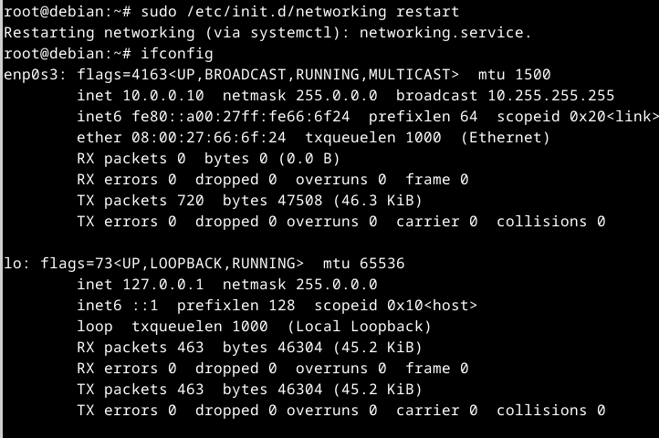
  <figcaption align="center">Figura 9: Reincio de los servicios de red y posterior verificación de las modificaciones en la IP de la interfaz <code>enp0s3</code></figcaption>
</figure>


Sin embargo, al verificar con `ifconfig`, no observamos los cambios efectuados anteriormente (ver figura 9).

### Paso 3: Reinicio de servicios mediante systemd

Ante la falta de efectividad del reinicio de servicios utilizando el método anterior, intentaremos reiniciar los servicios de red utilizando systemd. Ejecutamos el siguiente comando: `sudo systemctl restart networking` .

Este comando también debería reiniciar los servicios de red, pero al verificar con `ifconfig`, aún podríamos no ver los cambios reflejados (ver figura 10).
<figure>
  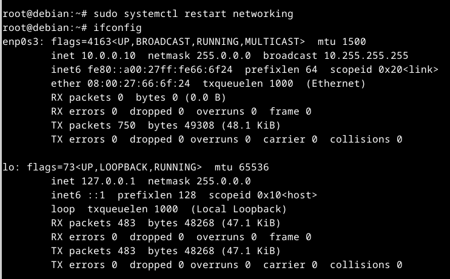
  <figcaption align="center">Figura 10: Reincio de los servicios de red con el comando <code>systemctl</code> y posterior verificación de las modificaciones en la IP de la interfaz <code>enp0s3</code></figcaption>
</figure>


### Paso 5: Verificación final
Dado que los intentos anteriores no muestran los cambios efectuados, optamos por reiniciar la máquina para asegurarnos de que todos los cambios se apliquen correctamente.
Después del reinicio del sistema, verificamos nuevamente la configuración de red y la tabla de rutas para confirmar que los cambios se hayan aplicado correctamente. Ejecutamos los comandos: `ifconfig` y `ip route`.
<figure>
  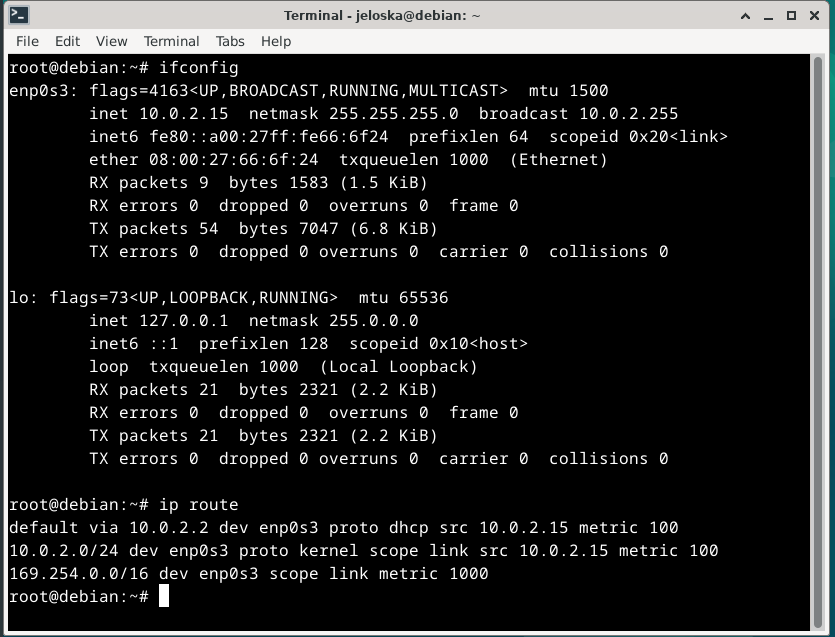
  <figcaption align="center">Figura 11: Verificación del restablecimiento de la IP de la interfaz <code>enp0s3</code></figcaption>
</figure>

En la figura 11 visualizamos que la interfaz `enp0s3` ha recuperado su configuración original, incluida la dirección IP, la máscara de red y la puerta de enlace predeterminada (comparar con las figuras 1 y 2).

### Paso 6: Prueba de conectividad

Después de restablecer la configuración de red, verificamos que la conexión a Internet esté funcionando correctamente. Realizamos una prueba de conectividad utilizando el comando `ping`, que envía paquetes ICMP al host de destino especificado y espera recibir respuestas.

```bash
ping 8.8.8.8
```

Este comando envía paquetes ICMP al servidor DNS público de Google (`8.8.8.8`). Si la conexión a Internet está configurada correctamente, deberíamos recibir respuestas del host de destino.

Al ejecutar el comando, podemos obervar en la figura 12 que los paquetes están siendo transmitidos correctamente y si recibimos respuestas del host:

<figure>
  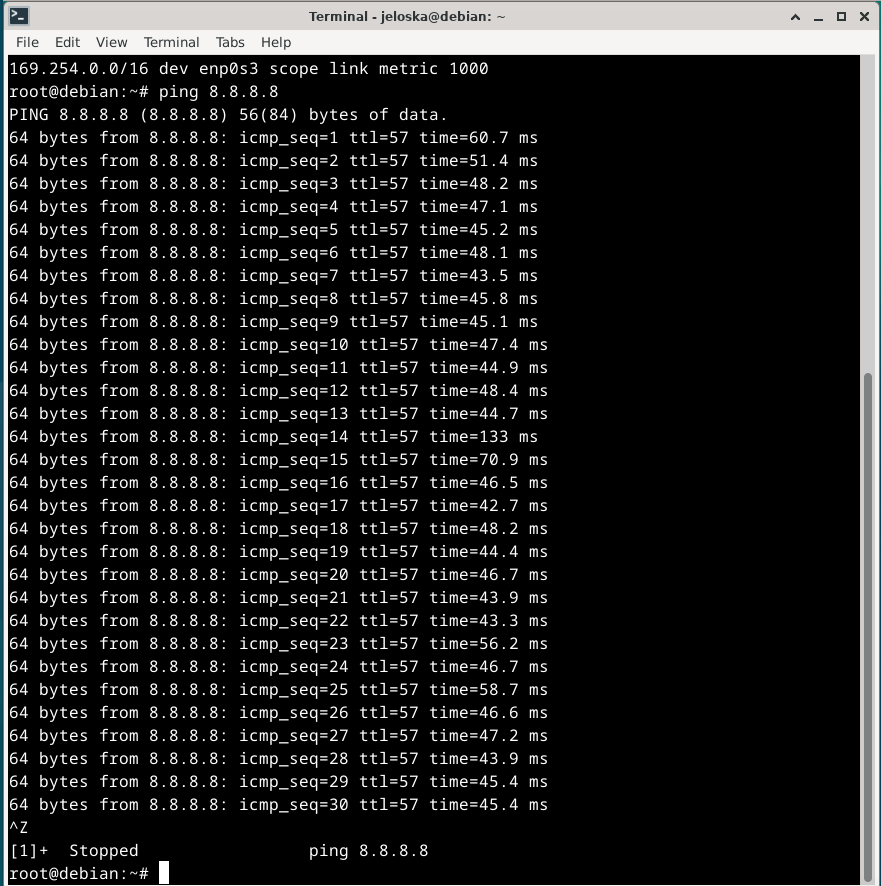
  <figcaption align="center">Figura 12: Prueba de conectividad mediante envio de paquetes ICMP al servidor DNS público de Google</figcaption>
</figure>

En este ejemplo, vemos que se están transmitiendo paquetes ICMP al host `8.8.8.8` y se están recibiendo respuestas. La línea final nos proporciona estadísticas sobre la prueba de conectividad, mostrando el número de paquetes transmitidos y recibidos, así como la pérdida de paquetes y la latencia (tiempo de ida y vuelta) promedio.

Como obtenemos respuestas exitosas como las anteriores, esto confirma que la conexión a Internet se ha restablecido con éxito y que el sistema puede comunicarse con hosts externos.

## Item c: Comparación del tiempo de conexión promedio 

Se realizaron pruebas de conectividad utilizando el comando `ping`. El comando `ping` se utiliza para enviar paquetes de solicitud de eco ICMP (Internet Control Message Protocol) a una dirección IP o un nombre de dominio específico y esperar una respuesta. Esta herramienta se utiliza comúnmente para verificar la conectividad de red y medir el tiempo de respuesta entre el host local y un host remoto.

Se utilizó el comando `ping` con la opción `-c` para especificar el número de paquetes ICMP que se enviarán. Por ejemplo, `-c 50` indica que se enviarán 50 paquetes. Luego, se proporciona el nombre de dominio del sitio web al que se desea enviar los paquetes: `google.com`, `facebook.com`, `instagram.com`, `whatsapp.com` que son los nombres de dominio de los sitios web a los que se enviaron los paquetes (ver figura 13).
<figure>
  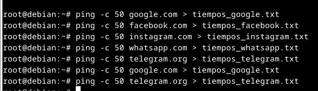
  <figcaption align="center">Figura 13: Comando ping -c 50. 50 paquetes ICMP enviados, resultados guardados en tiempos_google.txt. Proceso repetido para cada sitio, generando archivos separados.</figcaption>
</figure>

El comando `ping -c 50 google.com > tiempos_google.txt` se utilizó para enviar 50 paquetes ICMP al sitio web `google.com` y guardar los resultados en el archivo `tiempos_google.txt`. Este proceso se repitió para cada uno de los sitios web mencionados en el ejercicio, generando archivos separados para cada sitio web.


Los archivos resultantes contienen información sobre los tiempos de respuesta de los paquetes ICMP enviados a cada sitio web (ver figura 14). Estos datos se utilizaran posteriormente para analizar el rendimiento de los diferentes servicios en términos de conectividad y generar un cuadro comparativo.

<figure>
  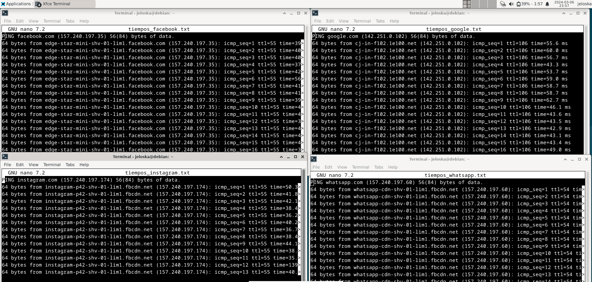
  <figcaption align="center">Figura 14: Archivos resultantes de los tiempos de respuesta de los paquetes ICMP enviados a cada sitio web</code></figcaption>
</figure>

Para elaborar el cuadro comparativo de tiempo de conexión promedio de los sitios Google, Facebook, Instagram y Whatsapp, primero calcularemos los tiempos promedio de conexión para cada uno de ellos. Luego, analizaremos y explicaremos las posibles razones de las variaciones en los tiempos de conexión.

### Cuadro Comparativo de Tiempos de Conexión Promedio

| Sitio Web | Tiempo Promedio de Conexión [ms] |
|-----------|----------------------------------|
| Google    | 50.257                           |
| Facebook  | 41.100                           |
| Instagram | 42.567                           |
| Whatsapp  | 44.660                           |

### Análisis

- **Google:** Posee el tiempo promedio de conexión más alto entre los sitios analizados, con 50.257 ms. Este valor podría atribuirse a la complejidad de los servicios ofrecidos por Google, la carga de tráfico en el servidor durante la prueba y la distancia geográfica entre el servidor y el punto de origen de la prueba.

- **Facebook:** Presenta un tiempo promedio de conexión de 41.100 ms, más bajo que Google pero más alto que Instagram. Esto podría ser resultado de la optimización de la infraestructura de servidores de Facebook y la distribución eficiente del tráfico.

- **Instagram:** Exhibe un tiempo promedio de conexión de 42.567 ms, similar al de Facebook pero ligeramente más alto. Esto se puede atribuir a la complejidad de la aplicación y la carga de imágenes y videos mostrados en la plataforma.

- **WhatsApp:** Posee el tiempo promedio de conexión más bajo entre los cuatro sitios analizados, con 44.660 ms. A pesar de ser una aplicación de mensajería instantánea, la variabilidad en el tiempo de conexión puede estar relacionada con la infraestructura de servidores y la gestión del tráfico de datos.

Las variaciones en los tiempos de conexión entre los sitios pueden explicarse por varios factores:

- **Infraestructura de Servidores:** La calidad y la distribución geográfica de los servidores de cada plataforma pueden influir en los tiempos de conexión. Una infraestructura más robusta y mejor distribuida puede resultar en tiempos de conexión más rápidos.

- **Carga de Tráfico:** Los momentos de alta demanda pueden provocar congestión en los servidores, lo que aumenta los tiempos de respuesta. Los servicios con una mayor cantidad de usuarios activos pueden experimentar mayores variaciones en los tiempos de conexión.

- **Optimización de la Plataforma:** La eficiencia en la programación y la gestión de recursos puede influir en los tiempos de conexión. Las plataformas que están bien optimizadas pueden ofrecer tiempos de conexión más rápidos.

<figure>
  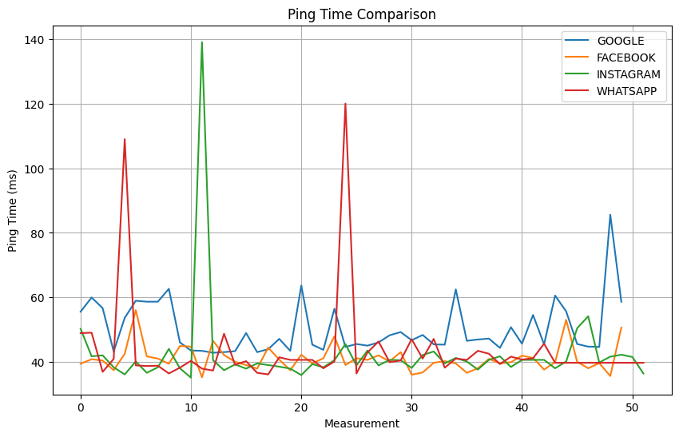
  <figcaption align="center">Figura 15: Gráfica comparativa de los tiempos de conexión</figcaption>
</figure>
La gráfica muestra la comparación de los tiempos de ping (latencia) para cuatro sitios web populares: Google, Facebook, Instagram y WhatsApp. Cada línea representa los tiempos de ping registrados en múltiples mediciones a lo largo del tiempo.

En el eje X se encuentra el número de la medición, representando cada punto una medición individual del tiempo de ping. El eje Y indica el tiempo de ping registrado en milisegundos. Los picos pronunciados sugieren momentos de mayor latencia o posibles interrupciones en la conexión.

Se observa que la mayoría de las líneas fluctúan alrededor de un valor relativamente constante en la latencia. Sin embargo, WhatsApp y Instagram muestran tendencias a tener tiempos de ping más altos en comparación con Google y Facebook. Esto puede atribuirse a diferencias en la infraestructura de red o la ubicación de los servidores.

### Bloqueo de Tráfico de Ping en Telegram.org
Al intentar realizar un ping al sitio web de Telegram (telegram.org) desde un sistema Debian utilizando el comando `ping -c 50 telegram.org > tiempos_telegram.txt`, se observó que los paquetes ICMP no reciben respuesta (ver figura 16). En lugar de recibir respuestas de los servidores de Telegram, se obtiene el mensaje "Destination Net Unreachable" desde una dirección IP específica (176.52.253.2), indicando que la red no puede encontrar una ruta hacia el destino. Como resultado, se registra una pérdida del 100% de los paquetes y se obtienen dos errores durante la transmisión de 50 paquetes ICMP.

<figure>
  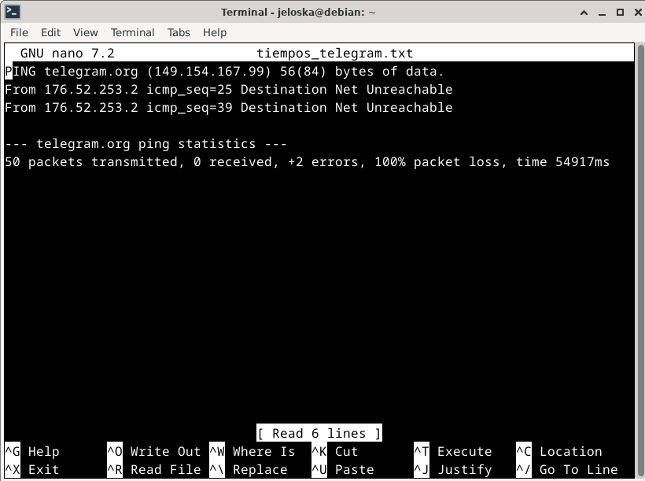
  <figcaption align="center">Figura 16: Archivos resultante tiempo de respuesta de los paquetes ICMP enviados a telegram.org</code></figcaption>
</figure>
El bloqueo del tráfico de ping puede explicar la falta de respuesta de los servidores de Telegram a los paquetes ICMP. Esta medida de seguridad puede implementarse por diversas razones, como proteger contra ataques de denegación de servicio o evitar la divulgación no autorizada de información sobre la infraestructura de red. Los administradores pueden establecer políticas de seguridad que incluyan el bloqueo del tráfico de ping como precaución ante posibles amenazas, como el escaneo de puertos o la identificación de la topología de red.