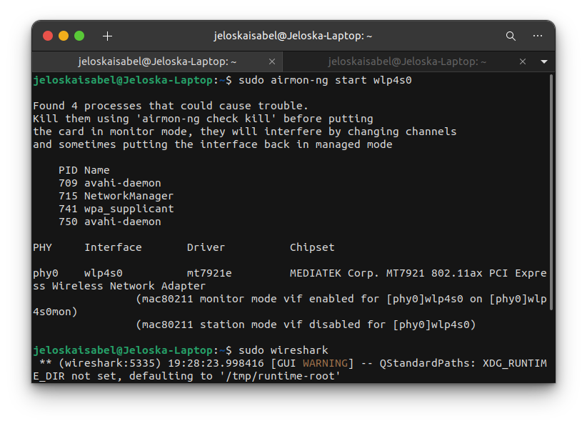
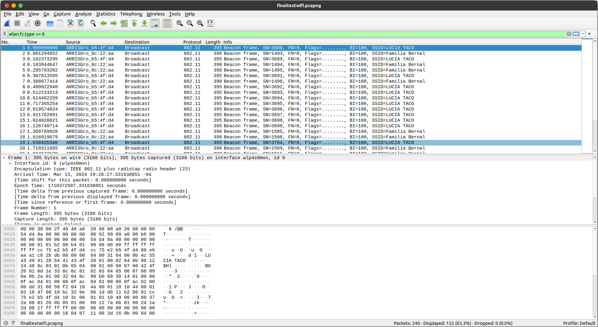
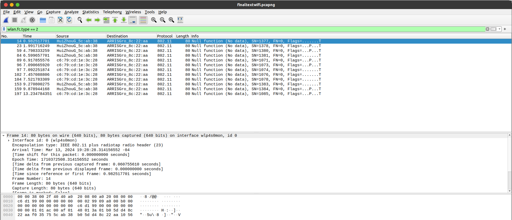

# Laboratorio 3: Análisis del Tráfico de Red con Wireshark
#### Jeloska Isabel Chavez Paredez
## Item 1
Realizamos el análisis de la comunicación web al acceder a la página http://fiumsa.edu.bo, examinando los paquetes capturados entre la dirección IP local (192.168.0.17) y la dirección IP remota del servidor (200.7.160.189). Se utilizó la herramienta de filtrado de Wireshark para seleccionar específicamente los paquetes HTTP relacionados con la comunicación web. El filtro utilizado, 'http && ip.host == 200.7.160.189', limita la captura a paquetes HTTP y asegura que solo se incluyan aquellos cuya dirección IP de origen o destino sea igual a la del servidor remoto. Esto nos permitió enfocarnos en la interacción entre el host local y el servidor de la página del curso en cuestión.

#### Análisis de los paquetes

Se realizó la captura de 25 paquetes, a continuación se describen los paquetes más representativos: 

**Paquete 1 - Solicitud GET /style.css:**
- Método: GET
- URL solicitada: /style.css
- Encabezados de solicitud:
  - Host: www.fiumsa.edu.bo
  - User-Agent: Mozilla/5.0 (X11; Ubuntu; Linux x86_64; rv:109.0) Gecko/20100101 Firefox/111.0
  - Accept: text/css,*/*;q=0.1
  - Accept-Language: en-US,en;q=0.5
  - Accept-Encoding: gzip, deflate
  - Connection: keep-alive
  - Referer: http://www.fiumsa.edu.bo/fiumsal.html
- Cookies enviadas: No se enviaron cookies

**Paquete 2 - Respuesta 404 Not Found para GET /style.css:**
- Código de estado: 404 Not Found
- Encabezados de respuesta:
  - Date: Wed, 13 Mar 2024 20:37:10 GMT
  - Server: Apache/2.2.16 (Debian)
  - Vary: Accept-Encoding
  - Content-Encoding: gzip
  - Content-Length: 242
  - Keep-Alive: timeout=15, max=100
  - Connection: Keep-Alive
  - Content-Type: text/html; charset=iso-8859-1
- Cookies recibidas: No se recibieron cookies

**Paquete 7 - Solicitud GET /favicon.ico:**
- Método: GET
- URL solicitada: /favicon.ico
- Encabezados de solicitud:
  - Host: www.fiumsa.edu.bo
  - User-Agent: Mozilla/5.0 (X11; Ubuntu; Linux x86_64; rv:109.0) Gecko/20100101 Firefox/111.0
  - Accept: */*
  - Accept-Language: en-US,en;q=0.5
  - Accept-Encoding: gzip, deflate
  - Connection: keep-alive
- Cookies enviadas: No se enviaron cookies

**Paquete 8 - Respuesta 404 Not Found para GET /favicon.ico:**
- Código de estado: 404 Not Found
- Encabezados de respuesta:
  - Date: Wed, 13 Mar 2024 20:37:17 GMT
  - Server: Apache/2.2.16 (Debian)
  - Vary: Accept-Encoding
  - Content-Encoding: gzip
  - Content-Length: 248
  - Keep-Alive: timeout=15, max=100
  - Connection: Keep-Alive
  - Content-Type: text/html; charset=iso-8859-1
- Cookies recibidas: No se recibieron cookies

**Paquete 12 - Respuesta 200 OK para GET /academico/plan-academico.htm:**
- Código de estado: 200 OK
- Encabezados de respuesta:
  - Date: Wed, 13 Mar 2024 20:37:32 GMT
  - Server: Apache/2.2.16 (Debian)
  - Last-Modified: Wed, 10 May 2017 16:05:53 GMT
  - ETag: "1400c-794b-54f2da58a9a40"
  - Accept-Ranges: bytes
  - Vary: Accept-Encoding
  - Content-Encoding: gzip
  - Content-Length: 8228
  - Keep-Alive: timeout=15, max=100
  - Connection: Keep-Alive
  - Content-Type: text/html
- Cookies recibidas: No se recibieron cookies

### Observaciones

Durante el análisis de los paquetes, se observó que todas las solicitudes registradas fueron del tipo GET, dirigidas a una variedad de recursos como archivos de video y HTML. Sin embargo, las respuestas a estas solicitudes se caracterizaban uniformemente por un código de estado "404 Not Found", indicando que los recursos solicitados no estaban disponibles en el servidor. Además, a pesar de la diversidad de recursos solicitados, no se detectaron cookies en ninguno de los paquetes. Esta ausencia sugiere que la autenticación o el seguimiento del usuario no se basan en cookies en esta comunicación específica.

### Conclusiones

- La comunicación analizada consiste en solicitudes GET para diversos recursos, pero todas las respuestas indican que los recursos solicitados no están disponibles en el servidor. Esto podría deberse a la inexistencia de los recursos o a problemas de configuración en el servidor.

- La ausencia de cookies en todas las solicitudes y respuestas sugiere que la interacción entre el cliente y el servidor no depende del uso de cookies para la autenticación o el seguimiento del usuario.

- El análisis de los paquetes proporciona información valiosa sobre la comunicación entre el cliente y el servidor, así como sobre los recursos solicitados y su disponibilidad en el servidor. Aunque no se identificaron problemas críticos en la comunicación, la falta de recursos solicitados puede afectar la funcionalidad y la experiencia del usuario en el sitio web.

## Item 2
Para configurar Wireshark para la captura de tráfico en una red Wi-Fi, inicialmente, se activa el modo de monitorización en la interfaz inalámbrica utilizando el comando `sudo airmon-ng start wlp4s0`. Este comando, ejecutado con privilegios de superusuario (`sudo`), inicia el modo de monitorización en la interfaz Wi-Fi especificada, que en este caso es "wlp4s0". El modo de monitorización habilita la captura de todos los paquetes que atraviesan la red, incluyendo aquellos que no están dirigidos específicamente a nuestro dispositivo. Esto permite un análisis exhaustivo del tráfico, incluso aquel que no es explícitamente destinado al dispositivo en observación.

Una vez que hemos iniciado el modo de monitorización, utilizamos Wireshark para filtrar y visualizar los diferentes tipos de paquetes en la red. Se aplicaron los siguientes filtros específicos para capturar tres tipos de paquetes:

1. **Paquetes de Control (wlan.fc.type == 0):**
   - Estos paquetes incluyen frames de balizamiento (beacon frames), frames de autenticación, desautenticación, asociación, reasociación, entre otros.
   - Los frames de control son utilizados por los puntos de acceso y los dispositivos clientes para gestionar la comunicación y la conexión en la red.
   - Filtrar estos paquetes nos permite analizar la presencia de redes Wi-Fi, así como las interacciones entre los dispositivos en la red.

2. **Paquetes de Datos (wlan.fc.type == 2):**
   - Estos paquetes transportan datos de usuario, como correos electrónicos, páginas web, archivos, etc.
   - Son los paquetes que llevan la información real que los usuarios están transmitiendo a través de la red.
   - Filtrar estos paquetes nos permite analizar el tráfico de datos en la red y entender qué tipo de información se está transmitiendo.

3. **Paquetes de Gestión (wlan.fc.type == 1):**
   - Estos paquetes se utilizan para gestionar y controlar la conexión entre los dispositivos y los puntos de acceso.
   - Incluyen frames de solicitud de asociación, confirmación de asociación, sondeo de puntos de acceso, entre otros.
   - Filtrar estos paquetes nos permite analizar cómo se establecen y mantienen las conexiones entre los dispositivos y los puntos de acceso en la red.

## Paquetes de Control

A continuación se presentan los paquetes de control más relevantes capturados durante el monitoreo:
#### Beacon Frames (Marcos de Balizamiento):

1. **Paquete 1:**
   - **Dirección MAC del Punto de Acceso (AP):** ARRISGro_b5:4f:d4
   - **SSID Anunciado:** LUCIA TACO
   - **Detalles:** Este marco de balizamiento transmite información acerca del punto de acceso con la dirección MAC "ARRISGro_b5:4f:d4" y su red inalámbrica con el SSID "LUCIA TACO". Incluye parámetros como la tasa de transmisión, el conjunto de capacidades admitidas y el intervalo de balizamiento.

2. **Paquete 2:**
   - **Dirección MAC del Punto de Acceso (AP):** ARRISGro_8c:22:aa
   - **SSID Anunciado:** Familia Bernal
   - **Detalles:** Este marco de balizamiento, emitido por el punto de acceso con la dirección MAC "ARRISGro_8c:22:aa", anuncia la red inalámbrica con el SSID "Familia Bernal". Al igual que el paquete anterior, proporciona detalles sobre las capacidades de la red y otros parámetros relevantes.

#### IEEE 802.11 Wireless Management (Gestión Inalámbrica IEEE 802.11):

1. **Paquete 1:**
   - **Tipo de Marco:** Beacon (Balizamiento)
   - **Función Específica:** Anuncio de la Red
   - **Detalles:** Este marco de gestión de tipo Beacon es utilizado por los puntos de acceso para anunciar la existencia de la red y proporcionar información sobre sus capacidades y configuración, facilitando la detección y conexión de dispositivos clientes a la red.

2. **Paquete 2:**
   - **Tipo de Marco:** Beacon (Balizamiento)
   - **Función Específica:** Anuncio de la Red
   - **Detalles:** Similar al paquete anterior, este marco de gestión de tipo Beacon proporciona detalles sobre otra red inalámbrica disponible en el área.

Los paquetes de control capturados son del tipo "Beacon frame", utilizados en redes inalámbricas para anunciar la presencia de puntos de acceso (AP) o estaciones. Estos paquetes contienen información vital para los dispositivos dentro del rango de la red, como el SSID (Service Set Identifier) y la dirección MAC del punto de acceso.

Se observó que los paquetes son transmitidos desde diferentes dispositivos con direcciones MAC específicas hacia una dirección de Broadcast, indicando que son emitidos por puntos de acceso inalámbricos. Cada paquete de control tiene un número de secuencia (SN) único, que ayuda a ordenar y distinguir los paquetes, y un número de fragmento (FN), sugiriendo que la transmisión de datos puede estar fragmentada en varios paquetes si es necesario.

Los flags presentes en cada paquete Beacon frame proporcionan información adicional sobre el estado y la función del paquete, como el BI (Beacon Interval), que indica el intervalo entre transmisiones de los paquetes de balizamiento. Además, el SSID proporciona el nombre de la red inalámbrica a la que los dispositivos pueden conectarse.

### Funcionamiento de los Paquetes de Control en una Red Inalámbrica

1. **Beacon Frames (Marcos de Balizamiento)**:
   - Emitidos periódicamente por los puntos de acceso para anunciar la existencia de la red y proporcionar información sobre sus capacidades.
   - Contienen parámetros cruciales como el SSID, la tasa de datos, los canales compatibles y otros detalles de configuración.
   - Utilizados por los dispositivos cliente para detectar y asociarse con los puntos de acceso disponibles en el área.

2. **IEEE 802.11 Wireless Management (Gestión Inalámbrica IEEE 802.11)**:
   - Destinados a la gestión y administración de la red inalámbrica.
   - Incluyen frames de gestión como los de asociación, reasociación, autenticación, sondeo y desasociación.
   - Facilitan el establecimiento y mantenimiento de conexiones entre dispositivos y puntos de acceso.
   - Contienen campos específicos que indican la función que están realizando, como la asociación de un dispositivo cliente con un punto de acceso o la autenticación de un dispositivo en la red.

## Paquetes de Datos

De cada paquete se obtuvo:

1. **No.**: Número de secuencia del paquete.
2. **Time**: Tiempo de llegada del paquete.
3. **Source**: Dirección MAC del dispositivo de origen.
4. **Destination**: Dirección MAC del dispositivo de destino.
5. **Protocol**: Protocolo utilizado (802.11 en este caso).
6. **Length**: Longitud del paquete en bytes.
7. **Info**: Información adicional proporcionada por el paquete.

Se observó que todos los paquetes son del tipo "Null function (No data)" y están destinados desde la fuente "HuiZhouG_5c:ab:38" al destino "ARRISGro_8c:22:aa". Además, todos los paquetes tienen un número de secuencia (SN), un número de fragmento (FN) y flags que indican el estado del paquete.
Los paquetes de datos analizados son del tipo "Null function", lo que indica que no contienen datos útiles, pero desempeñan funciones de control y gestión en la red inalámbrica. Estos paquetes se están transmitiendo desde el dispositivo con la dirección MAC "HuiZhouG_5c:ab:38" al dispositivo con la dirección MAC "ARRISGro_8c:22:aa", lo que sugiere una comunicación entre estos dos dispositivos en la red inalámbrica. Cada paquete tiene un número de secuencia (SN) único, lo que indica el orden de transmisión y ayuda en la detección de duplicados y la garantía de entrega ordenada de los paquetes. Además, los paquetes también contienen un número de fragmento (FN), lo que sugiere que la transmisión de datos puede estar fragmentada en varios paquetes si es necesario. Los flags presentes en cada paquete proporcionan información adicional sobre el estado y la función del paquete, como si contiene datos (P) o si es un paquete de transmisión (T).

### Funcionamiento de los Paquetes de Datos en una Red Inalámbrica

Los paquetes de datos en una red inalámbrica, como los del tipo "Null function", desempeñan funciones de control y gestión. Aunque no contienen datos útiles para el usuario, son esenciales para el funcionamiento adecuado de la red. Aquí hay algunas funciones importantes que estos paquetes realizan en una red inalámbrica:

1. **Gestión de la Conexión:** Los paquetes de control ayudan en la autenticación, asociación y desasociación de dispositivos en la red inalámbrica. Esto garantiza que solo dispositivos autorizados puedan acceder a la red y se conecten de manera segura.

2. **Control de Flujo y Congestión:** Estos paquetes ayudan a regular el flujo de datos y gestionar la congestión en la red inalámbrica. Esto es crucial para garantizar un rendimiento óptimo y evitar la congestión de la red.

3. **Ordenación y Detección de Errores:** Los números de secuencia en los paquetes permiten la ordenación adecuada de los datos y la detección de paquetes duplicados o perdidos. Esto mejora la confiabilidad de la transmisión de datos en la red.

4. **Fragmentación de Datos:** En casos donde los datos exceden el tamaño máximo de trama permitido en la red inalámbrica, los paquetes pueden ser fragmentados en varios fragmentos. El número de fragmento en los paquetes de control indica la secuencia correcta para ensamblar los fragmentos en el destino.

## Paquetes de Gestión

Los paquetes de gestión son una categoría de tramas en las redes Wi-Fi que se utilizan para diversas funciones de administración y control, como la autenticación, la asociación y el escaneo de redes. Este análisis se centra en los paquetes de gestión capturados con el filtro mencionado, proporcionando interpretaciones sobre su contenido y su funcionamiento en el contexto de una red inalámbrica.

Los paquetes de gestión fueron capturados utilizando un sniffer de red en un entorno controlado de una red Wi-Fi. Se utilizó el protocolo IEEE 802.11 para la comunicación inalámbrica. La captura se realizó con un filtro específico (wlan.fc.type == 1) para recopilar exclusivamente tramas de gestión.

Los paquetes de gestión capturados presentan una diversidad de tipos, cada uno desempeñando un papel crucial en la administración y el control de la red inalámbrica. Entre estos se destacan:

- **Tramas de "Beacon":** Estas tramas son emitidas por los puntos de acceso para anunciar la presencia de la red. Contienen información vital como el SSID (Service Set Identifier), la potencia de señal, las capacidades de encriptación y otros parámetros de configuración. Los dispositivos clientes utilizan estas tramas para identificar y conectarse a redes disponibles.

- **Tramas de "Probe Request":** Estas tramas son enviadas por dispositivos clientes que buscan redes disponibles. Contienen información sobre el SSID de la red que el dispositivo está buscando. Los puntos de acceso pueden responder a estas solicitudes con tramas de "Probe Response".

- **Tramas de "Probe Response":** Estas tramas son respuestas a las solicitudes de sondeo ("Probe Request") enviadas por dispositivos clientes. Proporcionan información detallada sobre la red, incluidos parámetros como el SSID, la tasa de datos admitida, el tipo de autenticación y más.

- **Tramas de "Authentication":** Estas tramas se utilizan para el proceso de autenticación entre un dispositivo cliente y un punto de acceso. El intercambio de tramas de autenticación es fundamental para establecer la identidad y la confianza entre las partes.

- **Tramas de "Association Request" y "Association Response":** Estas tramas se utilizan para establecer y confirmar la asociación entre un dispositivo cliente y un punto de acceso después de la autenticación. Contienen información sobre parámetros como la duración de la asociación y las capacidades de transmisión.

**Estructura de los Paquetes**

Cada paquete de gestión sigue la estructura definida por el estándar IEEE 802.11, que consta de un encabezado de gestión seguido de campos de datos específicos para cada tipo de trama. Dentro de este encabezado y los campos de datos, se encuentran elementos de información cruciales para la administración de la red. Estos elementos pueden incluir:

- **SSID:** El SSID identifica de manera única la red inalámbrica y ayuda a los dispositivos a distinguirla de otras redes cercanas.
- **BSSID:** La BSSID (Basic Service Set Identifier) identifica de manera única un punto de acceso dentro de una red inalámbrica.
- **Potencia de la señal:** Indica la intensidad de la señal entre el punto de acceso y el dispositivo cliente.
- **Capacidades de encriptación:** Especifica los métodos de seguridad admitidos por la red, como WEP, WPA o WPA2.
- **Intervalos de tiempo:** Define los períodos de tiempo entre las tramas y otros eventos de la red.

**Destinos y Orígenes**

Los paquetes de gestión tienen direcciones MAC de origen y destino que varían según el tipo de trama y los dispositivos involucrados en la comunicación. Estas direcciones MAC pueden pertenecer a puntos de acceso, dispositivos clientes u otros nodos de la red. Es importante destacar que las tramas pueden ser dirigidas (a una dirección MAC específica), multicast (a un grupo de direcciones MAC) o broadcast (a todas las direcciones MAC dentro del alcance).

**Información de Control**

Cada trama de gestión contiene información de control relevante para la administración de la red. Esto incluye detalles como la potencia de la señal, los canales de frecuencia utilizados, los tiempos de espera y otros parámetros de configuración. Esta información es vital para garantizar una comunicación eficiente y confiable dentro de la red inalámbrica.

### Funcionamiento de los Paquetes de Gestión en una Red Inalámbrica

Los paquetes de gestión en una red inalámbrica son fundamentales para la comunicación y la administración eficiente de los dispositivos.

En primer lugar, los "Beacons" son emitidos periódicamente por los puntos de acceso para anunciar la presencia de la red. Contienen información como el nombre de la red (SSID), el tipo de seguridad y la velocidad de datos soportada. Estos paquetes permiten que los dispositivos cercanos identifiquen y se conecten a la red.

Las "Solicitudes de Sondeo" y "Respuestas de Sondeo" son otro tipo de paquetes de gestión. Cuando un dispositivo cliente busca redes disponibles, envía solicitudes de sondeo que contienen el SSID de la red deseada. Los puntos de acceso responden con información relevante sobre la red, como su SSID y configuración de seguridad.

Además, los paquetes de autenticación y asociación son cruciales para establecer conexiones seguras entre dispositivos cliente y puntos de acceso. Los paquetes de autenticación se utilizan para verificar la identidad del cliente, mientras que los de asociación se emplean para solicitar la conexión a un punto de acceso específico.

