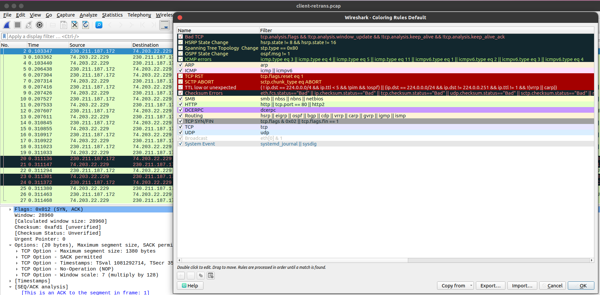
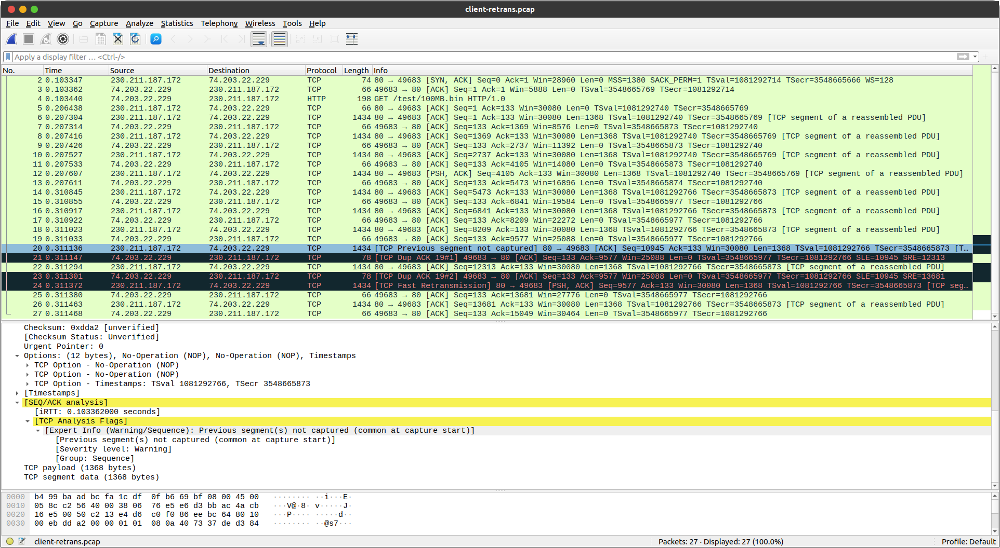
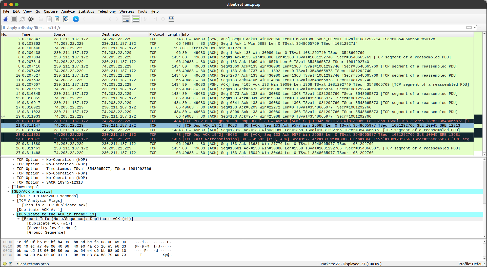
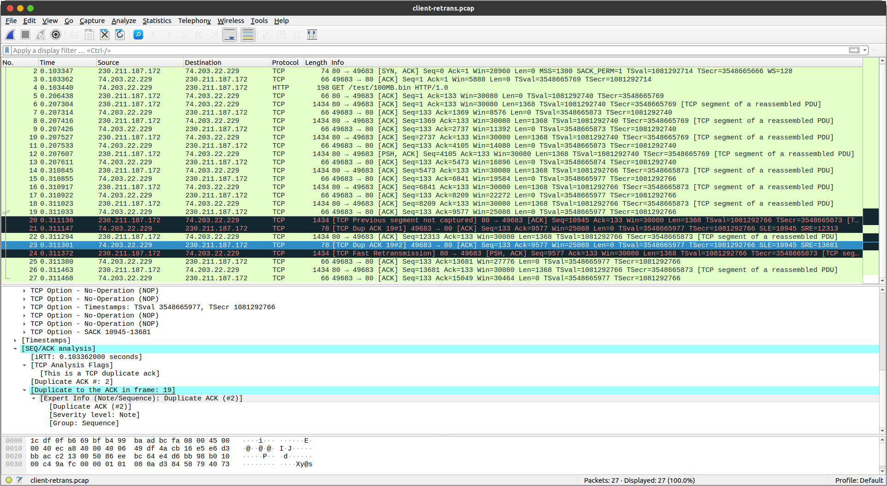
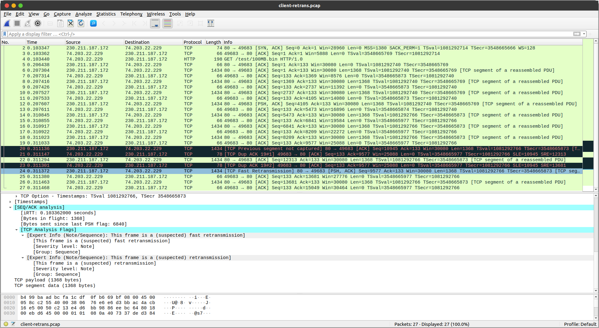
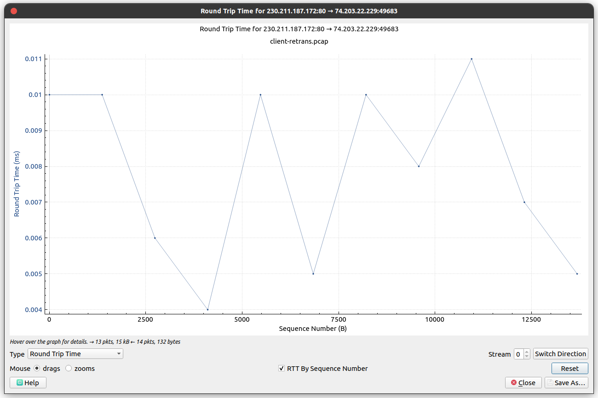
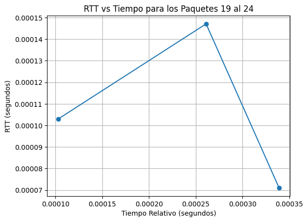

# Actividad Complementaria
#### Badani Davalos Kassandra Andrea
#### Chavez Paredez Jeloska Isabel

## Item 1: Formas de capturar paquetes con Wireshark
Las principales  formas en que Wireshark puede capturar paquetes para su análisis en redes de las siguientes formas:
1. **Captura en tiempo real desde una interfaz de red**:
   - Esta es una forma común de capturar paquetes directamente desde una interfaz de red en tu sistema. Puedes seleccionar una interfaz de red específica, como una tarjeta de red Ethernet o una interfaz inalámbrica, y Wireshark mostrará los paquetes que están pasando por esa interfaz en ese momento.

2. **Lectura de archivos de captura previos**:
   - Wireshark puede analizar archivos de captura previamente guardados en el disco duro. Esto te permite revisar el tráfico de red capturado anteriormente y realizar análisis retrospectivos.

3. **Captura remota a través de SSH**:
   - Wireshark puede capturar paquetes de forma remota a través de una conexión SSH a otro sistema. Esto es útil si necesitas capturar el tráfico en una red remota a la que no tienes acceso físico. Para ello, necesitas un servidor SSH en el sistema remoto y permisos para ejecutar Wireshark en ese sistema.

4. **Captura remota a través de un dispositivo de captura dedicado**:
   - Wireshark puede recibir paquetes capturados por dispositivos de captura dedicados, como taps de red o SPAN ports en switches. Estos dispositivos están diseñados para copiar el tráfico de red y enviarlo a Wireshark para su análisis. Esto es útil para analizar el tráfico en redes grandes o complejas donde la captura en tiempo real en una interfaz de red local puede no ser práctica.

5. **Captura de paquetes por protocolo**:
   - Wireshark te permite capturar paquetes de acuerdo con un protocolo específico. Puedes configurar Wireshark para que solo capture paquetes que utilicen el protocolo TCP, UDP, HTTP, HTTPS, etc. Esto te permite enfocarte en un tipo específico de tráfico de red y analizarlo de manera más detallada.


## Item 2: Identificación de Errores Potenciales
En la Figura 1, se puede observar mediante el código de colores de Wireshark que los posibles errores se encuentran en los frames 20, 21, 23 y 24. Los paquetes marcados en negro en Wireshark indican que han sido descartados o tienen algún tipo de problema en su transmisión.

<figure>
  
  <figcaption align="center">Figura 1: Captura del tráfico de red junto con la interpretación de colores proporcionada por Wireshark</figcaption>
</figure>

### 1. Error de Captura de Segmento Anterior (Previous segment not captured) (Frame 20)
El error observado en el paquete del Frame 20 (ver figura 2) se manifiesta como la advertencia "Previous segment(s) not captured", indicando que los segmentos anteriores a este no fueron registrados en la trama de red. Esta advertencia es típica al iniciar una captura de tráfico, especialmente cuando se inicia después de que la comunicación TCP ya haya comenzado. La ausencia de estos segmentos previos dificulta el análisis completo de la secuencia de la comunicación TCP.

Esta advertencia se genera cuando los segmentos anteriores al actual no están disponibles en la captura de tráfico. Esta carencia de segmentos previos complica la comprensión total de la comunicación TCP, incluyendo aspectos críticos como la secuencia de datos, los números de secuencia y de acuse de recibo (ACK), entre otros elementos cruciales para el análisis de la interacción entre el emisor y el receptor.

La advertencia afecta la relación con los frames tanto anteriores como posteriores en la secuencia de la comunicación TCP. La falta de segmentos previos limita la capacidad de establecer una conexión lógica y completa entre estos frames. Es crucial destacar que esta advertencia es algo común al inicio de una captura y no necesariamente señala un problema grave en la comunicación. Más bien, indica una restricción en la información disponible para el análisis exhaustivo de la interacción TCP.

<figure>
  
  <figcaption align="center">Figura 2: Información sobre el Error de Captura del Segmento Anterior en el Frame 20</figcaption>
</figure>


### 2. TCP Duplicate ACKs (Acknowledgments) (Frames 21, 23)

En el análisis de los paquetes de la captura de tráfico, se han detectado errores relacionados con TCP Duplicate ACKs (Acknowledgments) en los paquetes 21 y 23. Estos errores señalan la recepción de confirmaciones duplicadas de paquetes que fueron previamente enviados, lo cual sugiere la posible existencia de problemas relacionados con la congestión en la red o pérdida de paquetes.

En el paquete 21 (ver figura 3), se identificó un TCP Duplicate ACK #1, lo que indica que se recibió un duplicado del ACK asociado con el paquete número 19. El ACK relativo es 9577, lo que evidencia la recepción de datos hasta ese punto específico. Además, la ventana de recepción en este paquete es de 196, mostrando la capacidad del receptor para aceptar más datos. La presencia de un checksum no verificado resalta una falta de integridad en los datos transmitidos.

Por otro lado, en el paquete 23 (ver figura 4) se observó un TCP Duplicate ACK #2, indicando un segundo duplicado del ACK del paquete 19. Los valores de secuencia relativa, ACK relativo y ventana de recepción en este paquete fueron consistentes con el primer duplicado, confirmando la recepción de datos hasta la secuencia relativa 9577. Al igual que en el paquete anterior, la ventana de recepción es de 196, lo que indica la capacidad del receptor para aceptar más datos.

Ambos errores de Duplicate ACK (#1 y #2) reflejan un comportamiento atípico en la comunicación TCP, donde el receptor envía confirmaciones duplicadas consecutivas para el mismo paquete. Esta situación puede ser indicativa de problemas de congestión en la red, donde los ACKs se reenvían debido a la pérdida de paquetes o a la congestión en la ruta de entrega de los datos.

<div style="display: flex; justify-content: space-between; gap: 20px;">
  <figure style="flex: 1;">
    
    <figcaption align="center">Figura 3: Especificaciones de los ACKs duplicados de TCP en el frame 21</figcaption>
  </figure>
  <figure style="flex: 1;">
    
    <figcaption align="center">Figura 4: Especificaciones de los ACKs duplicados de TCP en el frame 23</figcaption>
  </figure>
</div>

### 3. TCP Fast Retransmission (Frame 24)
El Frame 24 revela un evento de TCP Fast Retransmission (ver figura 5), una acción tomada por el protocolo TCP cuando el receptor detecta la pérdida de un paquete o recibe tres ACK duplicados consecutivos. En lugar de esperar al tiempo de espera para retransmitir el paquete perdido, TCP realiza una retransmisión rápida para mejorar la eficiencia y reducir la latencia en la recuperación de datos perdidos.

Este hallazgo sugiere que ha ocurrido una pérdida de paquetes en la comunicación, posiblemente debido a congestión en la red, problemas en el enlace de comunicación o errores en los dispositivos de red. La rápida retransmisión busca garantizar la correcta entrega de datos al destino, aunque también puede señalar problemas de rendimiento o calidad en la conexión.

En cuanto al paquete específico del Frame 24, se trata de un segmento TCP de 1368 bytes enviado desde el puerto 80 al puerto 49683. Su número de secuencia relativa es 9577, indicando la secuencia en la que se envió en relación con otros segmentos. El campo de ACK en el paquete tiene un valor de 133, indicando que el receptor ha recibido los datos hasta el número de secuencia 133 y solicita el siguiente segmento con un número de secuencia de 10945.

El paquete también tiene activada la bandera PSH (Push), lo que indica una entrega urgente de los datos al proceso de aplicación receptor. Esto puede ser parte de la estrategia de retransmisión rápida para asegurar la pronta llegada de los datos perdidos al destino.

En relación con otros paquetes:

1. **Frame 23 (Duplicate ACK #2):** Este paquete es un ACK duplicado del paquete original perdido. La TCP Fast Retransmission se activa en respuesta a estos ACK duplicados para retransmitir rápidamente el paquete perdido.
2. **Frame 25 (ACK al paquete retransmitido):** Tras la retransmisión rápida en el Frame 24, se envía un ACK confirmando la recepción del paquete retransmitido.

<figure>
  
  <figcaption align="center">Figura 5: Detalles sobre la Retransmisión Rápida (TCP Fast Retransmission) observada en el frame 24</figcaption>
</figure>


## Item 3: Calcular el Porcentaje % de Paquetes Perdidos

Primero, analizaremos el flujo de paquetes en busca de posibles pérdidas para determinar si hay alguna pérdida de paquetes en la comunicación:

1. **Frame 19:** Se inicia con un segmento TCP con el flag ACK (Acknowledgment) activo, confirmando la recepción de datos del lado del receptor. Los valores de secuencia y ACK son 97 y 12313, respectivamente.

2. **Frame 20:** Este frame muestra una retransmisión rápida del segmento anterior (Frame 19), posiblemente debido a un timeout o a la recepción de duplicados de ACKs. Aunque no se menciona que el flag PSH (Push) esté activo en el análisis del paquete, la retransmisión sugiere que los datos se están enviando de forma urgente.

3. **Frame 21:** Es un ACK del Frame 20, confirmando la recepción del segmento retransmitido.

4. **Frame 22:** El servidor envía un segmento TCP ACK confirmando la recepción de los datos anteriores y también muestra datos adicionales en este segmento.

5. **Frame 23:** Se detecta un duplicado de ACK, lo que indica que el cliente ha recibido un segmento posterior al esperado. Esta situación puede ser señal de que un segmento se perdió en el camino o de que existen problemas en la entrega de los datos.

6. **Frame 24:** Ocurre una retransmisión rápida del segmento perdido, indicado por el Frame 22. Aunque no se menciona el flag PSH en el análisis, la urgencia en la entrega de estos datos se infiere por la retransmisión rápida.

7. **Frame 25:** Se muestra el ACK del segmento retransmitido en el Frame 24, confirmando que el servidor ha recibido los datos retransmitidos correctamente.

El flujo de frames indica una posible pérdida de segmentos en la red. Aunque el protocolo TCP logra recuperar la pérdida mediante retransmisiones rápidas y confirmaciones de recepción, es importante tener en cuenta estos eventos para garantizar la integridad y eficiencia de la comunicación. El porcentaje de pérdida de paquetes es 0%, ya que se recuperaron todas las transmisiones perdidas.

## Item 4: Calcular el RTT
En la figura 6, se presenta el diagrama que muestra el Round-Trip Time (RTT) a lo largo de la captura realizada. Es importante destacar que el RTT en el frame 19 es de 0.01 ms, mientras que en el frame 25 es de 0.008 ms (ver figura 7). Estos puntos representan los momentos en los que se evaluó la posible pérdida de paquetes.

<figure>
  
  <figcaption align="center">Figura 6: Diagrama de Número de Secuencia vs. RTT</figcaption>
</figure>

<figure>
  
  <figcaption align="center">Figura 7: Gráfico de RTT vs Tiempo para los Paquetes 19 al 24. Muestra la variación del tiempo de respuesta en la red durante la transmisión.</figcaption>
</figure>

A continuación, analizamos el RTT en cada segmento afectado por la pérdida de paquetes y exploramos su proceso de recuperación.

La fórmula para calcular el RTT es:

```
RTT = Tiempo de llegada del paquete de respuesta - Tiempo de llegada del paquete de solicitud
```

Los valores de RTT para los paquetes del 19 al 24 son:

- Paquete 19 al 20:
  ```
  RTT = 1433254319.966187000 - 1433254319.966084000 ≈ 0.000103 segundos
  ```

- Paquete 21 al 22:
  ```
  RTT = 1433254319.966345000 - 1433254319.966198000 ≈ 0.000147 segundos
  ```

- Paquete 23 al 24:
  ```
  RTT = 1433254319.966423000 - 1433254319.966352000 ≈ 0.000071 segundos
  ```


## Item 5: Estrategias para Proteger la Red de Ataques Externos
Existen distintas medidas para proporcionan una sólida defensa contra una variedad de amenazas externas y ayudan a garantizar la seguridad y la integridad de los datos en una red.Entre ellas podemos mencionar:
1. **Firewalls**: Configura y administra firewalls para controlar el tráfico de red entrante y saliente. Los firewalls pueden bloquear tráfico no autorizado y filtrar paquetes maliciosos antes de que lleguen a la red interna.

2. **Actualizaciones de seguridad**: Mantén todos los dispositivos de red actualizados con los últimos parches de seguridad para protegerlos contra vulnerabilidades conocidas que podrían ser explotadas por atacantes externos.

3. **Monitoreo de red**: Implementa herramientas de monitoreo de red, como sistemas de detección de intrusiones (IDS) y sistemas de prevención de intrusiones (IPS), para detectar y responder rápidamente a actividades sospechosas o no autorizadas en la red.

4. **Autenticación sólida**: Implementa políticas de autenticación sólidas, como contraseñas seguras y autenticación de dos factores, para proteger el acceso a la red y a los recursos internos.

5. **Segmentación de red**: Divide la red en segmentos más pequeños y protegidos utilizando VLANs y subredes para limitar el impacto de un ataque y controlar el acceso a recursos sensibles.

6. **Acceso remoto seguro**: Utiliza conexiones VPN para permitir el acceso remoto seguro a la red interna, cifrando el tráfico entre el dispositivo remoto y la red interna para protegerlo contra interceptaciones maliciosas.

7. **Respaldo y recuperación de datos**: Implementa políticas de respaldo regular para proteger los datos críticos contra pérdidas debido a ataques externos y desarrolla planes de recuperación de desastres para restaurar la funcionalidad de la red en caso de un incidente de seguridad. 

8. **Iptables**: Configura y administra iptables, una herramienta de filtrado de paquetes en sistemas Linux, para controlar el tráfico de red y establecer reglas de seguridad específicas.

9. **Listas de acceso**: Utiliza listas de acceso para controlar el acceso a recursos de red específicos, como puertos, direcciones IP o servicios, y para restringir el tráfico basado en reglas predefinidas.

## Item 6: Reglas IPTables para Proteger la Red

Para proteger la red según el enunciado, podemos utilizar reglas iptables en el servidor de la red local de la sala de servidores. 

1. **Restringir el tráfico entrante desde Internet a ciertos puertos específicos**:
```bash
iptables -A INPUT -p tcp --dport <puerto> -j DROP
```
Explicación: Esta regla iptables bloquea cualquier tráfico entrante desde Internet dirigido a un puerto específico en el servidor de la red local. Es importante para evitar accesos no autorizados a servicios que no deben ser accesibles desde el exterior.

2. **Permitir solo el tráfico necesario (tráfico HTTP)**:
```bash
iptables -A INPUT -i eth0 -p tcp --dport 80 -j ACCEPT
```
Explicación: Esta regla iptables permite el tráfico entrante en el puerto 80, utilizado para el protocolo HTTP. Solo se permite el tráfico necesario para servicios como el servidor web, lo que ayuda a limitar el acceso solo a servicios necesarios en el servidor.

3. **Limitar el número de conexiones SSH**:
```bash
iptables -A INPUT -p tcp --syn --dport 22 -m connlimit --connlimit-above 3 -j REJECT
```
Explicación: Esta regla iptables limita el número de conexiones SSH entrantes al puerto 22. Limitar el número de conexiones SSH ayuda a prevenir ataques de fuerza bruta y evita la sobrecarga del servidor, protegiendo así un servicio crítico como SSH.


