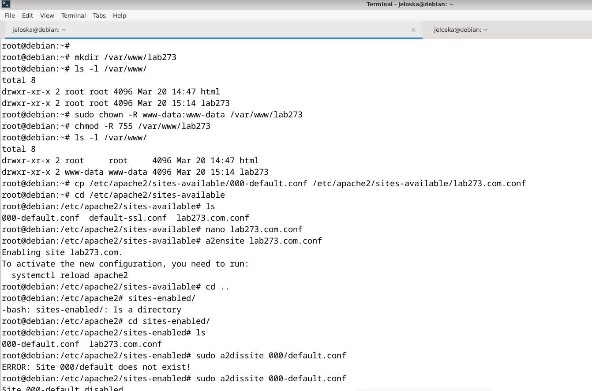

# Laboratorio 4
#### Jeloska Isabel Chavez Paredez
## Creacion  del virtual host lab273.com
Ejecutamos el comando  `mkdir /var/www/lab273` para crear la carpeta el sitio web. 

Posteriormente cambiamos de propiestario y permisos del direcorio con los comandos
```bash
sudo chown -R www-data:www-data /var/www/lab273
sudo chmod -R 755 /var/www/lab273

```
el usuario propietario suele ser www-data, que es el usuario predeterminado para el servidor web Apache en sistemas Debian y derivados.El anterior comando cambia el propietario (`www-data`) y el grupo (`www-data`) de forma recursiva (`-R`) para el directorio `/var/www/lab273`.

**Cambio de permisos (`chmod`):**

```bash
sudo chmod -R 755 /var/www/lab273
```

Este comando establece permisos recursivos (`-R`) en el directorio `/var/www/lab273` para que el propietario tenga permisos de lectura, escritura y ejecución (7), el grupo tenga permisos de lectura y ejecución (5), y otros usuarios tengan permisos de lectura y ejecución (5) también.

El procedimiento para crear el virtual host lab273.com tiene algunos errores y aspectos que podrían mejorarse. Aquí tienes una versión corregida y mejorada:

1. **Creación de la carpeta para el sitio web:**
   ```bash
   sudo mkdir /var/www/lab273
   ```

2. **Cambio de propietario y permisos del directorio y archivo:**
   ```bash
   sudo chown -R www-data:www-data /var/www/lab273
   sudo chmod -R 755 /var/www/lab273
   ```

3. **Creación del archivo de configuración del sitio en Apache:**
   ```bash
   sudo cp /etc/apache2/sites-available/000-default.conf /etc/apache2/sites-available/lab273.com.conf
   sudo nano /etc/apache2/sites-available/lab273.com.conf
   ```
   

En este paso se identifico un error en la ruta del archivo de configuración del sitio pues en el paso de copiar el archivo de configuración del sitio, la ruta utilizada fue incorrecta (`./000-default.conf.bak` en lugar de `/etc/apache2/sites-available/000-default.conf`). Esto habría causado que el archivo de configuración incorrecto fuera copiado y modificado, lo que podría llevar a errores de configuración del virtual host.

Establecemos el contenido el contenido de lab273.com.conf como sigue:
   ```apache
   <VirtualHost *:80>
       ServerAdmin webmaster@lab273.com
       ServerName lab273.com
       ServerAlias www.lab273.com
       DocumentRoot /var/www/lab273
       DirecoryIndex index.html 
       ErrorLog ${APACHE_LOG_DIR}/error.log
       CustomLog ${APACHE_LOG_DIR}/access.log combined
   </VirtualHost>
   ```
Tambien se identifico erroes en el contenido presentado en la guia En el archivo de configuración del sitio (lab273.com.conf), se estaba especificando incorrectamente la ruta del DocumentRoot. En lugar de /var/www/lab273, se mencionaba /var/www/lab273.com/index.html. Esto habría llevado a problemas al servir el contenido del sitio web.

## Creacion del index.html
En el directorio del host creado creamos el archivo index.html

## Habilitar el sitio y deshabilitar el sitio por defecto:

sudo a2ensite lab273.com.conf
sudo a2dissite 000-default.conf


## Creando el index


### Configurando



```bash
root@debian:~# mkdir /var/www/lab273
root@debian:~# ls -l /var/www/
total 8
drwxr-xr-x 2 root root 4096 Mar 20 14:47 html
drwxr-xr-x 2 root root 4096 Mar 20 15:14 lab273
root@debian:~# sudo chown -R www-data:www-data /var/www/lab273
root@debian:~# chmod -R 755 /var/www/lab273
root@debian:~# ls -l /var/www/
total 8
drwxr-xr-x 2 root     root     4096 Mar 20 14:47 html
drwxr-xr-x 2 www-data www-data 4096 Mar 20 15:14 lab273
root@debian:~# cp /etc/apache2/sites-available/000-default.conf /etc/apache2/sites-available/lab273.com.conf
root@debian:~# cd /etc/apache2/sites-available
root@debian:/etc/apache2/sites-available# ls 
000-default.conf  default-ssl.conf  lab273.com.conf
root@debian:/etc/apache2/sites-available# nano lab273.com.conf 
root@debian:/etc/apache2/sites-available# a2ensite lab273.com.conf
Enabling site lab273.com.
To activate the new configuration, you need to run:
  systemctl reload apache2
root@debian:/etc/apache2/sites-available# cd ..
root@debian:/etc/apache2# sites-enabled/
-bash: sites-enabled/: Is a directory
root@debian:/etc/apache2# cd sites-enabled/
root@debian:/etc/apache2/sites-enabled# ls
000-default.conf  lab273.com.conf
root@debian:/etc/apache2/sites-enabled# sudo a2dissite 000/default.conf
ERROR: Site 000/default does not exist!
root@debian:/etc/apache2/sites-enabled# sudo a2dissite 000-default.conf
Site 000-default disabled.
To activate the new configuration, you need to run:
  systemctl reload apache2
root@debian:/etc/apache2/sites-enabled# ls
lab273.com.conf
root@debian:/etc/apache2/sites-enabled# systemctl reload apache2

```

### Cambiando de Puerto

nano /etc/apache2/sites-available/lab273.com.conf
´

