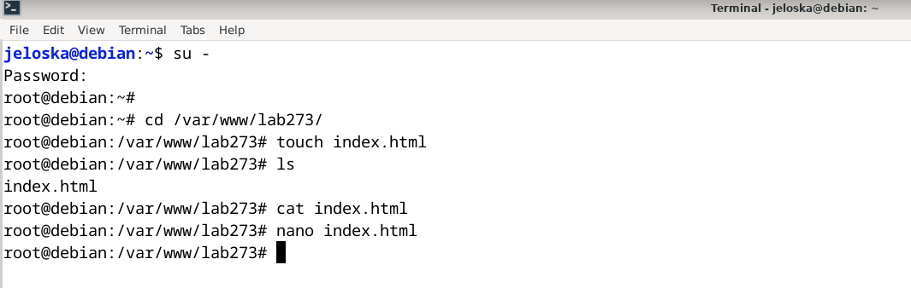
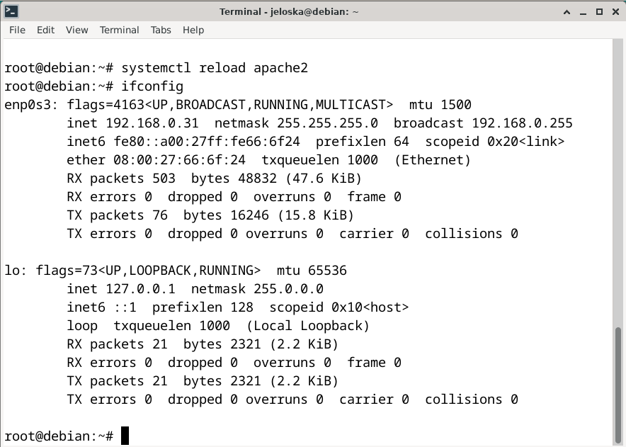
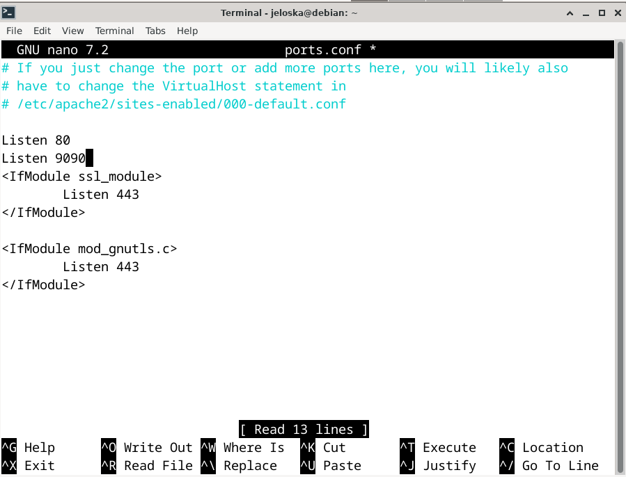

## Item 1: Configuración del Virtual Host lab273.com en Apache

#### Jeloska Isabel Chavez Paredez


### Paso 1: Creación del Directorio del Host Virtual
Para comenzar, se ejecutó el siguiente comando para crear el directorio donde se alojará el host virtual lab273.com (ver figura 4):

```bash
sudo mkdir /var/www/lab273
```

Este directorio servirá como la ubicación principal para todos los archivos y recursos del host.

### Paso 2: Cambio de Propietario y Permisos del Directorio

A continuación, se cambió el propietario y los permisos del directorio `/var/www/lab273` utilizando los siguientes comandos:

```bash
sudo chown -R www-data:www-data /var/www/lab273
sudo chmod -R 755 /var/www/lab273
```

Se utilizó el comando `chown` para cambiar el propietario y el grupo del directorio al usuario `www-data`, que es el propietario predeterminado utilizado por el servidor web Apache en sistemas Debian. Este cambio de propietario asegura que Apache tenga los permisos necesarios para acceder y servir los archivos del host virtual sin problemas de acceso. Por otra parte, se empleó el comando `chmod` para establecer los permisos en el directorio del host. Los permisos `755` otorgan al propietario (`www-data`) los permisos de lectura, escritura y ejecución necesarios, mientras que el grupo (`www-data`) y otros usuarios tienen permisos de lectura y ejecución (ver figura 4). Estos permisos aseguran un acceso controlado a los archivos del host virtual.

### Paso 3: Creación del Archivo de Configuración del Virtual Host
A continuación, se procedio a crear el archivo de configuración específico para el virtual host lab273.com en Apache:

```bash
sudo cp /etc/apache2/sites-available/000-default.conf /etc/apache2/sites-available/lab273.com.conf
sudo nano /etc/apache2/sites-available/lab273.com.conf
```
Se copio el archivo de configuración predeterminado de Apache y renombrarlo como `lab273.com.conf`(ver figura 4). Esta acción se realizó para utilizar el archivo predeterminado como base y luego modificarlo según las necesidades específicas del virtual host lab273.com. Sin embargo, se identificó un error en la guía proporcionada en cuanto a la ruta del archivo de configuración, que se encontraba incorrecta (`./000-default.conf.bak` en lugar de `/etc/apache2/sites-available/000-default.conf`).

### Paso 4: Corrección de Errores en el Archivo de Configuración

Al editar el archivo `lab273.com.conf` (ver figura 1), se realizaron las siguientes correcciones:

- Se corrigió la ruta del `DocumentRoot`, que originalmente estaba especificada como `/var/www/lab273.com/index.html`, en lugar de la ruta correcta `/var/www/lab273`.
  
- Se agregó la directiva `DirectoryIndex` para especificar el archivo de índice predeterminado, como se muestra a continuación:

  ```apache
  <VirtualHost *:80>
      ServerAdmin webmaster@lab273.com
      ServerName lab273.com
      ServerAlias www.lab273.com
      DocumentRoot /var/www/lab273
      DirectoryIndex index.html
      ErrorLog ${APACHE_LOG_DIR}/error.log
      CustomLog ${APACHE_LOG_DIR}/access.log combined
  </VirtualHost>
  ```

<figure>
  
  <figcaption align="center">Figura 1: Creación del archivo de configuración lab273.com.conf para el servidor lab273.com</figcaption>
</figure> 

### Paso 5: Creación del Archivo index.html

En el directorio `/var/www/lab273`, se generó el archivo `index.html` (ver figuras 2 y 3) destinado a ser la página principal del host virtual lab273.com. Este documento es esencial para presentar el contenido inicial y establecer la estructura básica del host.
<figure>
  
  <figcaption align="center">Figura 2: Creación del documento index.html en directorio /var/www/lab273</figcaption>
</figure>
<figure>
  
  <figcaption align="center">Figura 3: Edición del documento index.html en el editor nano</figcaption>
</figure>


### Paso 6: Habilitación del Virtual Host y Deshabilitación del Sitio por Defecto

Finalmente, se procedió a habilitar el virtual host `lab273.com.conf` en Apache utilizando el comando `sudo a2ensite lab273.com.conf`, mientras que el sitio por defecto (`000-default.conf`) fue deshabilitado mediante el comando `sudo a2dissite 000-default.conf` (ver figura 4). Es importante señalar que al habilitar el virtual host `lab273.com.conf`, se crea automáticamente su archivo de configuración en el directorio `sites-enabled`, mientras que al deshabilitar el sitio por defecto, este deja de estar presente en el mismo directorio (ver figura 4).
<figure>
  
  <figcaption align="center">Figura 4: Pasos 1, 2, 3, 4 y 6 para la configuración del Virtual Host lab273.com en Apache</figcaption>
</figure>

### Paso 7: Verificación y Validación de la Configuración del Servidor Apache
Al finalizar la configuración del servidor Apache, se ejecutó el comando `systemctl reload apache2` para recargar la configuración y aplicar los cambios realizados (ver figura 5). Esto asegura que Apache reconozca las nuevas configuraciones, incluyendo la habilitación del virtual host `lab273.com.conf` y la deshabilitación del sitio por defecto `000-default.conf`.

<figure>
  
  <figcaption align="center">Figura 5: Ejecución del comando systemctl reload apache2 y obtención de la ip</figcaption>
</figure>

Una vez realizado este paso, abrimos el navegador web y accedimos a `http://localhost` o colocamos nuestra ip para visualizar el índice del host virtual (ver figura 6). Esto permite verificar que la configuración del virtual host se haya aplicado correctamente y que el servidor esté listo para servir el contenido del host lab273.com cuando accedemos a través de `localhost`.
<figure>
  
  <figcaption align="center">Figura 6: Visualización del index.html del servivor lab273.com en el navegador</figcaption>
</figure>

## Item 2: Cambio de Puerto

### Paso 1: Modificación del Archivo de Configuración del Virtual Host

Utilizando el editor de texto `nano`, accedimos al archivo de configuración del servidor local:
   
   ```bash
   sudo nano /etc/apache2/sites-available/lab273.com.conf
   ```

En este archivo, modificamos la línea `<VirtualHost *:80>` por `<VirtualHost *:9090>` (ver figura 7)para cambiar el puerto de escucha del servidor de Apache de 80 a 9090.

Esta modificación asegura que el servidor Apache escuche las solicitudes en el puerto 9090 en lugar del puerto por defecto 80.
<figure>
  
  <figcaption align="center">Figura 7: Modificación del puerto en el archivo de configuración </figcaption>
</figure>

### Paso 2: Habilitación del Puerto en el Archivo ports.conf

1. Accedimos al archivo `ports.conf` ubicado en el directorio de configuración de Apache:

   ```bash
   sudo nano /etc/apache2/ports.conf
   ```

2. En este archivo, agregamos la línea `Listen 9090` para indicar que Apache debe escuchar las solicitudes en el puerto 9090 (ver figura 8).

Al agregar esta línea, estamos habilitando el puerto 9090 para que Apache acepte conexiones entrantes en este puerto.

Estos pasos se llevaron a cabo con el propósito de modificar el puerto de escucha del servidor Apache de 80 a 90 y permitir que el servidor acepte conexiones entrantes en el puerto 9090. Una vez completadas estas configuraciones, se ejecutó el comando systemctl reload apache2 para aplicar y activar los cambios realizados en la configuración del servidor Apache.

<figure>
  
  <figcaption align="center">Figura 8: Habilitación del puerto 9090</figcaption>
</figure>


*Disclaimer*: La creación del archivo index.html para el servidor virtual lab273.com se realizó previamente en el paso 5 del item 1.

## Item 3: Acceder al host virtual mediante la URL [http://localhost:9090/index.html](http://localhost:9090/index.html).

<figure>
  
  <figcaption align="center">Figura 9: Acceso al host virtual desde el puerto 9090</figcaption>
</figure>


