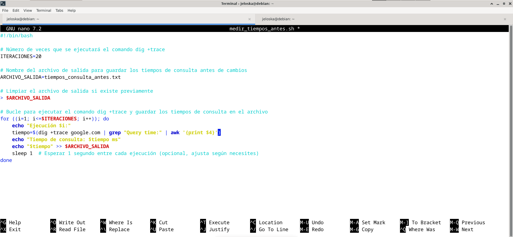

### Porgrama para medir los tiempos



```bash
#!/bin/bash

# Número de veces que se ejecutará el comando dig
ITERACIONES=10

# Nombre del archivo de salida para guardar los tiempos de consulta antes de configurar el DNS como servidor cache 
ARCHIVO_SALIDA=tiempos_consulta_antes.txt

# Limpiar el archivo de salida si existe previamente
> $ARCHIVO_SALIDA

# Bucle para ejecutar el comando dig y guardar los tiempos de consulta en el archivo de salida
for ((i=1; i<=$ITERACIONES; i++)); do
    echo "Ejecución $i:"
    tiempo=$(dig google.com +stats | grep "Query time:" | awk '{print $4}')
    echo "Tiempo de consulta: $tiempo ms"
    echo "$tiempo" >> $ARCHIVO_SALIDA
    sleep 1  # Esperar 1 segundo entre cada ejecución (opcional, ajusta según necesites)
done

echo "Tiempos de consulta guardados en $ARCHIVO_SALIDA"
```


