# Laboratorio 5
#### Jeloska Isabel Chavez Paredez

## Item 1: Configuración de DNS como servidor caché

Para establecer el DNS como servidor caché, primero modificamos el archivo `/etc/bind/named.conf.options`. Agregamos el siguiente bloque de código, en este caso utilizando el DNS de Google: `plaintext
forwarders {
    8.8.8.8;
};
`

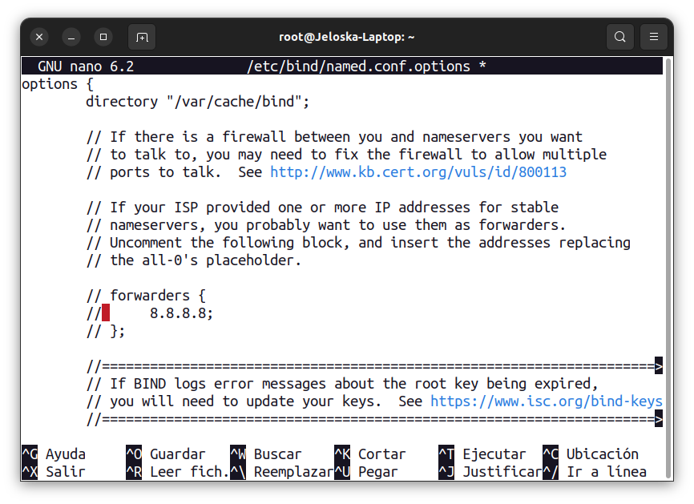


Una vez realizada esta configuración, es necesario reiniciar el servicio DNS para aplicar los cambios. Esto se logra ejecutando el siguiente comando:

```bash
sudo systemctl restart bind9
```


Para verificar la efectividad de esta configuración y medir el tiempo de consulta, utilizamos el comando `dig`, el cual se instala con el paquete `dnsutils`. A continuación, se muestran los resultados de dos consultas de tiempo, donde se puede observar que inicialmente el tiempo de consulta era de 39ms y posteriormente se redujo a 0ms.

<div style="display: flex;">
    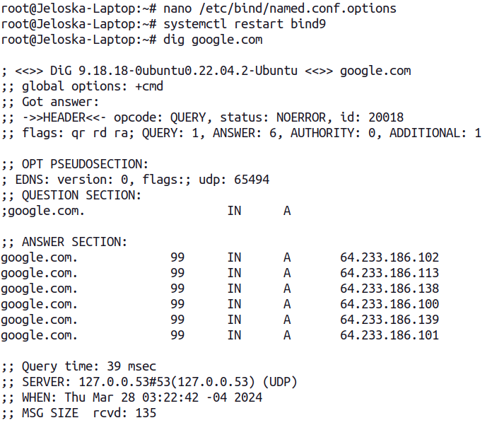
    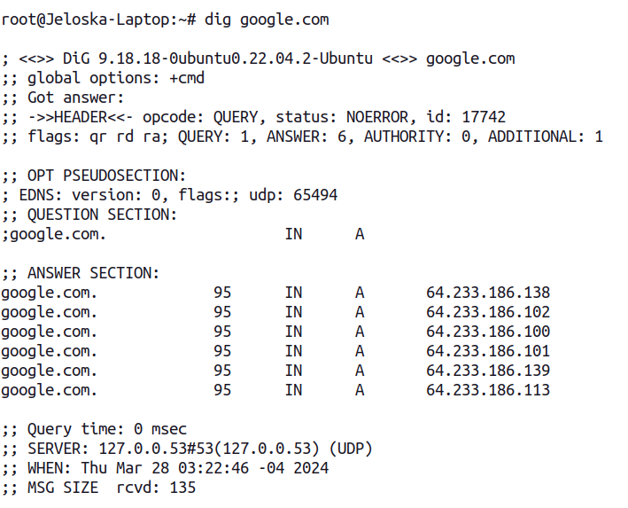
</div>


Este cambio demuestra cómo la configuración del servidor DNS como caché puede mejorar significativamente los tiempos de consulta, optimizando el rendimiento y la eficiencia del sistema de nombres de dominio.


## Item 2: Configuración DNS primario

1. **Verificación y Validación del Archivo de Configuración Bind9:**

   - **Paso 1:** Abrimos el archivo `/etc/bind/named.conf` utilizando el editor nano para verificar que las líneas `include "/etc/bind/named.conf.options";`, `include "/etc/bind/named.conf.local";` y `include "/etc/bind/named.conf.default-zones";` no estén comentadas, lo que asegura que las configuraciones en esos archivos se estén incluyendo correctamente en la configuración global de Bind9.
   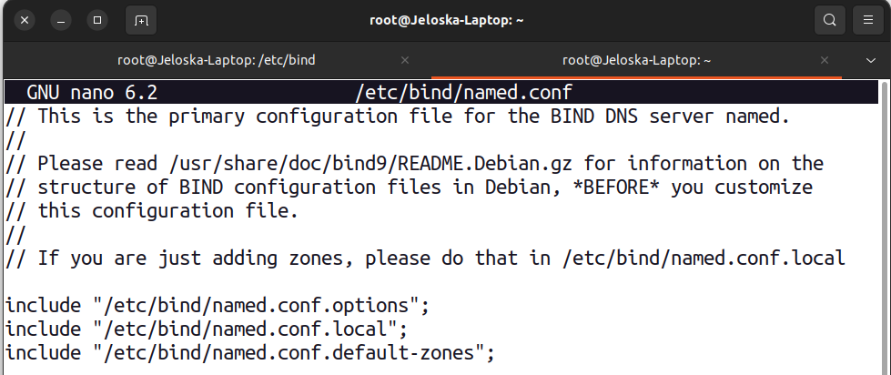

   Se verificó que las líneas mencionadas no están comentadas en el archivo de configuración `named.conf`.


2. **Agregando una Entrada de Zona en el Archivo `named.conf.local`:**

   Agregamos una entrada de zona para nuestro dominio `ejemplo.com` en el archivo `/etc/bind/named.conf.local`. Para ello, añadimos las siguientes líneas:

   ```bash
   zone "ejemplo.com" {
       type master;
       file "/etc/bind/db.ejemplo.com";
   };
   ```

   Estas líneas indican que la zona `ejemplo.com` será manejada como una zona maestra (`type master`) y que los datos de esa zona se encuentran en el archivo `/etc/bind/db.ejemplo.com`. De esta manera, Bind9 reconocerá y gestionará la zona `ejemplo.com` de acuerdo con la configuración en el archivo de zona correspondiente.
   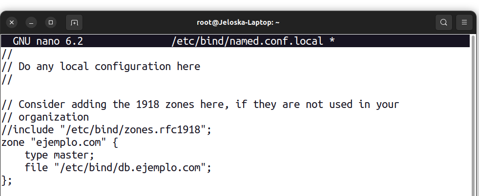

3. **Creación y Edición del Archivo de Zona para ejemplo.com:**

   - **Paso 1:** Copiamos la plantilla de archivo de zona `db.local` para crear el archivo de zona `db.ejemplo.com` para el dominio `ejemplo.com` de esta manera preparamos el archivo para ser editado con los registros de recursos necesarios para la resolución DNS de ese dominio `
     sudo cp /etc/bind/db.local /etc/bind/db.ejemplo.com
     `
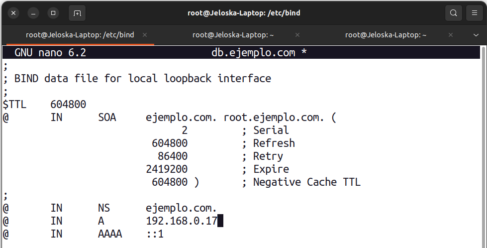
   - **Paso 2:** Abrimos el archivo `db.ejemplo.com` con Nano y efectuamos las siguientes configuraciones: 

      **Registro SOA (Start of Authority):**
         - Establecimos el registro SOA para definir la autoridad de la zona `ejemplo.com`.
         - `@ IN SOA ns1.ejemplo.com. admin.ejemplo.com. (2022032701 ...)`:
         - `@` representa el dominio principal `ejemplo.com`.
         - `IN` indica la clase de datos, que en este caso es Internet.
         - `SOA` especifica el tipo de registro, que es el inicio de autoridad.
         - `ns1.ejemplo.com.` es el nombre del servidor de nombres autoritario para la zona.
         - `admin.ejemplo.com.` es la dirección de correo electrónico del administrador de la zona.
         - `2022032701` es el número de serie que indica la versión actual del archivo de zona.
         - `604800`, `86400`, `2419200` y `604800` son los parámetros de tiempo para refrescar, reintento, expiración y TTL negativo, respectivamente.

      **Registro NS (Name Server):**
         - Agregamos un registro NS para designar `ns1.ejemplo.com.` como el servidor de nombres principal de la zona.
         - `@ IN NS ns1.ejemplo.com.`: Indica que `ns1.ejemplo.com.` es el servidor de nombres autoritario para la zona `ejemplo.com`.

      **Registros de Dirección (A):**
         - Configuramos registros de dirección (A) para asignar direcciones IP a los nombres de host en la zona.
         - `@ IN A 192.168.1.10`: Asigna la dirección IP `192.168.1.10` al nombre de host principal `ejemplo.com`.
         - `www IN A 192.168.1.10`: Asigna la misma dirección IP al subdominio `www.ejemplo.com`..

4. **Verificación de la Configuración de la Zona y Reinicio del Servidor DNS:**

   - **Paso 1:** Verificamos la sintaxis del archivo de zona `db.ejemplo.com` utilizando el comando `named-checkzone`:

     ```bash
     sudo named-checkzone ejemplo.com /etc/bind/db.ejemplo.com
     ```

     

   La salida del comando indica si la zona `ejemplo.com` se cargó correctamente y no presenta errores sintácticos.

   - **Paso 2:** Reiniciamos el servicio Bind9 para que los cambios realizados en la configuración, como la adición de la nueva zona `ejemplo.com`, surtan efecto y se apliquen correctamente en el servidor DNS.
     ```bash
     sudo systemctl restart bind9
     ```
   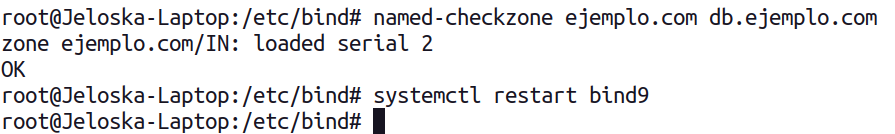

5. **Configuración del archivo /etc/resolv.conf:**

   - **Paso 1:** Editamos el archivo `/etc/resolv.conf` para agregar la línea `nameserver` con la dirección IP del servidor DNS actual para que el sistema utilice el servidor DNS local.


     ```bash
     sudo nano /etc/resolv.conf
     ```

   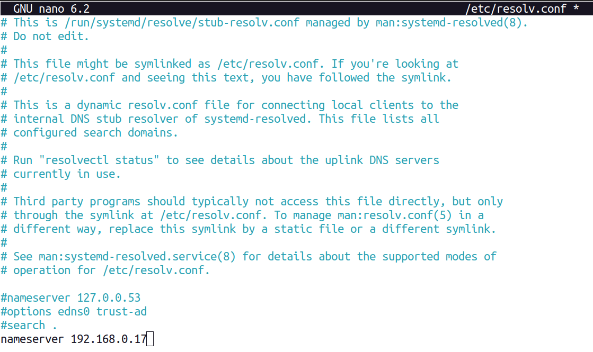  

6. **Prueba de Resolución DNS utilizando nslookup:**

   - **Paso 1:** Ejecutamos el comando `nslookup` para verificar que la resolución DNS del dominio `ejemplo.com` se esté realizando correctamente utilizando el servidor DNS local.

     ```bash
     nslookup ejemplo.com
     ```
   La salida del comando `nslookup` muestra el servidor DNS utilizado y la dirección IP resuelta para el dominio `ejemplo.com`, confirmando que la configuración del servidor DNS primario para el dominio `ejemplo.com` es exitosa.

   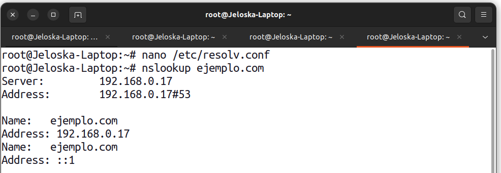  

## Item 3: Procedimiento para Archivo de Zona Inversa

1. **Agregando una Entrada de Zona Inversa en el Archivo `named.conf.local`:**

   Para configurar la zona inversa en el servidor DNS Bind9, agregamos la siguiente entrada en el archivo `/etc/bind/named.conf.local`:

   ```bash
   zone "0.168.192.in-addr.arpa" {
       type master;
       file "/etc/bind/db.17";
   };
   ```

   Esta configuración define que la zona inversa correspondiente a la subred `192.168.0.0/24` será manejada como una zona maestra (`type master`) y que los datos de la zona inversa se encuentran en el archivo `/etc/bind/db.17`.

   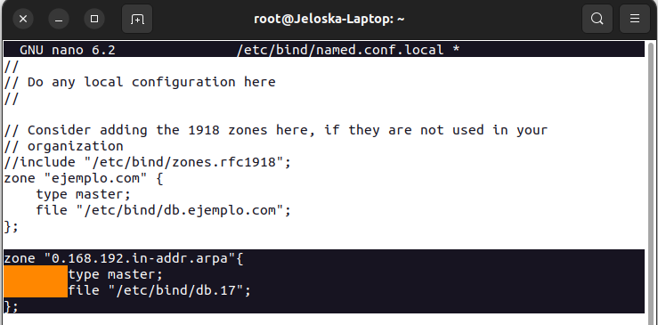

2. **Creación y Edición del Archivo de Zona Inversa `db.17`:**
   - **Paso 1:** Copiamos la plantilla de archivo de zona `db.255` para crear el archivo de zona inversa `db.17` correspondiente a la subred `192.168.0.0/24`:

     ```bash
     sudo cp /etc/bind/db.255 /etc/bind/db.17
      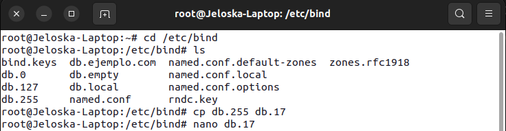
     ```

   - **Paso 2:** Abrimos el archivo `db.17` con el editor Nano para agregar los registros de recursos inversos necesarios:

   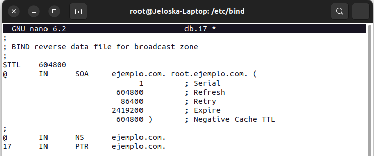
    


   1. **Añadimos el Registro SOA:**
      Agregamos el registro `SOA` (Start of Authority) al principio del archivo para establecer la autoridad de la zona inversa. Este registro incluye información como el nombre del servidor DNS autoritario, el contacto del administrador, y otros parámetros. En nuestro caso, el registro `SOA` se ve así:

      ```plaintext
      @       IN      SOA     ejemplo.com. root.ejemplo.com. (
                                    1         ; Serial
                              604800         ; Refresh
                                 86400         ; Retry
                              2419200         ; Expire
                              604800 )       ; Negative Cache TTL
      ```

      - `@`: Representa el dominio principal de la zona inversa `0.168.192.in-addr.arpa`.
      - `IN`: Indica la clase de datos, en este caso, Internet.
      - `SOA`: Tipo de registro que define la autoridad de la zona.
      - `ejemplo.com.`: Nombre del servidor DNS autoritario.
      - `root.ejemplo.com.`: Dirección de correo electrónico del administrador de la zona.

   2. **Agregamos el Registro NS:**
      Añadimos el registro `NS` (Name Server) para designar el servidor de nombres principal de la zona inversa. Esto se hace con la siguiente línea:

      ```plaintext
      @       IN      NS      ejemplo.com.
      ```

      - `@`: Representa el dominio principal de la zona inversa `0.168.192.in-addr.arpa`.
      - `IN`: Indica la clase de datos.
      - `NS`: Tipo de registro que especifica el servidor de nombres principal.
      - `ejemplo.com.`: Nombre del servidor de nombres principal.

   3. **Agregamos el Registro PTR:**
      Por último, añadimos un registro `PTR` (Pointer) que asocia una dirección IP con un nombre de host. En nuestro caso, la dirección IP `192.168.0.17` se asigna al nombre de host `ejemplo.com.`:

      ```plaintext
      17      IN      PTR     ejemplo.com.
      ```

      - `17`: El último octeto de la dirección IP invertida (`192.168.0.17` se convierte en `17.0.168.192.in-addr.arpa`).
      - `IN`: Indica la clase de datos.
      - `PTR`: Tipo de registro que establece una relación de puntero entre la dirección IP y el nombre de host.
      - `ejemplo.com.`: Nombre de host asociado con la dirección IP `192.168.0.17`.

   Estos cambios son importantes para la configuración correcta de la zona inversa en el servidor DNS Bind9, ya que definen la autoridad de la zona, el servidor de nombres principal y las asociaciones de direcciones IP con nombres de host.

3. **Verificación de la Configuración de la Zona Inversa y Reinicio del Servidor DNS:**

   - **Paso 1:** Verificamos la sintaxis del archivo de zona inversa `db.17` utilizando el comando `named-checkzone`:

     ```bash
     named-checkzone 0.168.192.in-addr.arpa /etc/bind/db.17
     ```

     Este comando comprueba la sintaxis del archivo y nos indica si la zona inversa se cargó correctamente sin errores sintácticos.

   - **Paso 2:** Reiniciamos el servicio Bind9 para aplicar los cambios en la configuración del servidor DNS:

     ```bash
     sudo systemctl restart bind9
     ```

   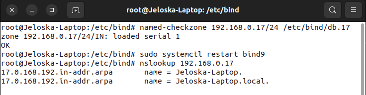  

4. **Prueba de Resolución DNS utilizando `nslookup`:**

   Para verificar la resolución inversa de direcciones IP, ejecutamos el comando `nslookup` seguido de la dirección IP que queremos resolver. En nuestro caso, utilizamos la dirección IP local `192.168.0.17`.

   ```bash
   nslookup 192.168.0.17
   ```

   Este comando envía una consulta DNS al servidor DNS configurado en el sistema para obtener información inversa de la dirección IP especificada.

   La salida esperada de este comando es un registro que muestra la dirección IP invertida y su correspondiente nombre de host:

   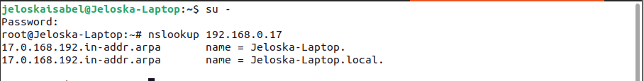

   Aquí, la parte `17.0.168.192.in-addr.arpa` representa la dirección IP invertida, y `ejemplo.com` es el nombre de host asociado con la dirección IP `192.168.0.17` en la zona inversa configurada en el servidor DNS.

   La captura de pantalla adjunta muestra un ejemplo de la salida obtenida al realizar esta prueba de resolución DNS utilizando `nslookup`. Esta salida confirma que la configuración de la zona inversa en el servidor DNS está funcionando correctamente al asociar la dirección IP con el nombre de host correspondiente.

## Item 4: Cambiar el DNS de ISP por DNS público


### 1. Cambiar DNS a Google DNS:

Para cambiar la configuración del servidor DNS en Linux, comenzamos editando el archivo de configuración de red `/etc/resolv.conf`. Dentro de este archivo, localizamos la línea que comienza con `nameserver` y reemplazamos la dirección IP del servidor DNS actual con la dirección de Google DNS (`8.8.8.8`). El cambio en el archivo se reflejará de la siguiente manera:

   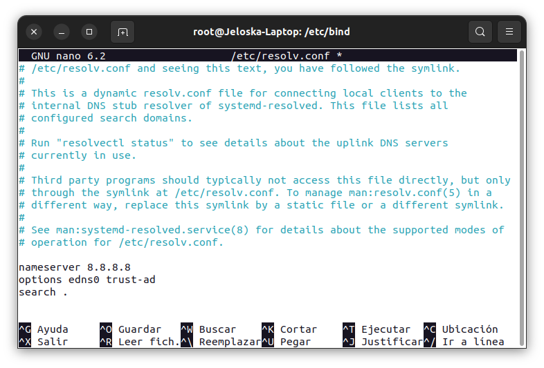


### 1.2. Pruebas de velocidad de acceso:

Se utilizó un script en bash del apéndice A para registrar los tiempos de consulta DNS. Este script está diseñado para realizar mediciones de tiempo utilizando el comando `dig` en un entorno Linux. En primer lugar, se configura el número de veces que se ejecutará el comando `dig`, estableciendo en este caso 10 iteraciones. También se define el nombre del archivo de salida, `tiempos_consulta_dns_google.txt`, donde se almacenarán los tiempos de consulta DNS.

Una vez configuradas estas variables, el script realiza una limpieza del archivo de salida en caso de que ya exista, asegurando que los datos se guarden de manera organizada y sin contenido previo. Luego, se inicia un bucle `for` que se repetirá las 10 veces definidas anteriormente.

En cada iteración del bucle, el script ejecuta el comando `dig` para realizar una consulta DNS al dominio `google.com`, utilizando el servidor DNS de Google con la dirección IP `8.8.8.8`. El tiempo de respuesta de cada consulta se extrae utilizando herramientas como `grep` y `awk`, y se guarda en el archivo de salida en milisegundos.

Además, el script incluye una pausa de 1 segundo entre cada ejecución del comando `dig` para evitar sobrecargar el servidor DNS y obtener mediciones más precisas. Una vez finalizadas todas las iteraciones, se muestra un mensaje indicando la finalización del proceso y se informa al usuario sobre la ubicación del archivo donde se han guardado los tiempos de consulta, facilitando así su análisis posterior.

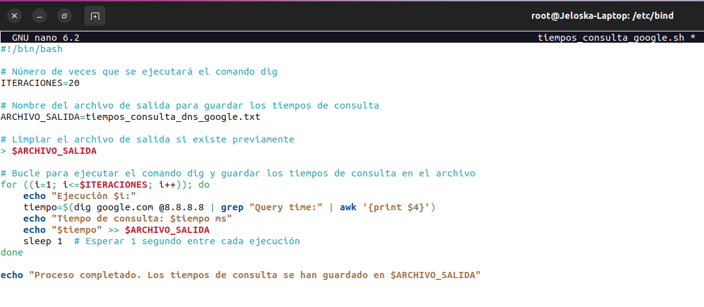
Los resultados obtenidos al ejecutar el script se presentan en la captura de pantalla adjunta. 
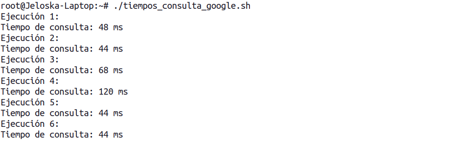

### 2. Cambiar DNS a Cloudflare DNS:

Para modificar la configuración del servidor DNS, primero editamos el archivo de configuración de red `/etc/resolv.conf`. En este archivo, ubicamos la línea que comienza con `nameserver` y sustituimos la dirección IP del servidor DNS actual por la dirección de Google DNS (`1.1.1.1`).


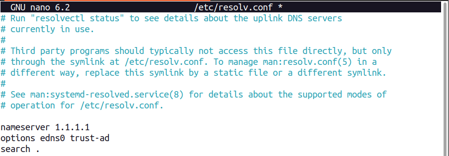

### 2.1. Pruebas de velocidad de acceso:
Al igual que en la instancia anterior, utilizamos el script del apéndice A para realizar mediciones de tiempo de consulta DNS. Esta vez, el archivo de salida se denominó `tiempos_consulta_dns_cloudflare.txt`. La línea de código empleada en el script para esta medición fue la siguiente:

```plaintext
tiempo=$(dig cloudflare.com @1.1.1.1 | grep "Query time:" | awk '{print $4}')
```

Este comando ejecuta una consulta DNS al dominio `cloudflare.com` utilizando el servidor DNS de Cloudflare (`1.1.1.1`). Luego, se extrae el tiempo de respuesta de la consulta y se guarda en el archivo de salida mencionado anteriormente.


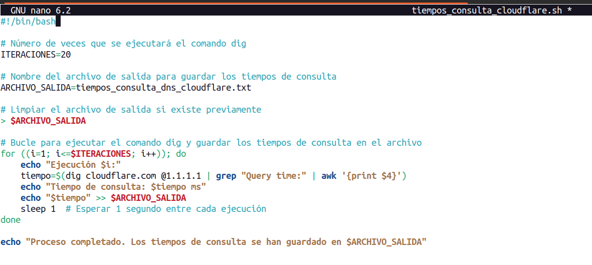
En la siguiente captura se muestran los resultados obtenidos:
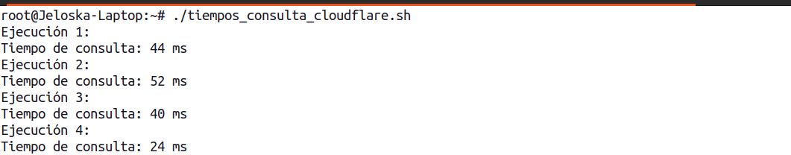

### Comparación y análisis de los resultados:

**Tiempo de Respuesta de los Servidores DNS (en milisegundos)**

| Intento | Cloudflare | Google |
|---------|------------|--------|
| 1       | 44         | 48     |
| 2       | 52         | 44     |
| 3       | 40         | 68     |
| 4       | 24         | 120    |
| 5       | 36         | 44     |
| 6       | 24         | 44     |
| 7       | 28         | 64     |
| 8       | 28         | 76     |
| 9       | 44         | 68     |
| 10      | 32         | 44     |
| 11      | 28         | 44     |
| 12      | 40         | 48     |
| 13      | 28         | 44     |
| 14      | 40         | 48     |
| 15      | 44         | 108    |
| 16      | 44         | 60     |
| 17      | 40         | 68     |
| 18      | 44         | 72     |
| 19      | 44         | 44     |
| 20      | 48         | 44     |
| Promedio| 37.6       | 58.8   |

---

**Análisis de los Resultados:**

1. **Tiempo Promedio:**
   - Cloudflare: 37.6 ms
   - Google: 58.8 ms
   - Podemos observar que, en promedio, Cloudflare tiene tiempos de respuesta más bajos en comparación con Google.

2. **Variabilidad:**
   - Cloudflare muestra una menor variabilidad en los tiempos de respuesta, con valores que oscilan entre 24 ms y 52 ms.
   - Google presenta una mayor variabilidad, con tiempos que van desde 44 ms hasta 120 ms.

3. **Rendimiento Global:**
   - Basándonos en estos datos, Cloudflare parece ofrecer un mejor rendimiento en términos de tiempo de respuesta promedio y estabilidad en comparación con Google.

4. **Consideraciones Adicionales:**
   - Es importante considerar que estos tiempos pueden variar dependiendo de la ubicación geográfica y las condiciones de red en el momento de la medición.
   - Para un análisis más completo y preciso, se recomienda realizar múltiples mediciones en diferentes momentos y ubicaciones.

#### Gráfica comparativa
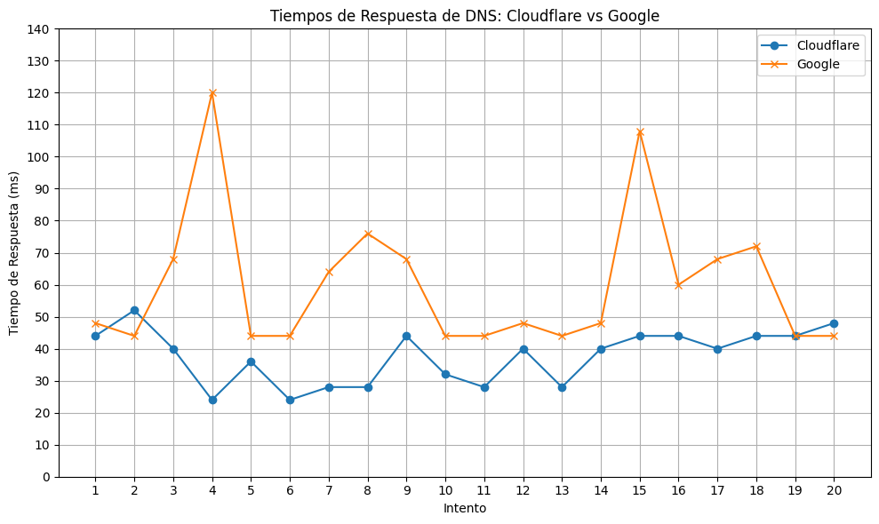

El análisis del gráfico comparativo de los tiempos de respuesta entre los servidores DNS de Cloudflare y Google revela importantes conclusiones. Cloudflare muestra una mayor estabilidad en sus tiempos de respuesta a lo largo de múltiples intentos de medición, evidenciado por una curva más suave y consistente en el gráfico, con variaciones mínimas entre los puntos de datos.

Por otro lado, los tiempos de respuesta del servidor DNS de Google presentan una variabilidad más marcada, con picos de tiempo en ciertos intentos que generan una curva más irregular en el gráfico. Esta variabilidad sugiere que el rendimiento del servidor DNS de Google puede fluctuar más significativamente en diferentes momentos o condiciones de red.


## Apendice A: Script de Medición de Tiempos de Consulta DNS

```bash
#!/bin/bash

# Nombre del script: medir_tiempos_dns.sh

# Número de veces que se ejecutará el comando dig
ITERACIONES=20

# Nombre del archivo de salida para guardar los tiempos de consulta
ARCHIVO_SALIDA=tiempos_consulta_dns.txt

# Limpiar el archivo de salida si existe previamente
> $ARCHIVO_SALIDA

# Bucle para ejecutar el comando dig y guardar los tiempos de consulta en el archivo
for ((i=1; i<=$ITERACIONES; i++)); do
    echo "Ejecución $i:"
    tiempo=$(dig google.com @8.8.8.8 | grep "Query time:" | awk '{print $4}')
    echo "Tiempo de consulta: $tiempo ms"
    echo "$tiempo" >> $ARCHIVO_SALIDA
    sleep 1  # Esperar 1 segundo entre cada ejecución
done

echo "Proceso completado. Los tiempos de consulta se han guardado en $ARCHIVO_SALIDA"
```
