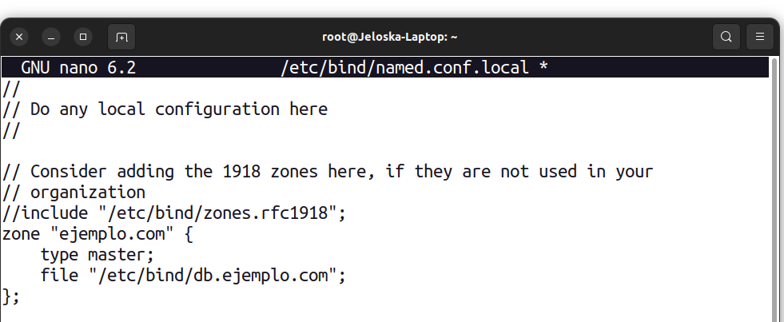
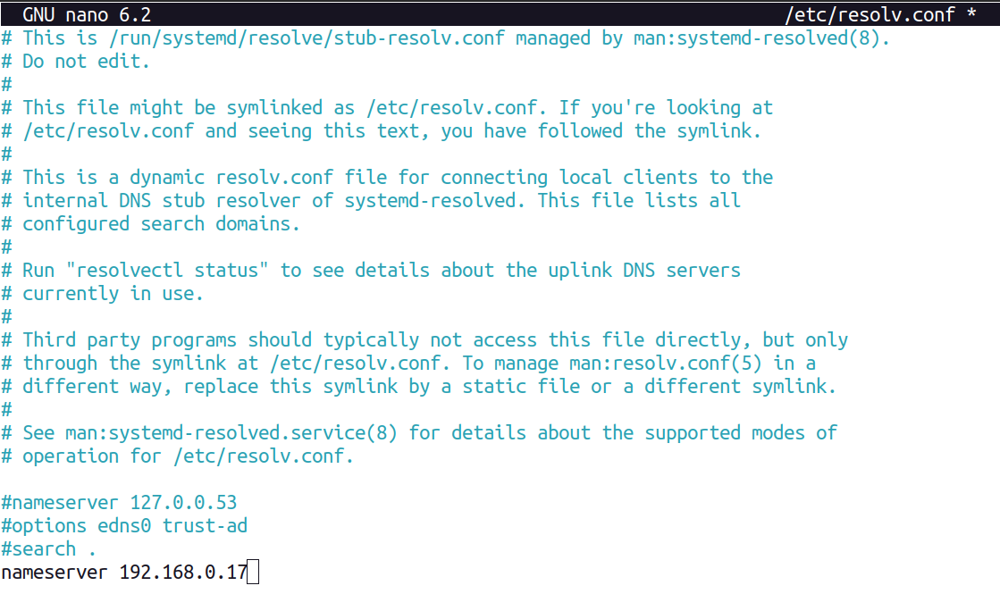
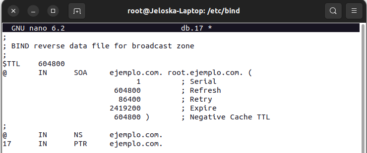
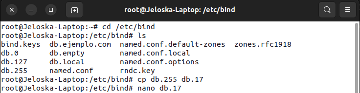
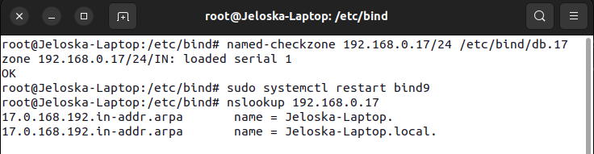

## Guidelines ej2
Para configurar un servidor DNS primario en Linux utilizando Bind9, sigue estos pasos:

1. **Instalar Bind9:**
   Asegúrate de tener Bind9 instalado en tu sistema. Puedes instalarlo con el siguiente comando en sistemas basados en Debian/Ubuntu:

   ```bash
   sudo apt update
   sudo apt install bind9
   ```

   En sistemas basados en Red Hat/CentOS, puedes instalar Bind9 con el siguiente comando:

   ```bash
   sudo yum install bind bind-utils
   ```

2. **Configurar el archivo de zona:**
   Abre el archivo de configuración Bind9 `named.conf.local` para configurar la zona del dominio:

   ```bash
   sudo nano /etc/bind/named.conf.local
   ```

   Agrega una entrada de zona para tu dominio. Por ejemplo, si tu dominio es `ejemplo.com`, agrega lo siguiente:

   ```bash
   zone "ejemplo.com" {
       type master;
       file "/etc/bind/db.ejemplo.com";
   };
   ```

   Guarda y cierra el archivo.

3. **Crear el archivo de zona:**
   Copia la plantilla de archivo de zona y crea el archivo para tu dominio `ejemplo.com`:

   ```bash
   sudo cp /etc/bind/db.local /etc/bind/db.ejemplo.com
   ```

   Abre el archivo de zona para editar:

   ```bash
   sudo nano /etc/bind/db.ejemplo.com
   ```

   En el archivo, configura las entradas de recursos (RR) para tu dominio. Por ejemplo:

   ```bash
   ;
   ; Archivo de zona para ejemplo.com
   ;
   $TTL    604800
   @       IN      SOA     ns1.ejemplo.com. admin.ejemplo.com. (
                           2022032701 ; Serial
                           604800     ; Refresh
                           86400      ; Retry
                           2419200    ; Expire
                           604800 )   ; Negative Cache TTL
   ;
   @       IN      NS      ns1.ejemplo.com.
   @       IN      A       192.168.1.10
   www     IN      A       192.168.1.10
   ```

   Reemplaza `ns1.ejemplo.com`, `admin.ejemplo.com`, y las direcciones IP (`192.168.1.10`) con los valores correspondientes para tu configuración.

4. **Configurar resolución inversa (opcional):**
   Si deseas configurar la resolución inversa, repite los pasos anteriores para configurar la zona inversa (`db.192`) en el archivo `named.conf.local` y crear el archivo de zona correspondiente.

5. **Reiniciar Bind9:**
   Una vez que hayas configurado la zona y los archivos de zona, reinicia el servicio Bind9 para aplicar los cambios:

   ```bash
   sudo systemctl restart bind9
   ```

6. **Prueba la configuración:**
   Verifica que tu servidor DNS esté respondiendo correctamente a las consultas DNS. Puedes usar herramientas como `dig` o `nslookup` para realizar pruebas de resolución de nombres y asegurarte de que los registros DNS se estén resolviendo correctamente.

   Por ejemplo:

   ```bash
   dig ejemplo.com
   ```

   Esto debería devolver la dirección IP configurada para `ejemplo.com`.

Al seguir estos pasos, deberías poder configurar correctamente un servidor DNS primario utilizando Bind9 en tu sistema Linux. Asegúrate de ajustar las configuraciones según tus necesidades específicas y la estructura de tu red.

## Ej 2
0. Reviso que no este comentado


1. Setenado el archivo



//
// Do any local configuration here
//

// Consider adding the 1918 zones here, if they are not used in your
// organization
//include "/etc/bind/zones.rfc1918";
zone "ejemplo.com" {
    type master;
    file "/etc/bind/db.ejemplo.com";
};
2. Modificnado ejemplo.com

;
; BIND data file for local loopback interface
;
$TTL    604800
@       IN      SOA     ejemplo.com. root.ejemplo.com. (
                              2         ; Serial
                         604800         ; Refresh
                          86400         ; Retry
                        2419200         ; Expire
                         604800 )       ; Negative Cache TTL
;
@       IN      NS      ejemplo.com.
@       IN      A       192.168.0.17
@       IN      AAAA    ::1


3. Comprobando cambios





Aquí está la mejora en la documentación del procedimiento para el archivo de zona inversa:

### Item 2: Procedimiento para Archivo de Zona Inversa

1. **Agregando una Entrada de Zona Inversa en el Archivo `named.conf.local`:**

   Para configurar la zona inversa en el servidor DNS Bind9, agregamos la siguiente entrada en el archivo `/etc/bind/named.conf.local`:

   ```bash
   zone "0.168.192.in-addr.arpa" {
       type master;
       file "/etc/bind/db.17";
   };
   ```

   Esta configuración define que la zona inversa correspondiente a la subred `192.168.0.0/24` será manejada como una zona maestra (`type master`) y que los datos de la zona inversa se encuentran en el archivo `/etc/bind/db.17`.

   

2. **Creación y Edición del Archivo de Zona Inversa `db.17`:**

   - **Paso 1:** Copiamos la plantilla de archivo de zona `db.255` para crear el archivo de zona inversa `db.17` correspondiente a la subred `192.168.0.0/24`:

     ```bash
     sudo cp /etc/bind/db.255 /etc/bind/db.17
     ```

     

   - **Paso 2:** Abrimos el archivo `db.17` con el editor Nano para agregar los registros de recursos inversos necesarios:

     ```bash
     sudo nano /etc/bind/db.17
     ```

     Editamos el archivo para incluir registros PTR que mapean direcciones IP a nombres de host en la subred `192.168.0.0/24`. Por ejemplo:

     ```plaintext
     ;
     ; BIND reverse data file for broadcast zone
     ;
     $TTL    604800
     @       IN      SOA     ejemplo.com. root.ejemplo.com. (
                                  1         ; Serial
                             604800         ; Refresh
                              86400         ; Retry
                            2419200         ; Expire
                             604800 )       ; Negative Cache TTL
     ;
     @       IN      NS      ejemplo.com.
     17      IN      PTR     ejemplo.com.
     ```

     

3. **Verificación de la Configuración de la Zona Inversa y Reinicio del Servidor DNS:**

   - **Paso 1:** Verificamos la sintaxis del archivo de zona inversa `db.17` utilizando el comando `named-checkzone`:

     ```bash
     named-checkzone 0.168.192.in-addr.arpa /etc/bind/db.17
     ```

     Este comando comprueba la sintaxis del archivo y nos indica si la zona inversa se cargó correctamente sin errores sintácticos.

   - **Paso 2:** Reiniciamos el servicio Bind9 para aplicar los cambios en la configuración del servidor DNS:

     ```bash
     sudo systemctl restart bind9
     ```

4. **Prueba de Resolución DNS utilizando nslookup:**

   Para comprobar la resolución inversa de direcciones IP, podemos utilizar el comando `nslookup` con la dirección IP que deseamos resolver:

   ```bash
   nslookup 192.168.0.17
   ```

   La salida debería mostrar el nombre de host asociado con la dirección IP en la zona inversa configurada. Por ejemplo:

   ```plaintext
   17.0.168.192.in-addr.arpa    name = ejemplo.com.
   ```

   

Estos pasos detallados y las capturas de pantalla proporcionan una guía completa para configurar y verificar la zona inversa en el servidor DNS Bind9.