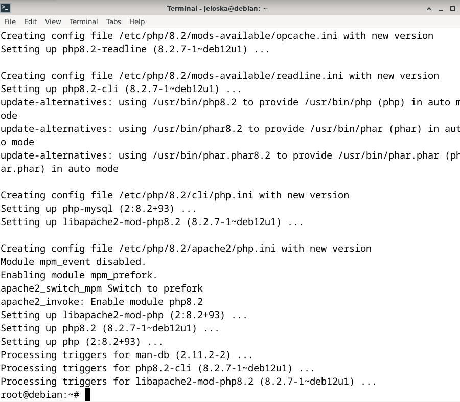
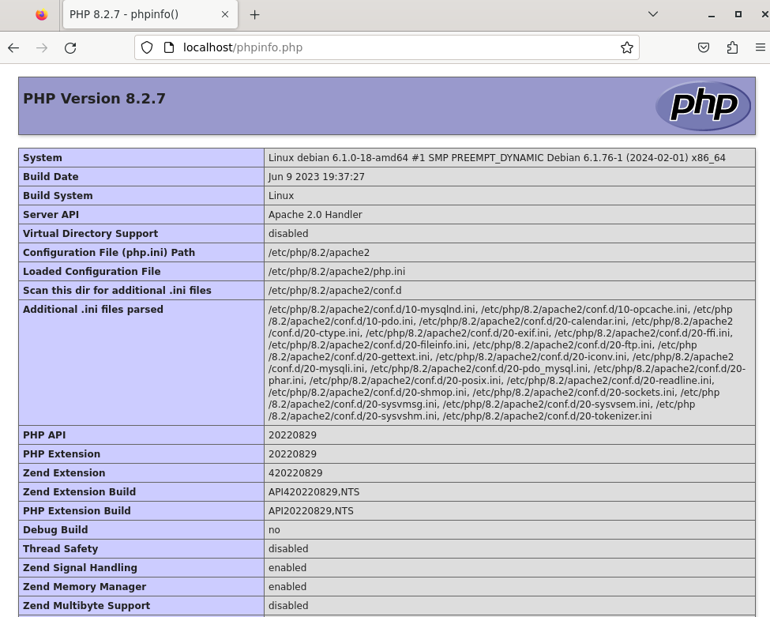

# Laboratorio 6
#### Jeloska Isabel Chavez Paredez
### 1. Instalación Tasksel
Primero, necesitalamos instalar `tasksel`, una herramienta que facilita la instalación de muchos paquetes comunes como grupos, lo cual es ideal para configuraciones como LAMP, para tal efecto ejecutamos el siguiente comando en la consola:

```bash
sudo apt-get update
sudo apt-get install tasksel
```
Posteriormente verificamos si tasksel está instalado ejecutando el siguiente comando para buscar tasksel en la lista de paquetes instalados:
```bash
dpkg -l | grep tasksel
```

<figure>
  
  <figcaption>Figura 1: Ejecución de y verifiación de tasksel</figcaption>
</figure>


### 2. Instalar el servidor LAMP
Usamos `tasksel` para instalar el paquete `lamp-server`, que incluye Apache, MySQL y PHP.
<figure>
  
  <figcaption>Figura 2: Instalación de lamp-server a través de la consola</figcaption>
</figure>

Sin embargo, notificamos un problema al momento de ejecutar el comando `tasksel` podemos observar en la figura 3 que no se encuentra LAMP como software para instalar.
<figure>
  
  <figcaption>Figura 3: Configuración de paquetes en tasksel</figcaption>
</figure>
 
Para subsanar el error procedimos a instalar el stack LAMP (`apache2`, `php` y `mysql`) de forma individual.

### Paso 1: Instalar Apache

Apache es el servidor web en el stack LAMP, verificamos su instalación accediendo a `http://localhost` desde el navegador web. Se observó la página predeterminada de Apache si la instalación fue exitosa.
<figure>
  
  <figcaption>Figura 4: Verificación de Apache desde el navegador</figcaption>
</figure>


### Paso 2: Instalar MySQL

MySQL es el sistema de gestión de bases de datos. Para instalarlo, usamos `sudo apt-get install mysql-server`
<figure>
  
  <figcaption>Figura 5: Error E: Package 'mysql-server' has no installation candidate al instalar mysql-server</figcaption>
</figure>

Sin embargo, notificamos el problema `E: Package 'mysql-server' has no installation candidate` al intentar isntalar asi al Uso de Repositorios para MySQL, entomces para agregar el repositorio oficial de MySQL al sistema Debian y luego instalar MySQL desde ese repositorio efectuamos los siguientes pasos:

- **Descargar el paquete del repositorio de MySQL**
Descargar el paquete del repositorio de MySQL que contiene la configuración del repositorio APT. Este paquete se obtuvo directamente desde el sitio web oficial de MySQL, ejecutando el siguiente comando

```bash
wget https://dev.mysql.com/get/mysql-apt-config_0.8.29-1_all.deb
```

<figure>
  
  <figcaption>Figura 6: Descargando el paquete del repositorio de MySQL</figcaption>
</figure>

**- Instalar el paquete del repositorio de MySQL**

Una vez descargado, instalamos el paquete. Esto agregaró el repositorio de MySQL al sistema.

```bash
sudo dpkg -i mysql-apt-config_0.8.29-1_all.deb
```
<figure>
  
  <figcaption>Figura 7: Estableciendo la configuración para MySQL</figcaption>
</figure>

Durante la instalación, establecimos la configuracion obervada en la figura 7.


-  **Actualizar la lista de paquetes**

Después de agregar el repositorio, actualizamos la lista de paquetes (`apt-get update`) para incluir los paquetes de MySQL disponibles en el nuevo repositorio.
<figure>
  
  <figcaption>Figura 8: Actualizando la lista de paquetes del sistema</figcaption>
</figure>

- **Instalar MySQL Server**

Ejecutamos `apt-get install mysql-server` y configuramos una contraseña para el usuario `root` de MySQL.

<figure>
  
  
  <figcaption>Figura 9: Estableciendo la configuración para mysql-server</figcaption>
</figure>

- **Ejecución el script de seguridad**

Una vez instalado MySQL, ejecutamos el script de seguridad `mysql_secure_installation` para mejorar la seguridad de la instalación de MySQL. A través de dicho script establecimos una contraseña segura para el usuario `root` de MySQL, eliminamos cuentas anónimas, deshabilitamos el inicio de sesión remoto de root y eliminamos la base de datos de prueba.

### Paso 3: Instalar PHP 

PHP es el lenguaje de programación del lado del servidor en el stack. Para instalar PHP y el módulo PHP para Apache, ejecutamos `apt-get install php libapache2-mod-php php-mysql`

<figure>
  
  <figcaption>Figura 10: Instalación de php a través de la consola</figcaption>
</figure>

Después de instalar PHP, reiniciamos el servidor Apache para aplicar los cambios.

### Paso 4: Verificar la Instalación de PHP

Para probar si PHP está configurado correctamente, creamos un archivo de prueba llamado `info.php` en el directorio raíz del servidor web `/var/www/html/phpinfo.php`, posteriormente ajustamos los permisos del archivo para que sea accesible desde el navegador `chown www-data:www-data /var/www/html/phpinfo.php`
`chmod +x /var/www/html/phpinfo.php`.


<figure>
  
  
  <figcaption>Figura 11: (a) creación del archivo info.php (b) vericación de permisos del archivo info.php</figcaption>
</figure>

A continuación procedimos a verificar si PHP estaba funcionando correctamente navegando a `http://localhost/phpinfo.php`, la verificación fue exitosa como se puede obervar en la figura 12.
<figure>
  
  <figcaption>Figura 12: Verificando el funcionamiento de PHP</figcaption>
</figure>


### Paso 5: Instalar herramientas adicionales para MySQL
Para facilitar la administración de la base de datos MySQL, instalamos herramientas adicionales como MySQL Workbench y phpMyAdmin.


- **MySQL Workbench**:
Debido a que myspq-worbech tiene una dependencia de libjpeg8, una libreria ya no disponible para Debian 12 se efectu al instalación a traves de snap `snap run mysql-workbench-community`:
<figure>
  
  <figcaption>Figura 13: Instalando mysql worbench community atraves de snap</figcaption>
</figure>


**Prueba workbench**
Ejecutamos el siguiente comando `snap run mysql-workbench-community` para abrir workbench, en la figura 14 se puede obervara que accedimos correctamente a la pagina de inicio de workbench.
<figure>
  
  <figcaption>Figura 14: Pagina principal de Mysql workbehc</figcaption>
</figure>


- **PHPMyAdmin**:
Instlamos PHPMyAdmin `apt install phpmyadmin`. Durante la instalación de phpMyAdmin, se nos solicitó el servidor web que se configurará automáticamente para ejecutar phpMyAdmin; eligimos Apache. También se te solictp que configuremos la base de datos para phpMyAdmin con dbconfig-common; seleccionamos "Sí" y proporcionando tu contraseña de administrador de MySQL cuando se solicitó.

<figure>
  
  
  
  <figcaption>Figura 15: Estableciendo parametrso de configuración para MySQL Workbench</figcaption>
</figure>


### 7. Verificar PHPMyAdmin
Para asegurarte de que phpMyAdmin esté funcionando correctamente, navegamos `http://localhost/phpmyadmin` en el navegador web. Observamos la página de inicio de sesión de phpMyAdmin, donde iniciamos sesión con root.

<figure>
  

  <figcaption>Figura 16: </figcaption>
</figure>


