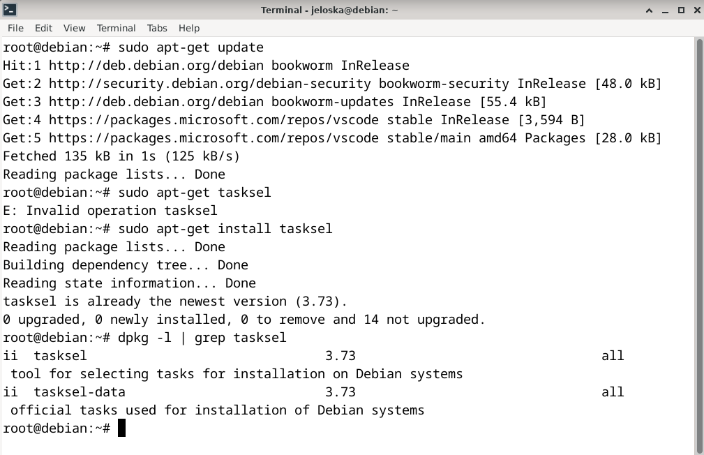
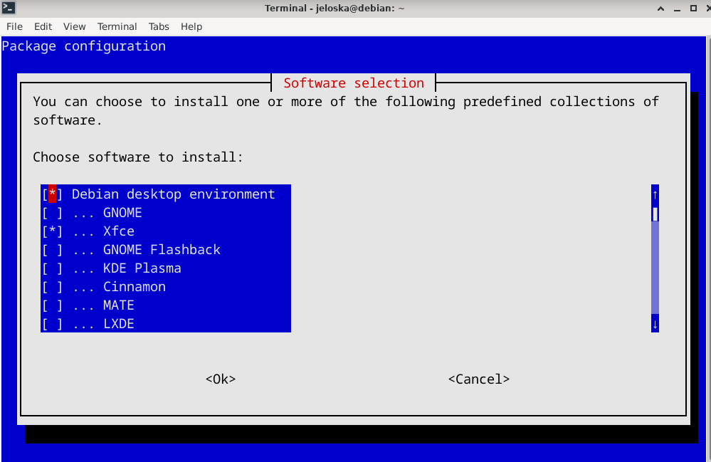
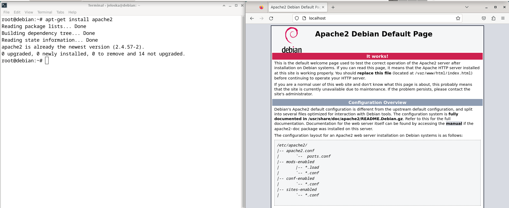
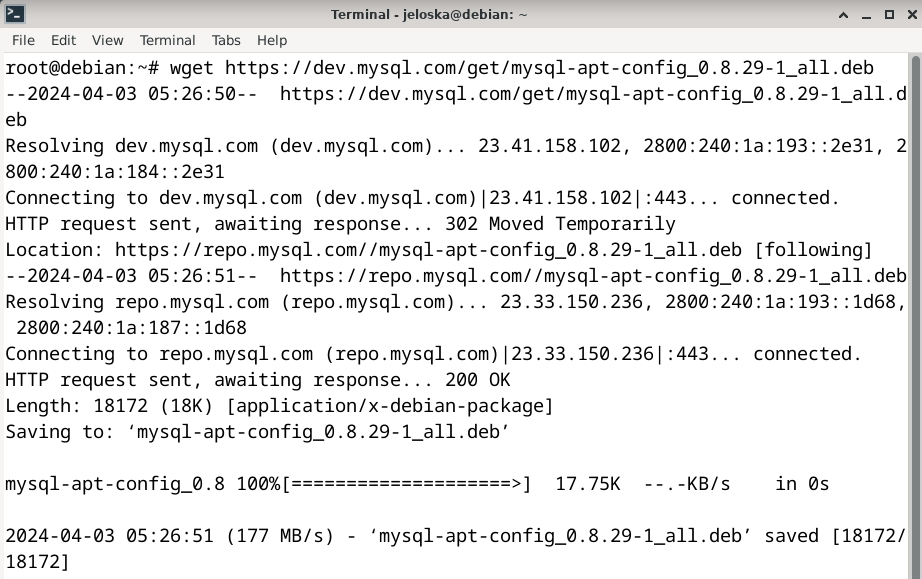
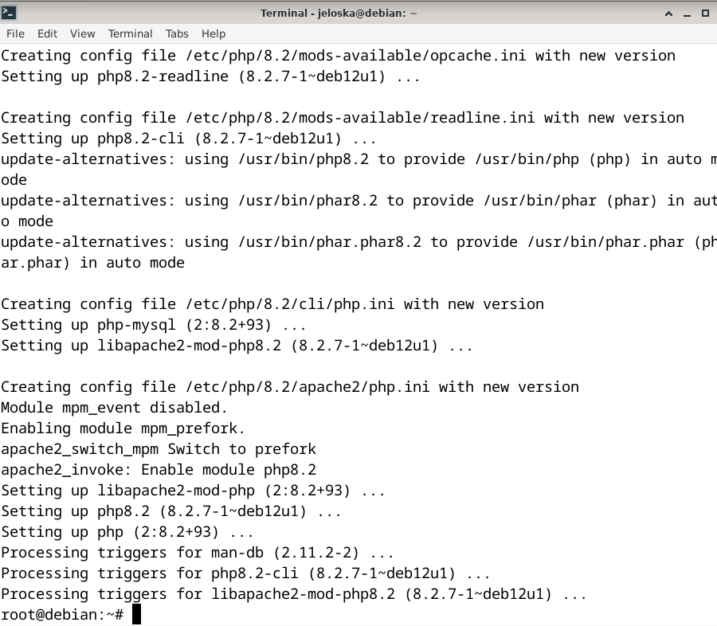
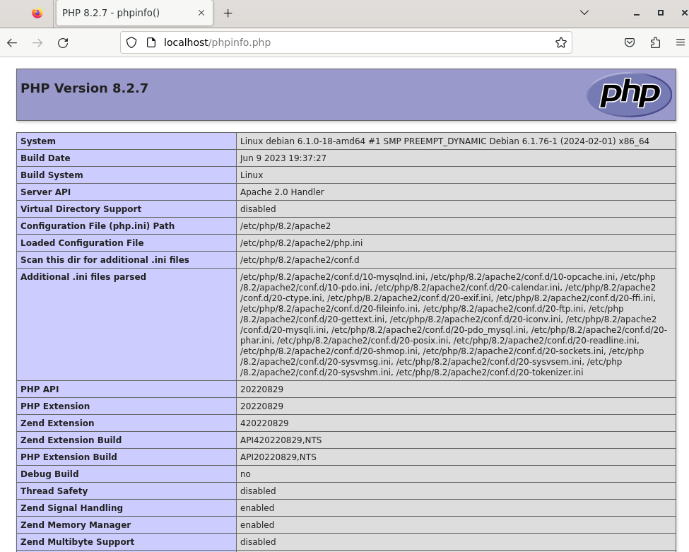
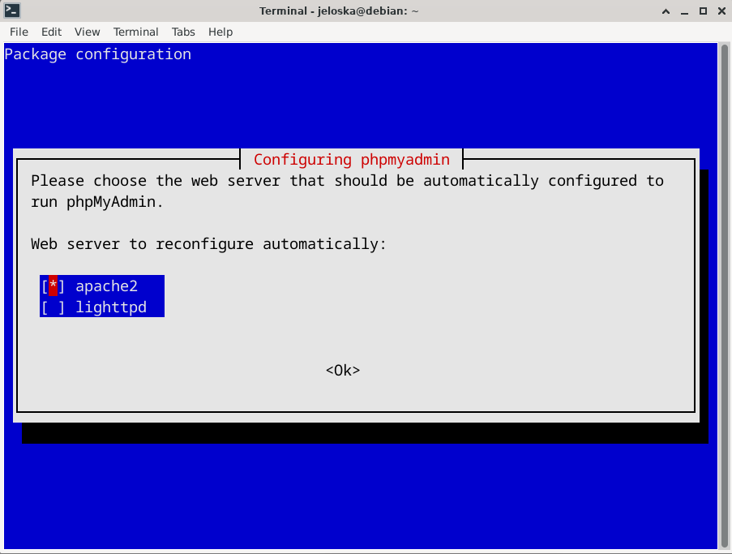
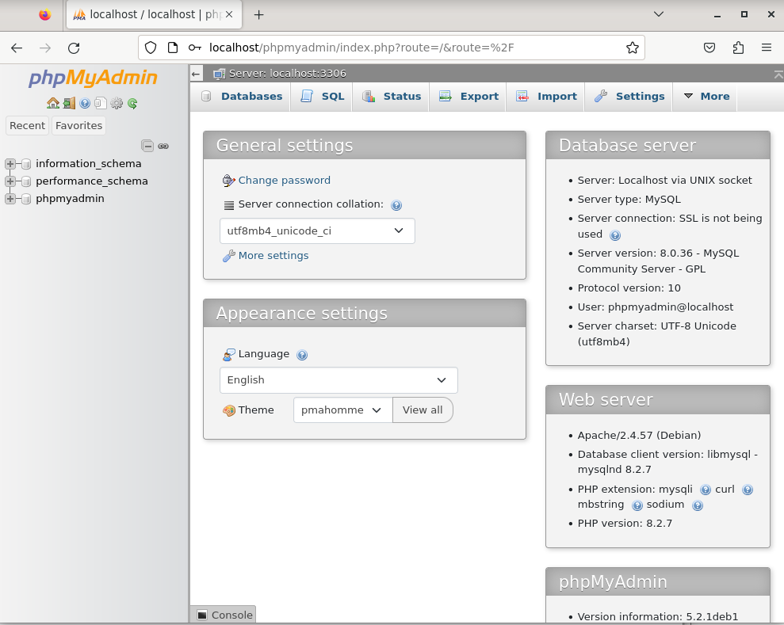

# Laboratorio 6: Instalación y Configuración de LAMP en Debian
#### Por Jeloska Isabel Chavez Paredez

### 1. Instalación de Tasksel

Tasksel es una herramienta de gestión de paquetes para Debian que permite a los usuarios instalar múltiples paquetes relacionados como una tarea cohesiva. Es especialmente útil para configuraciones de software complejas, como la pila LAMP, que requiere la instalación de múltiples componentes que funcionan juntos. Para instalar Tasksel, se ejecutan dos comandos principales en la terminal:

- `sudo apt-get update`: Este comando actualiza el índice de paquetes del sistema para asegurar que se descarguen las versiones más recientes de los paquetes y sus dependencias.
- `sudo apt-get install tasksel`: Instala Tasksel, permitiendo la selección e instalación de tareas predefinidas.

Para verificar que Tasksel se ha instalado correctamente, se utiliza:

- `dpkg -l | grep tasksel`: Un comando que filtra y muestra la instalación de Tasksel entre los paquetes del sistema.

*Figura 1: Ejecución y verificación de la instalación de Tasksel*

### 2. Instalación del Servidor LAMP

A través de Tasksel, se intenta instalar el paquete `lamp-server`, un meta-paquete que incluye Apache (servidor web), MySQL (sistema de gestión de bases de datos) y PHP (lenguaje de programación del lado del servidor). Sin embargo, se enfrenta una anomalía al no encontrar LAMP listado en Tasksel, lo que lleva a la necesidad de instalar cada componente individualmente.

*Figura 3: Dificultades al configurar paquetes en Tasksel*

#### Paso 1: Instalación de Apache

Apache es uno de los servidores web más populares y constituye la "A" en LAMP. Sirve páginas web estáticas y dinámicas a los usuarios. La confirmación de una instalación exitosa de Apache se realiza accediendo a `http://localhost` en un navegador web, lo que debería mostrar la página predeterminada de Apache.

*Figura 4: Confirmación de la instalación de Apache*

#### Paso 2: Instalación de MySQL

MySQL es el sistema de gestión de bases de datos relacional elegido para este stack LAMP, representando la "M" en el acrónimo. Cuando el paquete `mysql-server` no está disponible directamente a través de los repositorios predeterminados de Debian, es necesario agregar el repositorio oficial de MySQL al sistema. Esto se logra descargando y configurando un paquete especial (`mysql-apt-config`) que añade el repositorio de MySQL, lo que permite instalar la última versión de MySQL Server en el sistema.

*Figura 6: Añadiendo el repositorio de MySQL al sistema*

La instalación de este paquete repositorio garantiza que el sistema puede obtener y instalar MySQL Server, además de recibir futuras actualizaciones.

#### Paso 3: Instalación de PHP

PHP es el lenguaje de programación del lado del servidor utilizado para desarrollar páginas web dinámicas. La instalación de PHP y sus módulos relacionados (como `libapache2-mod-php` para integrar PHP con Apache, y `php-mysql` para permitir la comunicación entre PHP y MySQL) es crucial para el funcionamiento del stack LAMP.

*Figura 10: Instalación de PHP y módulos relacionados*

Después de instalar PHP, es necesario reiniciar el servidor Apache para aplicar los cambios y permitir que Apache procese los archivos PHP.

#### Paso 4: Verificación de PHP

La funcionalidad de PHP se verifica mediante la creación de un archivo de prueba (`info.php`) que contiene código PHP destinado a mostrar información detallada sobre la configuración de PHP en el servidor. Esta prueba asegura que PHP ha

 sido correctamente integrado con Apache y está listo para desarrollar y servir aplicaciones web dinámicas.

*Figura 12: Comprobación de la configuración de PHP*

#### Paso 5: Herramientas Adicionales

Para gestionar eficientemente la base de datos MySQL, se recomienda instalar herramientas como MySQL Workbench y phpMyAdmin. MySQL Workbench ofrece una interfaz gráfica para el diseño, desarrollo y administración de bases de datos MySQL. Por otro lado, phpMyAdmin proporciona una interfaz web para la administración de bases de datos MySQL, permitiendo realizar tareas como la creación de bases de datos, la ejecución de consultas SQL y la gestión de usuarios directamente desde el navegador.

*Figura 15: Configuración inicial de PHPMyAdmin*

### 7. Verificación de PHPMyAdmin

La correcta instalación y configuración de PHPMyAdmin se verifica accediendo a `http://localhost/phpmyadmin`, lo que debería presentar la pantalla de inicio de sesión de esta herramienta, permitiendo la administración de bases de datos MySQL a través de una interfaz web.

*Figura 16: Confirmación del funcionamiento de PHPMyAdmin*

---

Esta versión del informe proporciona una descripción más detallada y técnica de cada paso y herramienta involucrada en la instalación y configuración del stack LAMP en Debian, mejorando la comprensión de su propósito y su importancia en el desarrollo web.