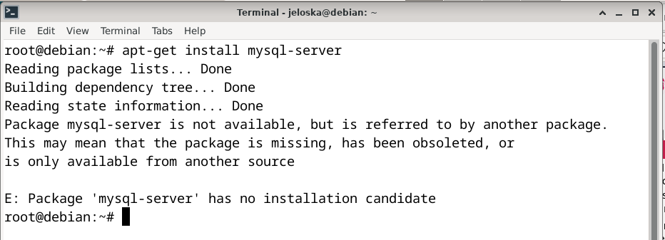
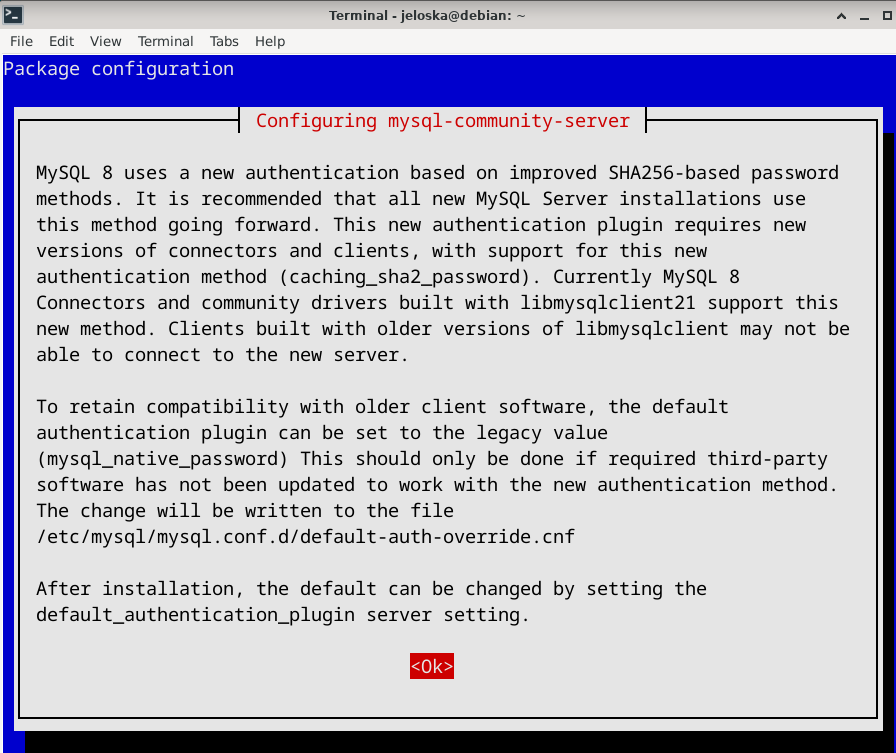
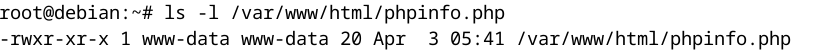
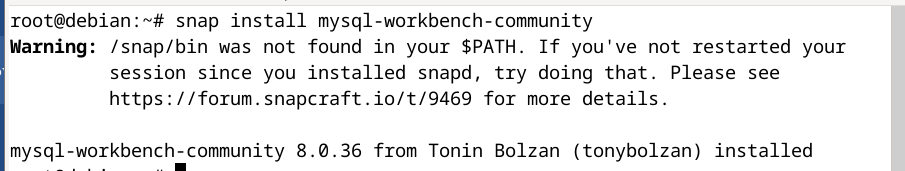
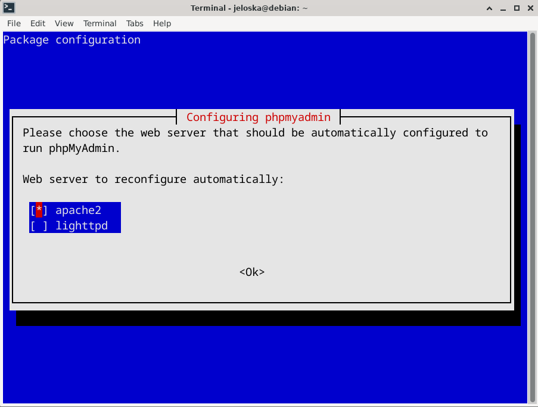
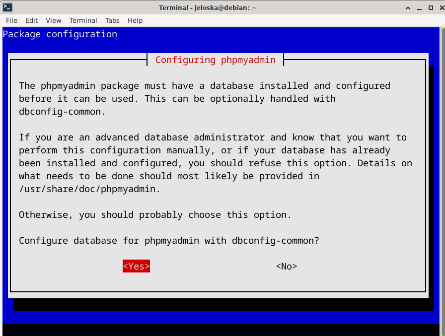
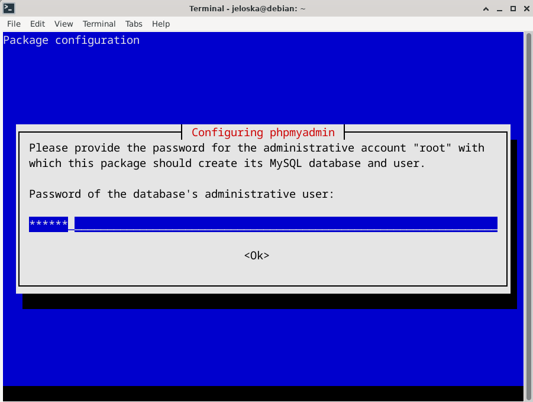

# Laboratorio 6
#### Realizado por: Jeloska Isabel Chavez Paredez

## Item 1: Instalación y configuración de un servidor LAMP

### 1. Preparación del Entorno de Instalación
`tasksel` es una herramienta que simplifica la instalación de paquetes agrupados en Debian y derivados. Para instalar `tasksel`, ejecutamos los siguientes comandos en la consola:

```bash
sudo apt-get update
sudo apt-get install tasksel
```

Tras la instalación, validamos la instalación de `tasksel` en el sistema mediante el comando `dpkg -l | grep tasksel`, como se ilustra en la Figura 1.

<figure>
  
  <figcaption>Figura 1: Validación de la instalación de tasksel</figcaption>
</figure>

### 2. Implementación del Servidor LAMP
A continuación, empleamos `tasksel` para instalar el paquete `lamp-server`, un meta-paquete que incluye Apache (servidor web), MySQL (sistema de gestión de bases de datos) y PHP (lenguaje de programación del lado del servidor).

<figure>
  
  <figcaption>Figura 2: Instalación del paquete lamp-server mediante tasksel</figcaption>
</figure>

Sin embargo, identificamos un inconveniente al ejecutar `tasksel`: el software LAMP no aparecía disponible para la instalación (Figura 3). Como solución, procedimos a instalar cada componente del stack LAMP de manera individual.

<figure>
  
  <figcaption>Figura 3: Ausencia de LAMP en la interfaz de tasksel</figcaption>
</figure>

#### Paso 1: Instalación de Apache
Apache, siendo el servidor web dentro del stack LAMP, se verifica accediendo a `http://localhost` desde un navegador, lo cual debería mostrar la página predeterminada de Apache si la instalación fue exitosa (Figura 4).

<figure>
  
  <figcaption>Figura 4: Confirmación de la instalación de Apache</figcaption>
</figure>

#### Paso 2: Instalación de MySQL
El gestor de bases de datos MySQL se instala mediante `sudo apt-get install mysql-server`. Sin embargo, nos encontramos con el error `E: Package 'mysql-server' has no installation candidate` (Figura 5). Para resolver esto, se siguieron pasos adicionales para agregar el repositorio oficial de MySQL y realizar la instalación.

<figure>
  
  <figcaption>Figura 5: Problema al intentar instalar mysql-server</figcaption>
</figure>

- **Configuración del Repositorio de MySQL:**
    1. Descarga del paquete del repositorio de MySQL con `wget https://dev.mysql.com/get/mysql-apt-config_0.8.29-1_all.deb` (Figura 6).
    2. Instalación del paquete con `sudo dpkg -i mysql-apt-config_0.8.29-1_all.deb`, lo que agrega el repositorio al sistema (Figura 7).
    3. Actualización de la lista de paquetes con `apt-get update` (Figura 8).
    4. Instalación de MySQL Server, seguido de la configuración inicial (Figura 9).

<figure>
  
  <figcaption>Figura 6: Descarga del paquete del repositorio de MySQL</figcaption>
</figure>

<figure>
  
  <figcaption>Figura 7: Configuración del repositorio de MySQL</figcaption>
</figure>

<figure>
  
  <figcaption>Figura 8: Actualización de la lista de paquetes</figcaption>
</figure>

<figure>
  
  
  <figcaption>Figura 9: Instalación y configuración de MySQL Server</figcaption>
</figure>

#### Paso 3: Instalación de PHP
PHP se instaló junto con el módulo PHP para Apache y el soporte para MySQL ejecutando `apt-get install php libapache2-mod-php php-mysql`. Posteriormente, se reinicio el servidor Apache para aplicar los cambios (Figura 10).

<figure>
  
  <figcaption>Figura 10: Instalación de PHP y sus módulos asociados</figcaption>
</figure>

#### Paso 4: Verificación de la Instalación de PHP
Creamos un archivo `info.php` en `/var/www/html` para verificar la correcta configuración de PHP. La accesibilidad del archivo se asegura mediante la modificación de permisos, seguida de la validación a través de `http://localhost/phpinfo.php`, como se muestra en la Figura 11 y Figura 12.

<figure>
  
  
  <figcaption>Figura 11: Creación y ajuste de permisos del archivo info.php</figcaption>
</figure>

<figure>
  
  <figcaption>Figura 12: Verificación del funcionamiento de PHP</figcaption>
</figure>

#### Paso 5: Instalación de Herramientas Adicionales para MySQL
La administración de MySQL se facilita mediante la instalación de herramientas como MySQL Workbench y phpMyAdmin.

- **MySQL Workbench:**
    La instalación se realizó a través de Snap debido a dependencias no disponibles en Debian 12 (Figura 13). La verificación de la instalación se muestra en la Figura 14.

- **PHPMyAdmin:**
    La configuración de PHPMyAdmin se realizó especificando el servidor web y la configuración de la base de datos durante su instalación (Figura 15).

<figure>
  
  <figcaption>Figura 13: Instalación de MySQL Workbench mediante Snap</figcaption>
</figure>

<figure>
  
  <figcaption>Figura 14: Verificación de MySQL Workbench</figcaption>
</figure>

<figure>
  
  
  
  <figcaption>Figura 15: Configuración de PHPMyAdmin</figcaption>
</figure>

### 7. Confirmación de la Funcionalidad de PHPMyAdmin
Finalmente, confirmamos el correcto funcionamiento de PHPMyAdmin accediendo a `http://localhost/phpmyadmin` y utilizando las credenciales de root para iniciar sesión (Figura 16).

<figure>
  
  <figcaption>Figura 16: Interfaz de inicio de sesión de PHPMyAdmin</figcaption>
</figure>

## Item 2: Instalación de NMP Server en Windows
NMP Server es un paquete integrado que proporciona Nginx (un servidor web de alto rendimiento), MySQL (un sistema de gestión de bases de datos relacionales) y PHP (un lenguaje de programación del lado del servidor), optimizado para entornos de desarrollo y producción.


### 1. Obtención del Paquete de Software
#### 1.1. Acceso al Repositorio de Código
Nos dirijimos al repositorio de archivos en el Google Code Archive utilizando el siguiente URL: `https://code.google.com/archive/p/nmp-server/`. Este repositorio aloja las versiones históricas y la versión más reciente del paquete NMP Server.

<figure>
  
  <figcaption>Figura 17: Página de proyecto de NMP Server en Google Code Archive</figcaption>
</figure>

#### 1.2. Selección de la Versión de Software
Seleccionamos el archivo correspondiente a la versión más actualizada del paquete NMP Server, etiquetado como "NMP-Server, Version 2.1". El archivo se presenta con un tamaño de 24.38 MB y con fecha de carga del 21 de noviembre de 2012.

<figure>
  
  <figcaption>Figura 18: Selección de la versión más reciente del NMP Server para descarga</figcaption>
</figure>

### 2. Descompresión del Archivo y Preparación
#### 2.1. Extracción del Contenido del Archivo
Extraemos el contenido del archivo ZIP descargado. 

<figure>
  
  <figcaption>Figura 19: Contenidos extraídos de la carpeta del archivo ZIP del NMP Server</figcaption>
</figure>

#### 2.2. Estructura de Archivos y Validación
Encontramos que las carpetas `nginx-1.2.5`, `mysql-5.5.28`, `php-5.4.8` y la aplicación ejecutable `nmp` están presentes y accesibles.

### 3. Configuración y Ejecución de Servicios
#### 3.1. Iniciación de la Aplicación de Control
Localizamos y ejecutamos la aplicación `nmp` dentro de la carpeta descomprimida. Esta acción desplegará el panel de control del NMP Server, el cual permite la gestión individualizada de cada servicio.

<figure>
  
  <figcaption>Figura 20: Interfaz inicial del panel de control de NMP Server</figcaption>
</figure>

#### 3.2. Activación de Componentes del Servidor
Para cada servicio (Nginx, MySQL, PHP-CGI), procedemos a hacer clic en el botón "Start" correspondiente. Monitorizamos la transición del estado de cada servicio de "Not Running" a "Running", lo cual indica que los servicios se han inicializado con éxito.

<figure>
  
  <figcaption>Figura 21: Panel de control de NMP Server con los servicios activos</figcaption>
</figure>

### 4. Verificación del Funcionamiento
#### 4.1. Prueba del Servidor Web
Presionamos el botón "Web-Browser" en el panel de control. Esto abrió el navegador web predeterminado y cargar la página de inicio de Nginx. Esta página confirma que el servidor web está operando y listo para servir contenido.

#### 4.2. Confirmación de la Configuración de PHP
En la misma página web, se debería visualizar la información de configuración de PHP, lo que confirma que PHP está correctamente integrado con Nginx y operativo para el procesamiento de scripts.

<figure>
  
  <figcaption>Figura 22: Página de prueba de PHP mostrando la configuración y versión instalada</figcaption>
</figure>

