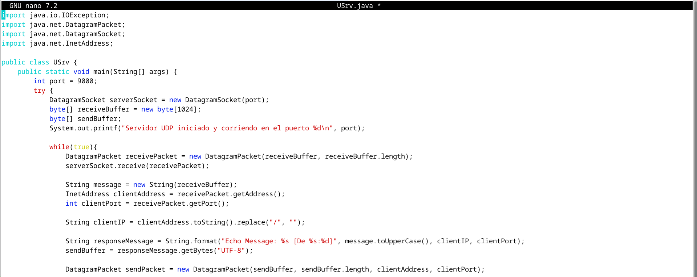
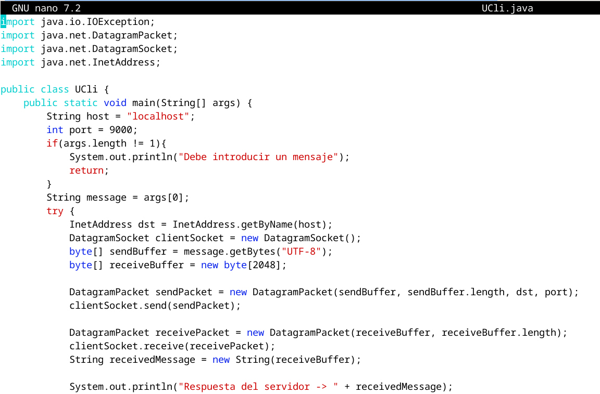
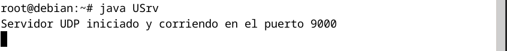
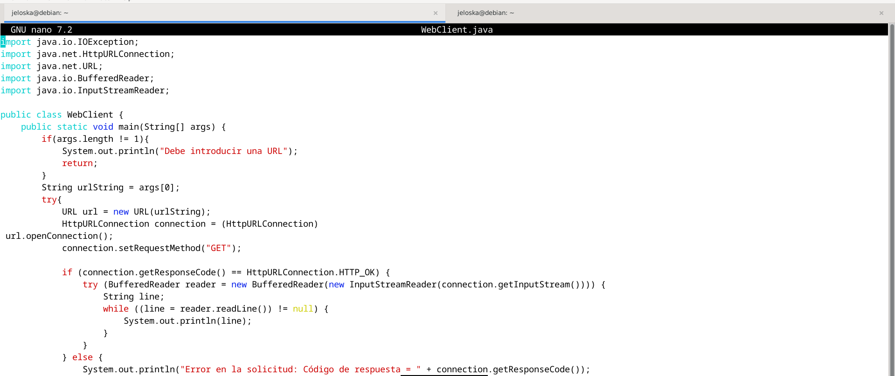
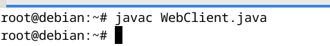
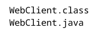
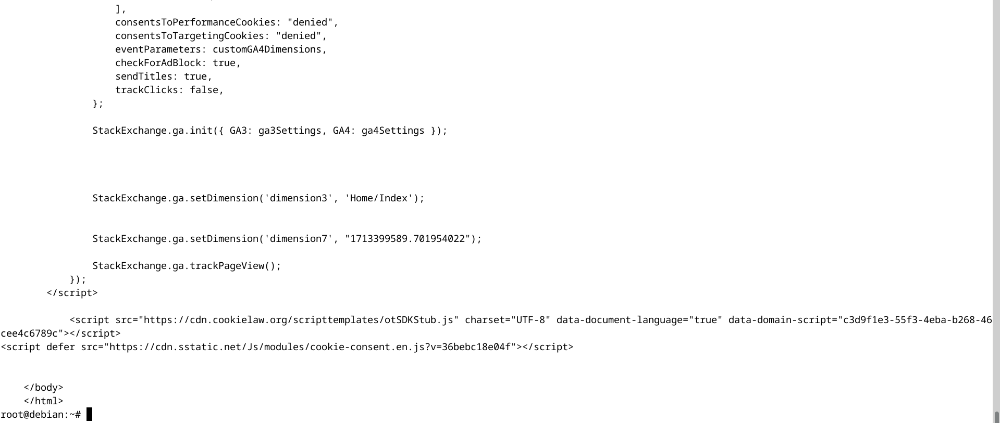

# Laboratorio 7
#### Jeloska Isabel Chavez Paredez

## Item 1

La solución desarrollada para el ejercicio consiste en dos partes principales: un servidor (`USrv.java`) y un cliente (`UCli.java`). Ambos interactúan mediante el protocolo UDP, que es un protocolo de comunicación de red de datagramas no orientado a la conexión. Esto implica que cada mensaje enviado es independiente y no garantiza la integridad o el orden de llegada, pero ofrece un mecanismo rápido y eficiente para la transferencia de datos en redes con baja latencia y pérdida mínima. 

### Descripción de la Solución

#### 1. Servidor UDP (`USrv.java`)
``` java
import java.io.IOException;
import java.net.DatagramPacket;
import java.net.DatagramSocket;
import java.net.InetAddress;

public class USrv {
    public static void main(String[] args) {
        int port = 9000;
        try {
            DatagramSocket serverSocket = new DatagramSocket(port);
            byte[] receiveBuffer = new byte[1024];
            byte[] sendBuffer;
            System.out.printf("Servidor UDP iniciado y corriendo en el puerto %d\n", port);

            while(true){
                DatagramPacket receivePacket = new DatagramPacket(receiveBuffer, receiveBuffer.length);
                serverSocket.receive(receivePacket);

                String message = new String(receiveBuffer);
                InetAddress clientAddress = receivePacket.getAddress();
                int clientPort = receivePacket.getPort();

                String clientIP = clientAddress.toString().replace("/", "");

                String responseMessage = String.format("Echo Message: %s [De %s:%d]", message.toUpperCase(), clientIP, clientPort);
                sendBuffer = responseMessage.getBytes("UTF-8");

                DatagramPacket sendPacket = new DatagramPacket(sendBuffer, sendBuffer.length, clientAddress, clientPort);
                serverSocket.send(sendPacket);

            }

        } catch (IOException e) {
            System.out.println("Error: " + e.getMessage());
        }
    }
}
```


##### Funcionalidad General:
El servidor está diseñado para ejecutarse continuamente en un puerto especificado (en este caso, el puerto 9000). Su tarea principal es escuchar peticiones entrantes, procesar los mensajes recibidos convirtiéndolos a mayúsculas, y devolver estos mensajes junto con la información del cliente (IP y puerto).

##### Proceso de ejecución:
- **Inicialización del Socket:** El servidor inicia abriendo un `DatagramSocket` en el puerto 9000, lo cual le permite recibir paquetes de cualquier dirección IP que intente comunicarse por ese puerto.
- **Recepción de Mensajes:** El servidor entra en un bucle infinito, donde espera a que lleguen nuevos mensajes. Utiliza un `DatagramPacket` para recibir los datos, que bloquea el proceso hasta que se recibe algún dato.
- **Procesamiento del Mensaje:** Una vez recibido un mensaje, el servidor extrae los datos del paquete, que incluyen el mensaje y los detalles del remitente. Convierte el mensaje de bytes a String, lo transforma a mayúsculas y prepara una respuesta que incluye esta cadena en mayúsculas junto con la dirección IP y el puerto del remitente.
- **Envío de la Respuesta:** La respuesta es convertida a bytes y enviada de vuelta al cliente usando otro `DatagramPacket`, especificando la dirección y el puerto del cliente.

#### 2. Cliente UDP (`UCli.java`)

```java
import java.io.IOException;
import java.net.DatagramPacket;
import java.net.DatagramSocket;
import java.net.InetAddress;

public class UCli {
    public static void main(String[] args) {
        String host = "localhost";
        int port = 9000;
        if(args.length != 1){
            System.out.println("Debe introducir un mensaje");
            return;
        }
        String message = args[0];
        try {
            InetAddress dst = InetAddress.getByName(host);
            DatagramSocket clientSocket = new DatagramSocket();
            byte[] sendBuffer = message.getBytes("UTF-8");
            byte[] receiveBuffer = new byte[2048];

            DatagramPacket sendPacket = new DatagramPacket(sendBuffer, sendBuffer.length, dst, port);
            clientSocket.send(sendPacket);

            DatagramPacket receivePacket = new DatagramPacket(receiveBuffer, receiveBuffer.length);
            clientSocket.receive(receivePacket);
            String receivedMessage = new String(receiveBuffer);

            System.out.println("Respuesta del servidor -> " + receivedMessage);
            clientSocket.close();
        } catch (IOException e) {
            System.out.println("Error: " + e.getMessage());
        }


    }
}
```

##### Funcionalidad General:
El cliente tiene la tarea de enviar un mensaje al servidor y mostrar la respuesta recibida. El mensaje que se debe enviar se proporciona como argumento al ejecutar el programa.

##### Proceso de ejecución:
- **Verificación y Preparación:** Primero, el cliente verifica si se ha proporcionado un mensaje como argumento. Si no es así, termina la ejecución con un mensaje de error.
- **Establecimiento de Conexión:** A continuación, prepara un `DatagramSocket` y resuelve la dirección IP del servidor usando el nombre de host (en este caso, "localhost"). Esto es necesario para saber dónde enviar el mensaje.
- **Envío del Mensaje:** El mensaje es codificado en bytes y empaquetado en un `DatagramPacket` que se envía al servidor.
- **Recepción de la Respuesta:** Tras enviar el mensaje, el cliente se prepara para recibir la respuesta configurando otro `DatagramPacket`. Una vez recibida, la respuesta es decodificada de bytes a String.
- **Visualización de la Respuesta:** Finalmente, el cliente imprime la respuesta del servidor en la consola y cierra el socket.


## Resultados

#### Proceso de Compilación
Para la preparación del entorno de ejecución, se ejecutaron las siguientes acciones:

1. **Compilación del Código Fuente:**
   Se compiló el código fuente de ambas aplicaciones utilizando el JDK. Los comandos ejecutados fueron:
   ```sh
   javac USrv.java
   javac UCli.java
   ```
   Estos comandos generan archivos `.class`, que contienen el bytecode de las aplicaciones servidor y cliente respectivamente, listos para ser ejecutados por la Java Virtual Machine (JVM).

#### Ejecución del Servidor
Se inició el servidor con el comando:

```sh
java USrv
```

El servidor se puso en marcha y quedó a la escucha en el puerto `9000`. Esta información se visualizó en la consola, confirmando que el servidor estaba operativo y listo para aceptar mensajes de clientes.


#### Ejecución del Cliente y Envío de Mensaje
Desde otra terminal, se ejecutó el cliente para enviar un mensaje al servidor. El comando utilizado fue:

```sh
java UCli "hola servidor ardilla"
```

El cliente enviaba el mensaje "hola servidor ardilla" como argumento de línea de comandos, el cual es capturado por la aplicación y enviado al servidor a través del protocolo UDP.


#### Resultados Obtenidos

1. **Confirmación de Inicio del Servidor:**
   La terminal del servidor mostró la siguiente salida, confirmando su correcto inicio y funcionamiento en el puerto designado:
   
   

   Este mensaje indica que el servidor está correctamente vinculado al puerto `9000` y está en modo de escucha para recibir datos de cualquier cliente UDP que envíe paquetes a dicho puerto.

2. **Respuesta del Servidor al Mensaje del Cliente:**
   En la terminal del cliente, se observó la siguiente salida tras enviar el mensaje:
   
   

   La línea:
   ```
   Respuesta del servidor -> Echo Message: HOLA SERVIDOR ARDILLA [De 127.0.0.1:35867]
   ```
   refleja que el servidor ha recibido el mensaje, lo ha procesado (convirtiéndolo a mayúsculas y añadiendo la dirección IP y puerto del cliente), y lo ha enviado de vuelta al cliente. El mensaje incluye la dirección IP `127.0.0.1`, que es la dirección de loopback, lo cual indica que el servidor y el cliente se están ejecutando en la misma máquina. El puerto `35867` es el puerto dinámico o efímero asignado al socket del cliente por el sistema operativo para la duración de esta sesión específica de comunicación UDP.

#### Conclusión de la Prueba
La prueba realizada valida la funcionalidad de la aplicación de eco UDP desarrollada en Java. Se confirma que la comunicación entre el servidor y el cliente es exitosa, los mensajes se procesan adecuadamente y las respuestas se generan y transmiten conforme a los requisitos del ejercicio. 

## Item 2


#### Implementación del Cliente HTTP (`WebClient.java`)
``` java
import java.io.IOException;
import java.net.HttpURLConnection;
import java.net.URL;
import java.io.BufferedReader;
import java.io.InputStreamReader;

public class WebClient {
    public static void main(String[] args) {
        if(args.length != 1){
            System.out.println("Debe introducir una URL");
            return;
        }
        String urlString = args[0];
        try{
            URL url = new URL(urlString);
            HttpURLConnection connection = (HttpURLConnection)
 url.openConnection();
            connection.setRequestMethod("GET");

            if (connection.getResponseCode() == HttpURLConnection.HTTP_OK) {
                try (BufferedReader reader = new BufferedReader(new InputStreamReader(connection.getInputStream()))) {
                    String line;
                    while ((line = reader.readLine()) != null) {
                        System.out.println(line);
                    }
                }
            } else {
                System.out.println("Error en la solicitud: Código de respuesta = " + connection.getResponseCode());
            }

        } catch (IOException e){
            System.out.println("Error al conectar con el URL: " + e.getMessage());
        }
    }
}

```


##### Importaciones Esenciales:
- `java.io.IOException`: Para manejar excepciones de entrada/salida durante la operación de red.
- `java.net.HttpURLConnection`: Para utilizar las capacidades de conexión HTTP.
- `java.net.URL`: Para interpretar y manejar la URL proporcionada como argumento.
- `java.io.BufferedReader`: Para leer texto de un flujo de entrada de caracteres de manera eficiente.
- `java.io.InputStreamReader`: Para decodificar bytes a caracteres usando un esquema de codificación especificado.

##### Flujo de Ejecución

###### Verificación de Argumentos:
El programa primero verifica que se haya proporcionado exactamente un argumento, que es el URL al que se realizará la solicitud HTTP GET.

```java
if(args.length != 1){
    System.out.println("Debe introducir una URL");
    return;
}
```
Esta verificación asegura que el programa opere con los datos necesarios y es una buena práctica en el desarrollo de software para validar la entrada antes de proceder con el procesamiento.

###### Establecimiento de Conexión HTTP:
Con el URL validado, el programa procede a establecer una conexión HTTP.
- **Creación del Objeto URL:**
  Se utiliza la clase `URL` para parsear y validar la estructura del URL proporcionado. Esta clase es una representación de alto nivel de una ubicación en la web.

- **Apertura de Conexión y Configuración:**
  La conexión se abre y se configura para una solicitud GET. La clase `HttpURLConnection` se usa para añadir semántica HTTP a la conexión subyacente.

```java
URL url = new URL(urlString);
HttpURLConnection connection = (HttpURLConnection) url.openConnection();
connection.setRequestMethod("GET");
```
Este paso involucra el manejo de `java.net.MalformedURLException` en caso de que el URL proporcionado no sea válido.

###### Procesamiento de la Respuesta HTTP:
El cliente verifica el código de estado HTTP para asegurarse de que la solicitud fue exitosa (código 200).

- **Lectura de la Respuesta:**
  Si el código de estado es `HTTP_OK`, el cliente lee la respuesta del servidor utilizando un `BufferedReader`, que está envolviendo un `InputStreamReader`. El `InputStreamReader` traduce bytes a caracteres, mientras que el `BufferedReader` permite una lectura eficiente de texto, reduciendo la frecuencia de las operaciones de lectura hacia el flujo subyacente.

```java
if (connection.getResponseCode() == HttpURLConnection.HTTP_OK) {
    try (BufferedReader reader = new BufferedReader(new InputStreamReader(connection.getInputStream()))) {
        // ...
    }
}
```

- **Visualización del Contenido HTML:**
  La respuesta, típicamente en HTML, se lee línea por línea y se imprime en la consola.

###### Manejo de Errores y Códigos de Estado:
- **Respuesta no satisfactoria:**
  Si el código de estado no es `HTTP_OK`, se informa al usuario del error y se muestra el código de estado para facilitar la depuración.

- **Excepciones de Entrada/Salida:**
  El manejo de `IOException` captura errores como problemas de conectividad, errores al leer la respuesta y otros fallos de entrada/salida.

```java
} else {
    System.out.println("Error en la solicitud: Código de respuesta = " + connection.getResponseCode());
}
...
catch (IOException e){
    System.out.println("Error al conectar con el URL: " + e.getMessage());
}
```


### Pruebas y Resultados: Cliente Web HTTP en Ubuntu

#### Proceso de Compilación
El programa `WebClient.java` fue compilado exitosamente utilizando el siguiente comando en la terminal:

```sh
javac WebClient.java
```

Esto generó el archivo bytecode `WebClient.class`, preparando la aplicación para su ejecución.


#### Ejecución del Cliente HTTP
Posteriormente, el cliente fue ejecutado con la URL de Stack Overflow como parámetro:

```sh
java WebClient https://www.stackoverflow.com
```


#### Resultados Obtenidos
La ejecución del cliente resultó en una conexión exitosa con el servidor web de Stack Overflow, recuperando el contenido HTML de la página inicial del sitio. El contenido recuperado fue desplegado en la terminal y consistió en la estructura HTML completa del sitio, incluyendo elementos tales como el `DOCTYPE`, la declaración de la etiqueta `html`, el bloque `head` con metadatos, enlaces a recursos externos como hojas de estilo y scripts, y el cuerpo de la página (`body`).

#### Observaciones de la Salida
El HTML mostrado contenía múltiples elementos típicos de una página web moderna, como:

- Elementos `meta` para descripciones, vista previa en redes sociales, y otros metadatos.
- Enlaces a iconos de favoritos y recursos gráficos (`favicon`, `apple-touch-icon`).
- Enlaces a archivos CSS para el estilo visual de la página.
- Referencias a scripts de JavaScript para funcionalidades interactivas y dinámicas del sitio.
- Marcado semántico estructural que define la disposición del contenido y los componentes visuales de la página.

#### Conclusión de la Prueba
El cliente web HTTP desarrollado en Java funcionó correctamente en el sistema operativo Ubuntu, demostrando la capacidad del programa para realizar solicitudes HTTP y presentar el contenido web en formato HTML. La prueba validó la funcionalidad del cliente en un escenario de uso real, confirmando que la aplicación es capaz de interactuar con servicios web y desplegar el contenido de manera efectiva.


