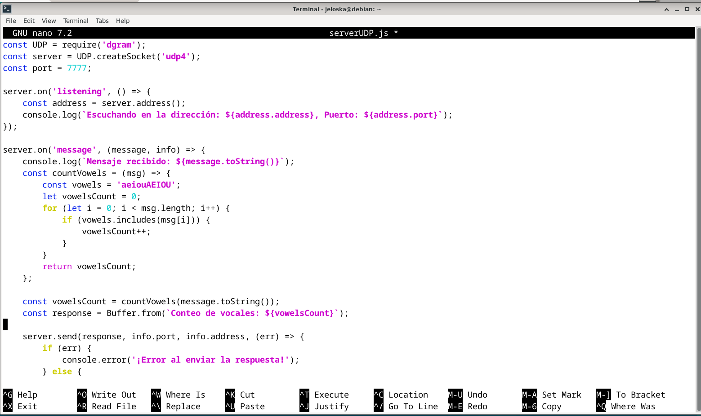
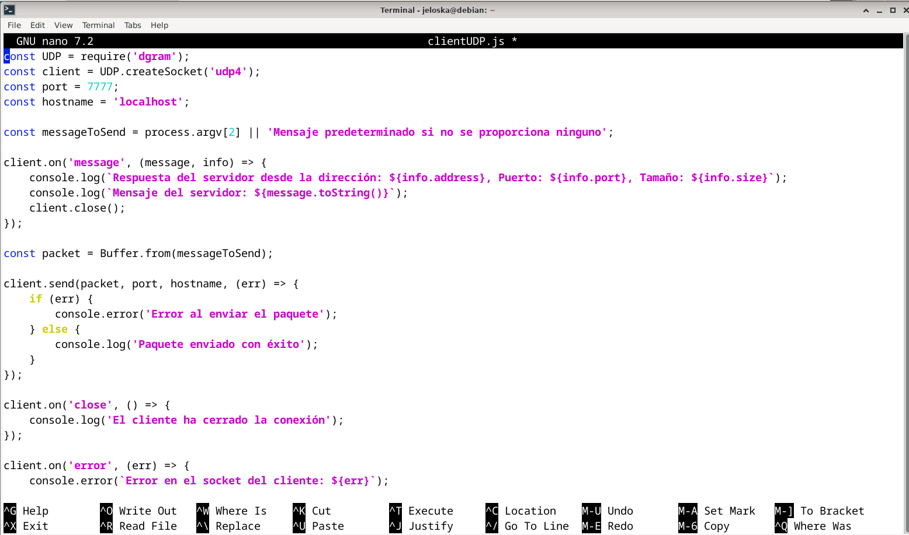
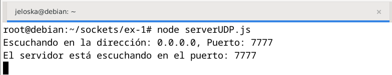
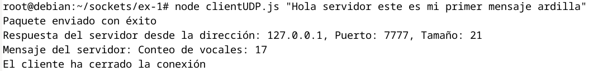
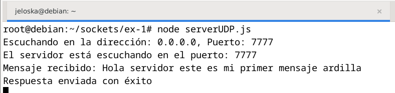
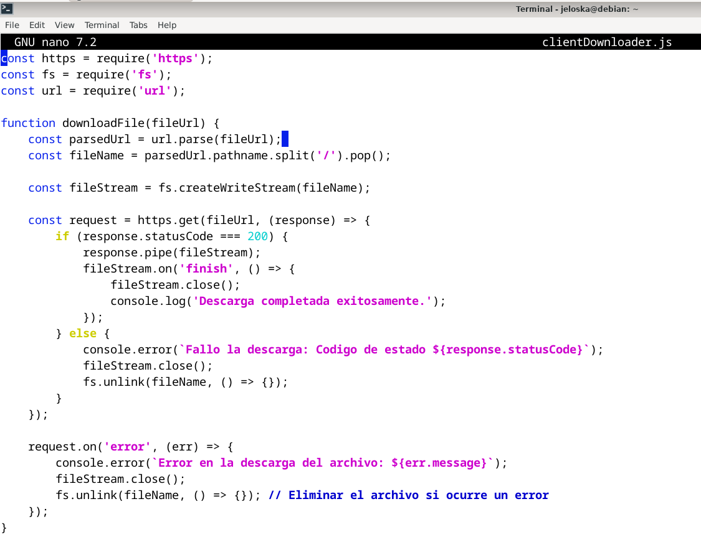
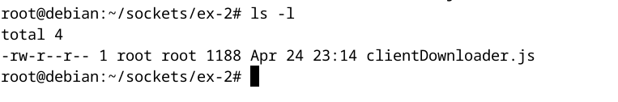
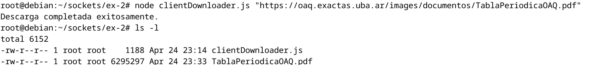
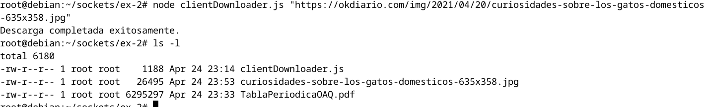

# Laboratorio 8
#### Jeloska Isabel Chavez Paredez

La solución se divide en dos componentes principales: un servidor UDP y un cliente UDP, que interactúan mediante el intercambio de mensajes utilizando el protocolo de Datagramas de Usuario (UDP). El servidor UDP recibe mensajes de texto de un cliente, cuenta el número de vocales en el mensaje recibido y envía esta cuenta de vuelta al cliente como respuesta.

## Item 1

### `ServerUDP`
``` javascript
const UDP = require('dgram');
const server = UDP.createSocket('udp4');
const port = 7777;

server.on('listening', () => {
    const address = server.address();
    console.log(`Escuchando en la dirección: ${address.address}, Puerto: ${address.port}`);
});

server.on('message', (message, info) => {
    console.log(`Mensaje recibido: ${message.toString()}`);
    const countVowels = (msg) => {
        const vowels = 'aeiouAEIOU';
        let vowelsCount = 0;
        for (let i = 0; i < msg.length; i++) {
            if (vowels.includes(msg[i])) {
                vowelsCount++;
            }
        }
        return vowelsCount;
    };

    const vowelsCount = countVowels(message.toString());
    const response = Buffer.from(`Conteo de vocales: ${vowelsCount}`);

    server.send(response, info.port, info.address, (err) => {
        if (err) {
            console.error('¡Error al enviar la respuesta!');
        } else {
            console.log('Respuesta enviada con éxito');
        }
    });
});

server.bind(port, (err) => {
    if (err) {
        console.error(`Error al enlazar el puerto: ${err}`);
        return;
    }
    console.log(`El servidor está escuchando en el puerto: ${port}`);
});

```



#### Descripción (`ServerUDP.js`)

```javascript
const UDP = require('dgram');
const server = UDP.createSocket('udp4');
const port = 7777;
```
- **Carga del módulo `dgram`**: Importa el módulo necesario para trabajar con datagramas UDP.
- **Creación del socket UDP**: Utiliza el método `createSocket` del módulo `dgram` para crear un socket UDP. El argumento `'udp4'` especifica que el socket usará IPv4.

```javascript
server.on('listening', () => {
    const address = server.address();
    console.log(`Escuchando en la dirección: ${address.address}, Puerto: ${address.port}`);
});
```
- **Evento `listening`**: Configura un manejador de eventos que se dispara cuando el servidor comienza a escuchar conexiones entrantes. Dentro de este manejador:
  - **Obtención de la dirección del servidor**: `server.address()` devuelve un objeto con la dirección IP y el puerto en los cuales el servidor está escuchando.
  - **Impresión en consola**: Muestra la dirección y el puerto para confirmación visual.

```javascript
server.on('message', (message, info) => {
    console.log(`Mensaje recibido: ${message.toString()}`);
    const countVowels = (msg) => {
        const vowels = 'aeiouAEIOU';
        let vowelsCount = 0;
        for (let i = 0; i < msg.length; i++) {
            if (vowels.includes(msg[i])) {
                vowelsCount++;
            }
        }
        return vowelsCount;
    };

    const vowelsCount = countVowels(message.toString());
    const response = Buffer.from(`Conteo de vocales: ${vowelsCount}`);

    server.send(response, info.port, info.address, (err) => {
        if (err) {
            console.error('¡Error al enviar la respuesta!');
        } else {
            console.log('Respuesta enviada con éxito');
        }
    });
});
```
- **Evento `message`**: Se ejecuta cada vez que el servidor recibe un mensaje.
  - **Conversión y registro del mensaje**: Convierte el mensaje de Buffer a String y lo imprime.
  - **Función `countVowels`**: Define una función local para contar las vocales en el mensaje recibido.
    - **Iteración sobre cada carácter**: Utiliza un bucle `for` para revisar cada carácter y verifica si es una vocal.
    - **Conteo de vocales**: Incrementa un contador cada vez que encuentra una vocal.
  - **Envío de la respuesta**: Crea un buffer con el conteo de vocales y lo envía de vuelta al cliente.
  - **Manejo de errores**: Captura y maneja cualquier error que ocurra durante el envío.

```javascript
server.bind(port, (err) => {
    if (err) {
        console.error(`Error al enlazar el puerto: ${err}`);
        return;
    }
    console.log(`El servidor está escuchando en el puerto: ${port}`);
});
```
- **Enlace a puerto**: El servidor se enlaza al puerto especificado y comienza a escuchar mensajes.
  - **Manejo de errores de enlace**: Verifica si hubo algún error durante el proceso de enlace y lo muestra.


#### `ClientUDP`

```javascript
const UDP = require('dgram');
const client = UDP.createSocket('udp4');
const port = 7777;
const hostname = 'localhost';

const messageToSend = process.argv[2] || 'Mensaje predeterminado si no se proporciona ninguno';

client.on('message', (message, info) => {
    console.log(`Respuesta del servidor desde la dirección: ${info.address}, Puerto: ${info.port}, Tamaño: ${info.size}`);
    console.log(`Mensaje del servidor: ${message.toString()}`);
    client.close();
});

const packet = Buffer.from(messageToSend);

client.send(packet, port, hostname, (err) => {
    if (err) {
        console.error('Error al enviar el paquete');
    } else {
        console.log('Paquete enviado con éxito');
    }
});

client.on('close', () => {
    console.log('El cliente ha cerrado la conexión');
});

client.on('error', (err) => {
    console.error(`Error en el socket del cliente: ${err}`);
    client.close();
});

```



#### Descripción

```javascript
const UDP = require('dgram');
const client = UDP.createSocket('udp4');
const port = 7777;
const hostname = 'localhost';
```
- **Configuración inicial**: Similar al servidor, importa `dgram` y crea un socket UDP para comunicaciones.

```javascript
const messageToSend = process.argv[2] || 'Mensaje predeterminado si no se proporciona ninguno';
```
- **Obtención del mensaje**: Toma un argumento desde la línea de comandos para el mensaje a enviar. Si no se proporciona, usa un mensaje predeterminado.

```javascript
client.on('message', (message, info) => {
    console.log(`Respuesta del servidor desde la dirección: ${info.address}, Puerto: ${info.port}, Tamaño: ${info.size}`);
    console.log(`Mensaje del servidor: ${message.toString()}`);
    client.close();
});
```
- **Evento `message`**: Manejador para cuando se recibe una respuesta del servidor.
  - **Impresión de detalles de la respuesta**: Muestra la dirección, puerto y tamaño de la respuesta, así como el mensaje.
  - **Cierre del socket**: Cierra la conexión después de recibir la respuesta.

```javascript
const packet = Buffer.from(messageToSend);

client.send(packet, port, hostname, (err) => {
    if (err) {
        console.error('Error al enviar el paquete');
    } else {
        console.log('Paquete enviado con éxito');
    }
});
```
- **Preparación y envío del mensaje**: Convierte el mensaje a un Buffer y lo envía al servidor.
  - **Manejo de errores de envío**: Reporta cualquier problema durante el envío del mensaje.

```javascript
client.on('close', () => {
    console.log('El cliente ha cerrado la conexión');
});

client.on('error', (err) => {
    console.error(`Error en el socket del cliente: ${err}`);
    client.close();
});
```
- **Manejo de eventos adicionales**: Gestiona el cierre del cliente y posibles errores del socket.


### Pruebas y Resultados

### 1. Ejecución del Servidor

El servidor se inicia ejecutando el siguiente comando en la línea de comando:

```bash
node serverUDP.js
```

Al iniciar, el servidor muestra en la consola la confirmación de que está escuchando, proporcionando detalles sobre la dirección IP y el puerto utilizado:

```
Escuchando en la dirección: 0.0.0.0, Puerto: 7777
```

Este mensaje indica que el servidor está correctamente configurado y listo para recibir mensajes en el puerto `7777`.



### 2. Ejecución del Cliente

Para probar la comunicación y la lógica del servidor, se ejecuta el cliente en una terminal diferente usando el siguiente comando:

```bash
node clientUDP.js "Hola servidor este es mi primer mensaje ardilla"
```

Este comando envía un mensaje específico al servidor, que contiene varias vocales para verificar el correcto conteo por parte del servidor.

#### Resultados en el Cliente

Tras enviar el mensaje, el cliente recibe la respuesta del servidor y muestra los siguientes detalles en la consola:

```
Paquete enviado con éxito
Respuesta del servidor desde la dirección: 127.0.0.1, Puerto: 7777, Tamaño: 21
Mensaje del servidor: Conteo de vocales: 17
```

Esta salida confirma que el mensaje ha sido enviado correctamente al servidor y que la respuesta ha sido recibida. El conteo de vocales (17) es el esperado para el mensaje enviado, validando así la precisión de la función `countVowels`.



### 3. Confirmación en el Servidor

Simultáneamente, en la consola del servidor, se registran los siguientes eventos:

```
Mensaje recibido: Hola servidor este es mi primer mensaje ardilla
Respuesta enviada con éxito
```

Esta salida en el servidor verifica que el mensaje ha sido recibido correctamente y que la respuesta ha sido enviada de vuelta al cliente. También confirma que la funcionalidad de conteo y respuesta está operando como se espera.




## Item 2

La solución desarrollada es un programa cliente en Node.js diseñado para descargar archivos desde Internet utilizando únicamente los módulos nativos `https`, `url` y `fs`. Este cliente web es capaz de manejar la descarga de cualquier tipo de archivo especificado mediante una URL pasada como argumento en la línea de comandos. El programa analiza la URL para determinar el nombre del archivo, realiza una solicitud HTTPS para descargar el archivo, y guarda el archivo en el sistema local. Si la descarga es exitosa, se cierra el flujo de datos y se confirma la finalización. En caso de errores, como respuestas no exitosas del servidor o problemas en la conexión, el archivo parcial se elimina para mantener la integridad del directorio. 

```sql
const https = require('https');
const fs = require('fs');
const url = require('url');

function downloadFile(fileUrl) {
    const parsedUrl = url.parse(fileUrl); 
    const fileName = parsedUrl.pathname.split('/').pop();

    const fileStream = fs.createWriteStream(fileName);

    const request = https.get(fileUrl, (response) => {
        if (response.statusCode === 200) {
            response.pipe(fileStream);
            fileStream.on('finish', () => {
                fileStream.close();
                console.log('Descarga completada exitosamente.');
            });
        } else {
            console.error(`Fallo la descarga: Codigo de estado ${response.statusCode}`);
            fileStream.close();
            fs.unlink(fileName, () => {});
        }
    });

    request.on('error', (err) => {
        console.error(`Error en la descarga del archivo: ${err.message}`);
        fileStream.close();
        fs.unlink(fileName, () => {}); // Eliminar el archivo si ocurre un error
    });
}

if (process.argv.length < 3) {
    console.error('Proporcione la URL del archivo como argumento.');
    process.exit(1);
}

const fileUrl = process.argv[2];
downloadFile(fileUrl); 
```




#### Descripción

```javascript
const https = require('https');
const fs = require('fs');
const url = require('url');
```
- **Requerimiento de Módulos**: Aquí se importan los módulos necesarios para la operación del programa:
  - `https`: Permite realizar peticiones HTTPS.
  - `fs`: Facilita operaciones de sistema de archivos, como crear y eliminar archivos.
  - `url`: Utilizado para analizar las URLs y extraer componentes como el nombre del archivo.

```javascript
function downloadFile(fileUrl) {
    const parsedUrl = url.parse(fileUrl); 
    const fileName = parsedUrl.pathname.split('/').pop();
    const fileStream = fs.createWriteStream(fileName);
```
- **Función `downloadFile`**: Define una función que maneja el proceso de descarga.
  - **Análisis de URL**: La URL del archivo se analiza para obtener el nombre del archivo utilizando `url.parse` y `split('/')`. Este nombre se usa para crear un archivo local donde se guardarán los datos descargados.
  - **Creación de Stream de Archivo**: Se inicia un flujo de escritura para el archivo con `fs.createWriteStream`, que escribirá los datos recibidos en el archivo designado.

```javascript
    const request = https.get(fileUrl, (response) => {
        if (response.statusCode === 200) {
            response.pipe(fileStream);
            fileStream.on('finish', () => {
                fileStream.close();
                console.log('Descarga completada exitosamente.');
            });
        } else {
            console.error(`Fallo la descarga: Codigo de estado ${response.statusCode}`);
            fileStream.close();
            fs.unlink(fileName, () => {});
        }
    });
```
- **Petición HTTPS**: Se realiza la petición al servidor para descargar el archivo.
  - **Manejo de Respuesta**:
    - **Éxito (Código 200)**: Si la respuesta del servidor es exitosa (código HTTP 200), los datos de la respuesta se canalizan directamente al archivo a través del método `pipe()`. El evento `finish` del `stream` asegura que el archivo se cierre una vez que la escritura haya finalizado completamente.
    - **Error**: Si el código de estado no es 200, se muestra un error y se cierra el `stream`. Además, se elimina cualquier archivo parcialmente descargado para evitar dejar datos incompletos o corruptos.

```javascript
    request.on('error', (err) => {
        console.error(`Error en la descarga del archivo: ${err.message}`);
        fileStream.close();
        fs.unlink(fileName, () => {}); // Eliminar el archivo si ocurre un error
    });
}
```
- **Manejo de Errores de Red**: Captura y trata los errores que puedan surgir durante la petición de red, cerrando el `stream` y eliminando el archivo parcial en caso de error.

```javascript
if (process.argv.length < 3) {
    console.error('Proporcione la URL del archivo como argumento.');
    process.exit(1);
}

const fileUrl = process.argv[2];
downloadFile(fileUrl);
```
- **Verificación y Ejecución**:
  - **Argumentos de Comando**: Antes de llamar a la función `downloadFile`, el script verifica que se haya proporcionado una URL como argumento. Si no es así, muestra un mensaje de error y termina la ejecución.
  - **Inicio de la Descarga**: Si todo está correcto, se pasa la URL al método `downloadFile` para iniciar el proceso de descarga.


Para documentar y explicar los resultados de las pruebas realizadas con el programa `clientDownloader.js`, aquí detallo cada prueba y analizo los resultados obtenidos:

### Truebas y resultados
Antes de iniciar las pruebas, se verificó el estado inicial del directorio donde se ejecutaría el cliente para asegurar que no existieran versiones previas de los archivos que se intentarían descargar.


#### Primera Prueba: Descarga de un PDF

Verificamos la capacidad del cliente para descargar correctamente archivos PDF desde una URL específica.

**URL de prueba**: "https://oaq.exactas.uba.ar/images/documentos/TablaPeriodicaOAQ.pdf"

**Comando Ejecutado**:
```bash
node clientDownloader.js "https://oaq.exactas.uba.ar/images/documentos/TablaPeriodicaOAQ.pdf"
```


El mensaje en la consola indicó `Descarga completada exitosamente.` Al verificar mediante el comando `ls -l`, se observó que el archivo `TablaPeriodicaOAQ.pdf` estaba presente en el directorio con un tamaño de archivo de aproximadamente 6.3 MB, lo cual indica una descarga exitosa.

#### Segunda Prueba: Descarga de una Imagen

Probamos la flexibilidad del cliente para manejar descargas de diferentes tipos de archivos, en este caso, una imagen.

**URL de prueba**: "https://okdiario.com/img/2021/04/20/curiosidades-sobre-los-gatos-domesticos-635x358.jpg"

**Comando Ejecutado**:
```bash
node clientDownloader.js "https://okdiario.com/img/2021/04/20/curiosidades-sobre-los-gatos-domesticos-635x358.jpg"
```


El mensaje en la consola fue `Descarga completada exitosamente.` La comprobación posterior con `ls -l` confirmó la presencia de la imagen `curiosidades-sobre-los-gatos-domesticos-635x358.jpg` en el directorio, con un tamaño de archivo de aproximadamente 26 KB, corroborando una descarga exitosa.


