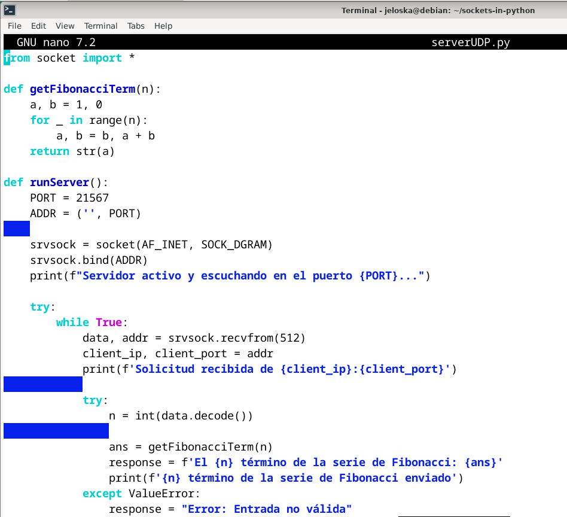
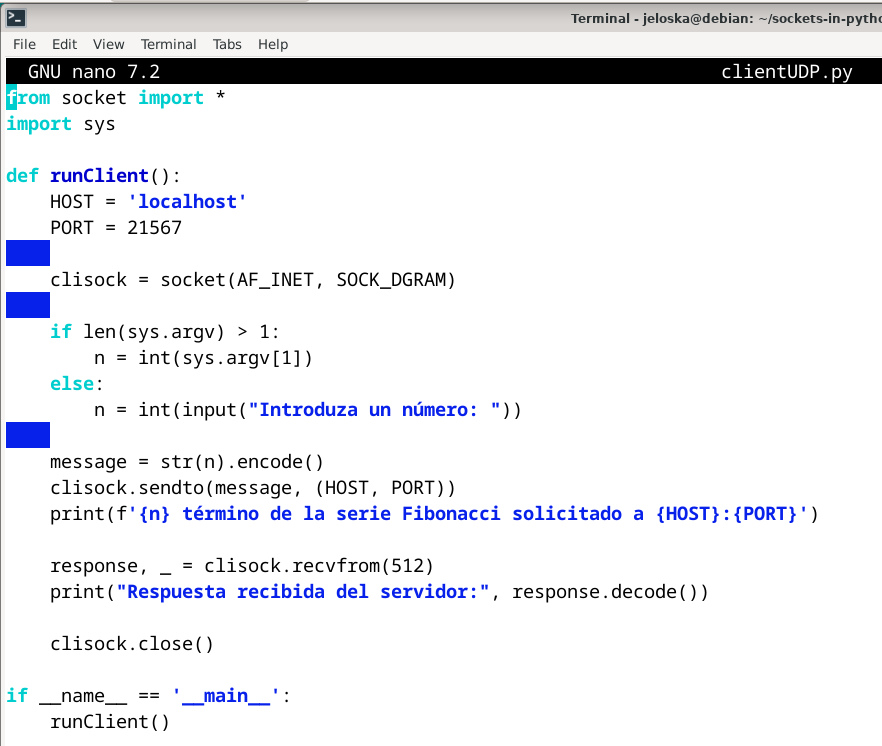
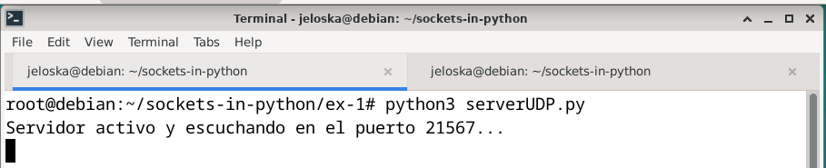
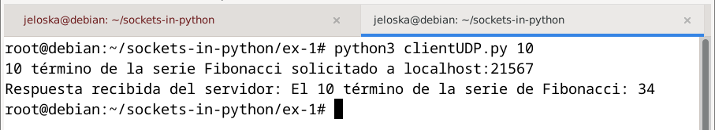
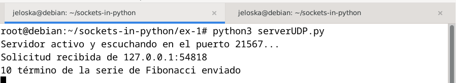
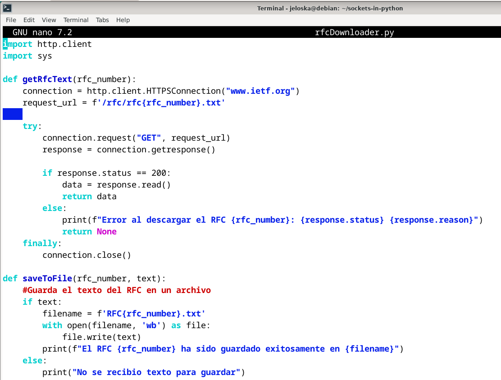
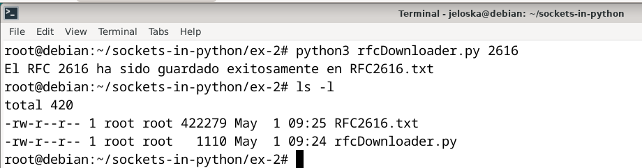
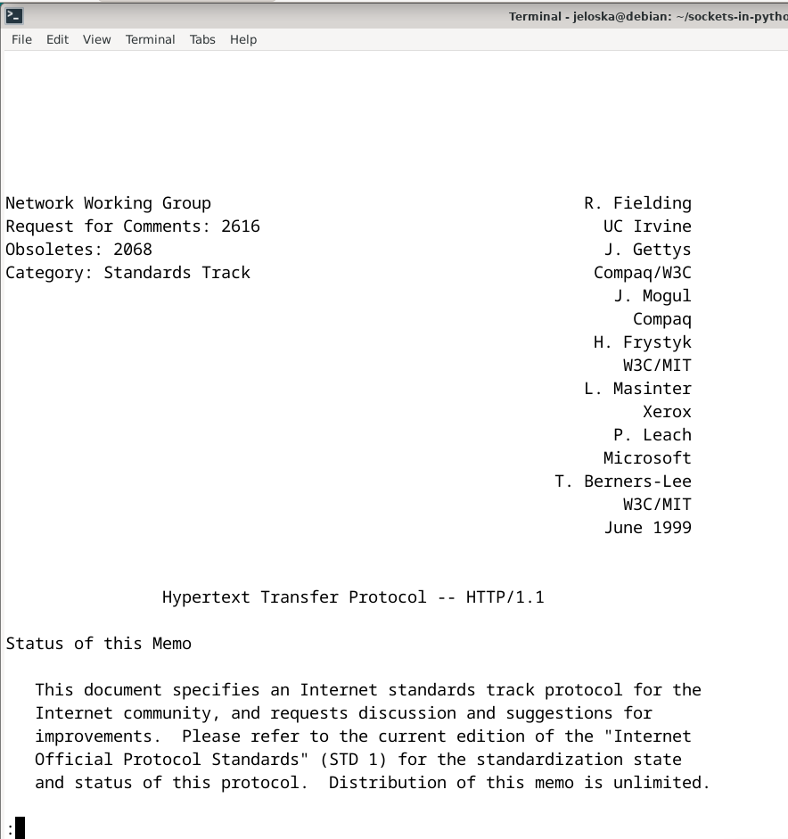
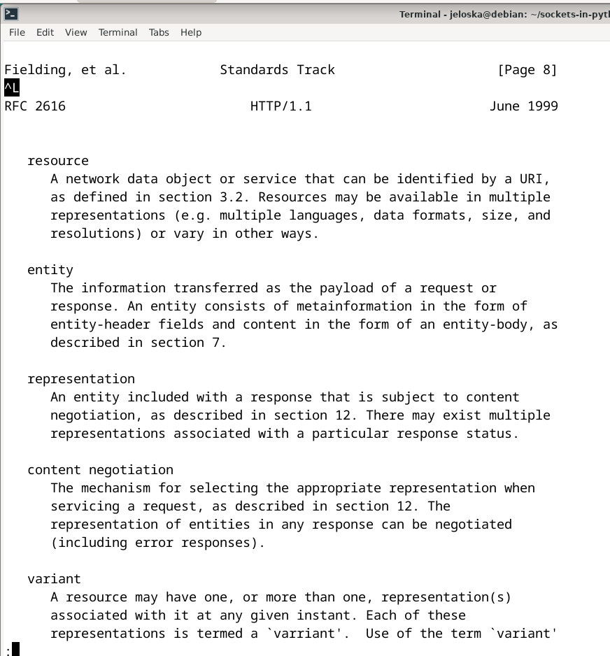
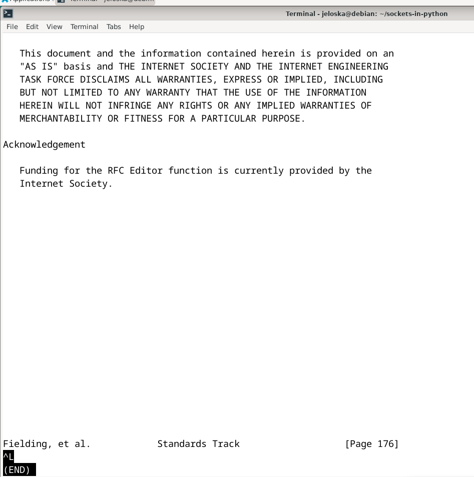

# Laboratorio 9
#### Jeloska Isabel Chavez Paredez
## Item 1
## Descripción de la solución
La solución propuesta implementa un sistema cliente-servidor utilizando el protocolo UDP para calcular y retornar términos específicos de la serie de Fibonacci. El servidor, configurado para escuchar en el puerto 21567, imprime la dirección IP y el puerto del cliente al recibir una solicitud. Utiliza una función específica para calcular el término de Fibonacci solicitado y maneja los errores de entrada inválida enviando mensajes adecuados. La respuesta con el término calculado se envía de vuelta al cliente.

Por otro lado, el cliente permite al usuario solicitar el cálculo de un término de Fibonacci, enviando el número deseado al servidor. Tras esto, espera y muestra la respuesta del servidor. Esta implementación es ideal para escenarios que requieren interacciones de red simples y eficientes sin confirmación de recepción garantizada.

### Script `serverUDP.py`
El script `serverUDP.py○` define un servidor UDP en Python que responde a solicitudes para calcular términos de la serie de Fibonacci.



#### Importación de la librería de socket

```python
from socket import *
```
Esta línea importa las funciones y clases necesarias desde el módulo estándar de Python `socket`, el cual proporciona las interfaces de bajo nivel para interactuar con redes a través de sockets en diversos protocolos, incluyendo UDP.

#### Definición de la función `getFibonacciTerm(n)`

```python
def getFibonacciTerm(n):
    a, b = 1, 0
    for _ in range(n):
        a, b = b, a + b
    return str(a)
```
Esta función implementa un algoritmo iterativo para calcular el n-ésimo término de la serie de Fibonacci. Los parámetros `a` y `b` se inicializan en 1 y 0, respectivamente. La función utiliza un bucle `for` para iterar `n` veces, actualizando los valores de `a` y `b` en cada paso. El resultado, `a`, es el n-ésimo término, que se convierte en una cadena antes de ser devuelto. Esta conversión facilita la transmisión sobre la red, dado que los sockets operan con datos en formato de bytes.

#### Función `runServer()`

```python
def runServer():
    PORT = 21567
    ADDR = ('', PORT)
    
    srvsock = socket(AF_INET, SOCK_DGRAM)
    srvsock.bind(ADDR)
    print(f"Servidor activo y escuchando en el puerto {PORT}...")
```
Esta sección configura el servidor para operar sobre IP (`AF_INET`) y utilizando el protocolo UDP (`SOCK_DGRAM`). El servidor se enlaza a todas las interfaces disponibles (`''` indica una dirección vacía) en el puerto 21567. Al no especificar una dirección IP específica, el servidor puede recibir datos enviados a cualquiera de las direcciones IP de la máquina.

```python
    try:
        while True:
            data, addr = srvsock.recvfrom(512)
            client_ip, client_port = addr
            print(f'Solicitud recibida de {client_ip}:{client_port}')
```
Dentro de un bucle infinito, el servidor se bloquea en la llamada `recvfrom`, esperando recibir hasta 512 bytes de datos de un cliente. Cuando recibe datos, extrae la dirección y el puerto del cliente (almacenado en `addr`) y decodifica los datos para procesarlos.

```python
            try:
                n = int(data.decode())
                
                ans = getFibonacciTerm(n)
                response = f'El {n} término de la serie de Fibonacci: {ans}'
                print(f'{n} término de la serie de Fibonacci enviado')
            except ValueError:
                response = "Error: Entrada no válida"
                print(f"Entrada no válida recibida de {client_ip}:{client_port}")
            srvsock.sendto(response.encode(), addr)
```
Intenta convertir los datos decodificados a un entero `n`. Si tiene éxito, calcula el término correspondiente de Fibonacci y prepara una respuesta descriptiva. En caso de error (p.ej., si los datos no son numéricos), se prepara y envía un mensaje de error. En ambos casos, la respuesta se codifica en bytes y se envía de vuelta al cliente utilizando `sendto`.

```python
    finally:
        srvsock.close()
```
El bloque `finally` garantiza que el socket se cierra adecuadamente al finalizar la ejecución, liberando el puerto y los recursos asociados para evitar fugas de memoria y otros problemas relacionados con la gestión de recursos de red.

```python
if __name__ == '__main__':
    runServer()
```
Esta última sección asegura que el servidor se ejecute solo cuando el script se inicie como programa principal, no cuando se importe como un módulo desde otro script.

### Script `clientUDP.py`

El script `clientUDP.py` configura un cliente UDP que envía solicitudes para calcular términos de la serie de Fibonacci a un servidor y recibe las respuestas correspondientes. 




#### Importación de Módulos

```python
from socket import *
import sys
```
Se importa el módulo `socket` para usar las funcionalidades de red basadas en sockets, y el módulo `sys` para acceder a la lista `argv`, que contiene los argumentos de la línea de comando proporcionados al script.

#### Definición de la función `runClient()`

```python
def runClient():
    HOST = 'localhost'
    PORT = 21567
```
Estas líneas definen las variables `HOST` y `PORT`, que representan la dirección del servidor y el puerto al que el cliente enviará las solicitudes, respectivamente. `'localhost'` indica que el servidor se espera que esté ejecutándose en la misma máquina que el cliente.

```python
    clisock = socket(AF_INET, SOCK_DGRAM)
```
Crea un socket UDP para el cliente utilizando `AF_INET` (que indica el uso de IPv4) y `SOCK_DGRAM` (que especifica que se trata de un protocolo basado en datagramas, como UDP).

```python
    if len(sys.argv) > 1:
        n = int(sys.argv[1])
    else:
        n = int(input("Introduza un número: "))
```
Este bloque determina el término `n` de Fibonacci que el cliente solicitará. Si se proporcionan argumentos de línea de comandos, usa el primero de ellos; de lo contrario, solicita una entrada del usuario.

```python
    message = str(n).encode()
    clisock.sendto(message, (HOST, PORT))
    print(f'{n} término de la serie Fibonacci solicitado a {HOST}:{PORT}')
```
Convierte el número `n` a una cadena, luego lo codifica en bytes y lo envía al servidor utilizando `sendto`, que también requiere la dirección del servidor y el puerto como tupla. Imprime un mensaje para confirmar la acción realizada.

```python
    response, _ = clisock.recvfrom(512)
    print("Respuesta recibida del servidor:", response.decode())
```
El cliente se bloquea esperando la respuesta del servidor, leyendo hasta 512 bytes. Una vez que recibe una respuesta, la decodifica de bytes a cadena y muestra el resultado en la consola.

```python
    clisock.close()
```
Esta línea asegura que el socket se cierra adecuadamente después de completar las transacciones, liberando cualquier recurso de red asociado.

```python
if __name__ == '__main__':
    runClient()
```
Este bloque garantiza que la función `runClient()` solo se ejecute si el script se inicia como el programa principal, evitando su ejecución inadvertida cuando el script es importado como un módulo.

## Pruebas y resultados

#### Ejecución del Servidor

El servidor se inicia con el comando:

```bash
python3 serverUDP.py
```

Al ejecutar, el servidor muestra el mensaje:

```
Servidor activo y escuchando en el puerto 21567...
```

Este mensaje confirma que el servidor está operativo y listo para recibir solicitudes en el puerto `21567`.




#### Ejecución del Cliente

El cliente se ejecuta en una consola separada con el comando:

```bash
python3 clientUDP.py 10
```

El cliente solicita el décimo término de la serie de Fibonacci. Durante la ejecución, el cliente muestra los mensajes:

```
10 término de la serie Fibonacci solicitado a localhost:21567
Respuesta recibida del servidor: El 10 término de la serie de Fibonacci: 34
```



Este output indica que el cliente ha enviado la solicitud correctamente al servidor y ha recibido la respuesta esperada, el décimo término de la serie de Fibonacci, que es `34`.

#### Comportamiento del Servidor durante la solicitud del cliente

Simultáneamente, en la consola del servidor se observan los siguientes mensajes tras recibir la solicitud del cliente:

```
Solicitud recibida de 127.0.0.1:54818
10 término de la serie de Fibonacci enviado
```



Estos mensajes confirman que el servidor ha recibido la solicitud desde la dirección IP `127.0.0.1` y puerto `54818`, que corresponde al cliente en el mismo equipo. Además, confirma que el término solicitado ha sido procesado y enviado de vuelta al cliente.

#### Conclusión de las Pruebas

La interacción entre el cliente y el servidor UDP funciona correctamente según lo diseñado. El servidor procesa las solicitudes y retorna el cálculo adecuado de la serie de Fibonacci, mientras que el cliente puede enviar solicitudes y recibir respuestas de manera efectiva. Los resultados validan el comportamiento esperado del sistema en un entorno controlado de desarrollo y pruebas.

## Item 2

## Descripción de la solución 

La solución propuesta consiste en desarrollar un cliente utilizando el módulo `http.client` de Python para descargar un RFC (Request for Comments) del sitio web www.ietf.org. Un RFC es un documento que describe las especificaciones técnicas y estándares utilizados en internet, incluyendo protocolos como HTTP, SMTP, TCP, entre otros.  Los RFCs están disponibles en el sitio web del IETF (Internet Engineering Task Force) en la siguiente ruta: https://www.ietf.org/rfc/rfcXXXX.txt, donde "XXXX" representa el número del RFC deseado. Por ejemplo, el RFC 2616 para HTTP/1.1 está disponible en la URL: https://www.ietf.org/rfc/rfc2616.txt.

#### Funcionamiento del Cliente

El cliente Python utilizará el módulo `http.client` para establecer una conexión HTTP con el servidor www.ietf.org y enviar una solicitud para descargar el RFC especificado por el usuario. El cliente recibirá como argumento el número del RFC deseado.

#### Proceso de Descarga del RFC

1. El cliente construirá la URL del RFC utilizando el número proporcionado por el usuario.
2. Establecerá una conexión HTTP con el servidor www.ietf.org.
3. Enviarán una solicitud GET al servidor para descargar el RFC.
4. El servidor responderá con el contenido del RFC en formato de texto.
5. El cliente recibirá y guardará el contenido del RFC en un archivo local en el sistema del usuario.

#### Manejo de Errores y Excepciones

El cliente implementará manejo de errores para gestionar situaciones como conexiones fallidas, respuestas de error del servidor, o problemas de escritura en el archivo local.

#### Visualización de Resultados

Una vez completada la descarga, el cliente mostrará un mensaje indicando que el RFC ha sido descargado exitosamente, junto con la ruta del archivo local donde se ha guardado el RFC.

### Script solución `rfcDownloader.py` 

El script `rfcDownloader.py` es un cliente HTTP diseñado para descargar documentos RFC desde el sitio web de la IETF, guardarlos en formato de texto en el sistema local, y gestionar posibles errores durante el proceso. 




#### Importación de Módulos

```python
import http.client
import sys
```
- `http.client`: Un módulo de Python que proporciona clases para la implementación de clientes HTTP.
- `sys`: Un módulo que se utiliza para acceder a algunas variables usadas o mantenidas por el intérprete y para funciones que interactúan fuertemente con el intérprete. Se usa aquí para acceder a los argumentos de la línea de comandos.

#### Función `getRfcText(rfc_number)`

```python
def getRfcText(rfc_number):
    connection = http.client.HTTPSConnection("www.ietf.org")
    request_url = f'/rfc/rfc{rfc_number}.txt'
    
    try:
        connection.request("GET", request_url)
        response = connection.getresponse()

        if response.status == 200:
            data = response.read()
            return data
        else:
            print(f"Error al descargar el RFC {rfc_number}: {response.status} {response.reason}")
            return None
    finally:
        connection.close()
```
- **Conexión HTTPS:** Se establece una conexión HTTPS con el servidor de la IETF. El uso de HTTPS asegura que la comunicación entre el cliente y el servidor sea segura.
- **Envío de la Solicitud:** Se realiza una solicitud GET utilizando la ruta formada por `/rfc/rfc{rfc_number}.txt`, donde `{rfc_number}` es el número del RFC especificado por el usuario.
- **Manejo de la Respuesta:** Se verifica el estado de la respuesta. Si es 200 (OK), se lee el contenido del RFC y se retorna. Si no es 200, se imprime un mensaje de error con el código de estado y la razón, y se retorna `None`.
- **Cierre de la Conexión:** La conexión se cierra automáticamente al final del bloque `try`, independientemente del resultado de la solicitud.

#### Función `saveToFile(rfc_number, text)`

```python
def saveToFile(rfc_number, text):
    if text:
        filename = f'RFC{rfc_number}.txt'
        with open(filename, 'wb') as file:
            file.write(text)
        print(f"El RFC {rfc_number} ha sido guardado exitosamente en {filename}")
    else:
        print("No se recibio texto para guardar")
```
- **Guardado del archivo:** Si se recibe el texto del RFC (es decir, si `text` no es `None`), se guarda en un archivo en el directorio actual. El nombre del archivo se forma concatenando `RFC` con el número del RFC y la extensión `.txt`.
- **Confirmación:** Se imprime un mensaje confirmando que el archivo ha sido guardado exitosamente.
- **Error de Contenido Vacío:** Si no se recibe texto (es decir, `text` es `None`), se imprime un mensaje indicando que no se recibió texto para guardar.

#### Bloque Principal

```python
if __name__ == "__main__":
    if len(sys.argv) < 2:
        print("Introduzca un numero de RFC!")
        sys.exit(1)

    rfcNumber = sys.argv[1]
    rfcText = getRfcText(rfcNumber)
    saveToFile(rfcNumber, rfcText)
```
- **Verificación de Argumentos:** Se verifica que el usuario haya proporcionado un argumento (el número del RFC). Si no se proporciona, se imprime un mensaje de error y se termina el script.
- **Obtención y Guardado del RFC:** Se obtiene el texto del RFC utilizando el número proporcionado y luego se guarda usando la función `saveToFile`.


## Pruebas y resultados

### Pruebas y Resultados del Cliente de Descarga de RFC
Se evaluó la funcionalidad del cliente descargando el RFC 2616, que especifica el protocolo HTTP/1.1.

#### Configuración de la Prueba

- **Script:** `rfcDownloader.py` ejecutado en Debian.
- **RFC Solicitado:** 2616 (HTTP/1.1).

#### Ejecución y Resultados

1. **Inicio del Cliente:**
   Se inició el cliente utilizando el comando:
   ```bash
   python3 rfcDownloader.py 2616
   ```
   El cliente procesó el argumento, realizó la solicitud HTTP para descargar el RFC 2616 y lo guardó como `RFC2616.txt`.

2. **Mensajes de Confirmación:**
   En la terminal se mostró el mensaje:
   ```
   El RFC 2616 ha sido guardado exitosamente en RFC2616.txt
   ```
   Este mensaje confirma que el documento fue descargado y guardado correctamente en el sistema local.

   

3. **Verificación del Archivo:**
   Un comando `ls -l` fue ejecutado para listar los detalles del archivo, mostrando:
   ```
   -rw-r--r-- 1 root root 422279 May  1 09:25 RFC2616.txt
   ```
   El tamaño del archivo (422279 bytes) indica que el contenido del RFC fue guardado completamente.

4. **Contenido del RFC:**
   Se usó un visor de texto para abrir y verificar el contenido del archivo `RFC2616.txt`. Las capturas de pantalla muestran diferentes secciones del RFC, incluyendo:
   - La portada, con los autores y el título.
   - El índice, que detalla la estructura del documento.
   - Fragmentos del contenido, que describen especificaciones técnicas del protocolo HTTP/1.1.


<div style="display: grid; grid-template-columns: auto auto;">
    
    
    
    
</div>


#### Conclusión de las Pruebas

Las pruebas demostraron que el script `rfcDownloader.py` funciona correctamente para descargar RFCs desde www.ietf.org. El archivo del RFC se guardó con éxito y su contenido coincide con lo esperado para el RFC 2616.

